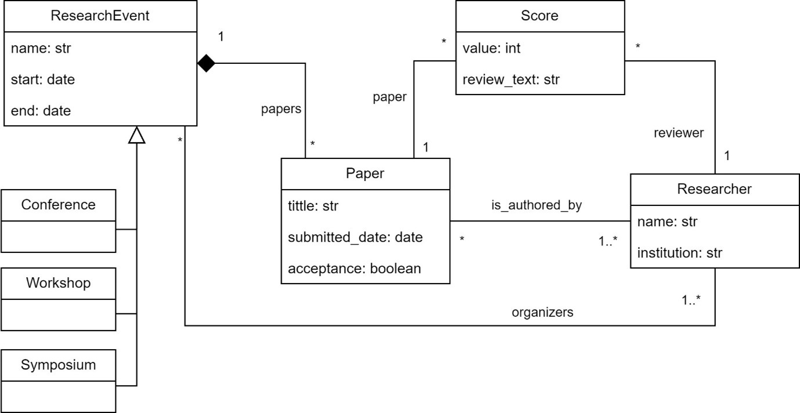

# Lab Guide 1

## Welcome to our BESSER lab guide!

This guide will walk you through using BESSER as end user. Next, we'll create some models using B-UML (BESSER's modeling language) and utilize code generators to produce executable code, enabling you to deploy your application (or part of it).

## 1. A bit of context

In recent years, low-code development tools have seen remarkable growth in the software development landscape. These platforms empower users, regardless of their programming expertise, to build robust applications with minimal hand-coding required. Low-code tools typically provide a modelling language with a concrete syntaxis (graphical, textual, etc..), and pre-built templates to accelerate the development process. They have become instrumental in enabling organizations to rapidly respond to market demands, reduce development costs, and enhance collaboration between business stakeholders and IT teams.

BESSER is an open-source low-code platform for smart software development. The following figure illustrates the architecture of the BESSER platform. At the core of this architecture, we have B-UML (short for BESSER’s Universal Modeling Language), the foundational language of the BESSER platform used for specifying domain models composed by structural models, object models, graphical interface models, and even OCL constraints. Additionally, BESSER offers code generators for various technologies such as SQLAlchemy, Django, Python, and more.

<div align="center">
  
</div>

## 2. Scenario

The following diagram depicts a domain related to academic research, where papers are authored by researchers, evaluated with scores, and presented at various research events. Each *Paper* is associated with one or more *Score*s provided by *Reviewer*s, along with textual reviews. *Researcher*s, affiliated with institutions, can organize *ResearchEvent*s such as *Conference*s, *Workshop*s, or *Symposium*s, each having distinct start and end dates. *Paper*s are presented at these events, forming a one-to-many composition relationship between *ResearchEvent* and *Paper*. Additionally, the diagram showcases inheritance, with specific types of *ResearchEvent*s inheriting attributes and behaviors from the generic *ResearchEvent* class. Overall, it illustrates the interplay between papers, reviewers, researchers, and research events within the academic research domain.

<div align="center">
  
</div>

## 3. Installing BESSER

BESSER works with Pyhton 3.9+. We recommend creating a virtual environment (e.g. venv, conda).

The latest stable version of BESSER is available in the Python Package Index (PyPi) and can be installed using this command.

    $ pip install besser

## 4. Creating a model with B-UML

It's time to start modeling with BESSER. To create a model using B-UML (BESSER's modeling language), there are several ways. In the following, we will look at some of the methods for creating the model.

### 4.1 Create a B-UML model using the B-UML python library

The first way consists of instantiating directly in Python the classes of the B-UML metamodel. For this, you must write the code in Python defining the domain model. For example, the following code is to define the *Paper* class with its attributes, where the classes **Class*, and *Property* are instantiated from the B-UML metamodel.

```python
from besser.BUML.metamodel.structural import NamedElement, DomainModel, Type, Class, \
        Property, PrimitiveDataType, Multiplicity, Association, BinaryAssociation, Generalization, \
        GeneralizationSet, AssociationClass, StringType, DateType, BooleanType, IntegerType

# Paper class definition
tittle: Property = Property(name="tittle", type=StringType)
submitted_date: Property = Property(name="submitted_date", type=DateType)
acceptance: Property = Property(name="acceptance", type=BooleanType)
paper: Class = Class(name="Paper", attributes={tittle, submitted_date, acceptance})
```

You can find the code for the definition of [the domain model here](models/domain_model.py), excluding the *Score* class. Run this code using Python and you should get in console the names of the classes of your model.

```bash
$ python domain_model.py
Symposium
ResearchEvent
Researcher
Conference
Paper
Workshop
```
> ### **Exercise:**
>
> - Modify the code of your model by adding the definition of the *Score* class and the relationships with *Paper* and *Research* classes.
> - Print not only the name of each class but also the name and type of their attributes.

### 4.2 Create a B-UML model using the Plantuml notation

The second way to create a B-UML metamodel is to use the [PlantUML](http://www.plantuml.com) notation. PlantUML is an open-source tool that allows users to generate UML diagrams from plain text descriptions, and it is regarded as one of the most popular tools for creating UML diagrams due to its simplicity.

Let's define a B-UML model using PlantUML. [In this file](models/model.plantuml), you can find the specification of our [example domain model](figs/research_model.png) using PlantUML notation. Create a new file, paste this code, and save it with the name domain.plantuml

Then you can use the following code to transform the PlantUML model to a B-UML model.

```python
from besser.BUML.notations.structuralPlantUML import plantuml_to_buml
from besser.BUML.metamodel.structural import DomainModel

# PlantUML to B-UML model
buml_model: DomainModel = plantuml_to_buml(plantUML_model_path="model.plantuml")
```

Now, the B-UML model is stored in `buml_model`.

> ### **Exercise:**
>
> Serialization of a model refers to the process of converting its internal representation into a format that can be efficiently stored or transmitted, typically as binary data or structured text. Use the [BESSER serialization function](https://besser.readthedocs.io/en/latest/utilities/serializer.html#model-serialization) to store the obtained buml model. At the end you should get a file with your serialized model.

### 4.3 Creating a B-UML model using an image (optional)

Another way to define a B-UML model is to use an image (e.g., a picture of your class diagram). BESSER will transform the image into a B-UML model using OpenAI's GPT4. But, to use this BESSER functionality, you must have a valid OpenAI token.

You can use the figure of our [domain model](figs/research_model.png). Save it as an image file (for example, with the name `model.png`) and run the following code to obtain the B-UML model (replace the value of the `openai_token` parameter with your token).

```python
from besser.BUML.metamodel.structural import DomainModel
from besser.utilities import image_to_buml

buml_model: DomainModel = image_to_buml(image_path="model.png", openai_token="****")
```

## 5. Using the BESSER code generators

Using the BESSER code generators is very easy. All you must do is provide the B-UML model to the generator.

Next, we are going to use some of the BESSER code generators using the B-UML model serialized in section 4.2 of this guide.

### 5.1 SQL Alchemy code generator

[SQLAlchemy](https://www.sqlalchemy.org/) is a Python SQL toolkit and Object-Relational Mapping (ORM) library that provides a flexible way to work with databases in Python, allowing developers to interact with databases using high-level Python objects.

To use the SQLAlchemy generator, we need to deserialize the domain model that we have previously saved in Section 4.2. You can execute the following code to complete the entire process.

```python
from besser.BUML.metamodel.structural import DomainModel
from besser.utilities import ModelSerializer
from besser.generators.sql_alchemy import SQLAlchemyGenerator

# Model deserialization
serializer: ModelSerializer = ModelSerializer()
buml_model: DomainModel = serializer.load(model_path="serialized model filename")

# Code generation
generator: SQLAlchemyGenerator = SQLAlchemyGenerator(model=buml_model)
generator.generate()
```

The `sql_alchemy.py` file with the declarative mapping of the database will be generated in the `<<current_directory>>/output/sql_alchemy.py`

Next, we are going to create an SQLite database using the generated code. Add the following code at the end of your `sql_alchemy.py` file generated and then run it.

```python
engine = create_engine("sqlite:///database.db", echo=True)
Base.metadata.create_all(engine)
```

The database should have been created as `database.db`. Explore the tables and relationships to see how the model's concepts are mapped to the database. If you're using VSCode, you can install the [SQLite Viewer plugin](https://marketplace.visualstudio.com/items?itemName=qwtel.sqlite-viewer) to easily visualize the database.

### 5.2 Django code generator

[Django](https://www.djangoproject.com/) is a high-level Python web framework that enables development of web applications. The architecture of web applications created with Django follows a Model-View-Template (MVT) architecture. The model layer represents the data and business logic, the view layer consists of functions or classes that handle the application logic, and the templates are HTML files that define the user interface presentation.

BESSER provides this code generator for the model layer of a web application built with Django. To use the Django code generator, execute the following code.

```python
from besser.BUML.metamodel.structural import DomainModel
from besser.utilities import ModelSerializer
from besser.generators.django import DjangoGenerator

# Model deserialization
serializer: ModelSerializer = ModelSerializer()
buml_model: DomainModel = serializer.load(model_path="serialized model filename")

# Code generation
generator: DjangoGenerator = DjangoGenerator(model=buml_model)
generator.generate()
```

The `models.py` file with the Django models defined will be generated in the `<<current_directory>>/output/models.py` file.

> ### **Exercise:**
>
> Modify the [domain model](figs/research_model.png) by adding two new classes: *Junior* and *Senior*, both of which inherit from the *Researcher* class. Redefine the B-UML model using any of the provided options from Section 4 and use the SQLAlchemy code generator to create the database.
