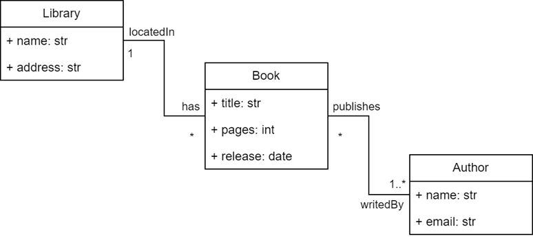

# Lab Guide 2: Create your code generator with BESSER

## Welcome to our BESSER lab guide!

In this guide, you will learn to use BESSER from the perspective of a developer user, specifically for developing a code generator.

## 1. Context

As you've seen in the previous guide, BESSER provides the B-UML modeling language for creating different types of models. In this case, we will develop a code generator that takes as input a structural model defined with B-UML and generates Java code representing the object model, i.e., the classes and attributes in the Java language.

To create the code generator, you can utilize the interface provided by BESSER and define a Jinja template for code generation. You can find more information about this in the BESSER documentation at https://besser.readthedocs.io/en/latest/generators.html The documentation provides details about BESSER's code generation capabilities, including how to create custom generators and work with Jinja templates.

## 2. Creating your Code Generator in BESSER

To create your code generator, you should create a class (for example, JavaGenerator) using the GeneratorInterface interface provided by BESSER, ensuring that all BESSER code generators maintain a consistent structure. You can use the following code to create your Java code generator. The constructor method will receive the DomainModel or B-UML model as an input parameter, while the generate() method performs the code generation. Note that the java_template.py.j2 template is used for code generation.

Copy this code in a new file named `java_generator.py`:

```python
import os
from jinja2 import Environment, FileSystemLoader
from besser.BUML.metamodel.structural import DomainModel
from besser.generators import GeneratorInterface

class JavaGenerator(GeneratorInterface):

    def __init__(self, model: DomainModel, output_dir: str = None):
        super().__init__(model, output_dir)

    def generate(self):
        file_path = self.build_generation_path(file_name="code.java")
        templates_path = os.path.join(os.path.dirname(
            os.path.abspath(__file__)), "templates")
        env = Environment(loader=FileSystemLoader(
            templates_path), trim_blocks=True, lstrip_blocks=True, extensions=['jinja2.ext.do'])
        template = env.get_template('java_template.py.j2')
        with open(file_path, mode="w") as f:
            generated_code = template.render(model=self.model)
            f.write(generated_code)
            print("Code generated in the location: " + file_path)
```

## 3. Jinja template example

Let's create an initial example Jinja template. To do this, create a file named `templates/java_template.py.j2` and write the following code:

```jinja2
This is a template example to list the name of the classes


    class {{ class.name }}

```

Now let's test the code generator. First, we need to create a B-UML model, and then instantiate the generator to obtain the generated code. Execute the following code and check the code generated in the output folder:

```python
from besser.BUML.metamodel.structural import DomainModel
from besser.BUML.metamodel.structural import DomainModel, Class, Property, \
    Multiplicity, BinaryAssociation, StringType, IntegerType, DateTimeType
from besser.utilities import ModelSerializer
from java_generator import JavaGenerator

############################
#   BUML model definition  #
############################

# Library attributes definition
library_name: Property = Property(name="name", type=StringType)
address: Property = Property(name="address", type=StringType)
# Library class definition
library: Class = Class(name="Library", attributes={library_name, address})

# Book attributes definition
title: Property = Property(name="title", type=StringType)
pages: Property = Property(name="pages", type=IntegerType)
release: Property = Property(name="release", type=DateTimeType)
# Book class definition
book: Class = Class(name="Book", attributes={title, pages, release})

# Author attributes definition
author_name: Property = Property(name="name", type=StringType)
email: Property = Property(name="email", type=StringType)
# Author class definition
author: Class = Class(name="Author", attributes={author_name, email})

# Library-Book association definition
located_in: Property = Property(name="locatedIn", type=library, multiplicity=Multiplicity(1, 1))
has: Property = Property(name="has", type=book, multiplicity=Multiplicity(0, "*"))
lib_book_association: BinaryAssociation = BinaryAssociation(name="lib_book_assoc", ends={located_in, has})

# Book-Author association definition
publishes: Property = Property(name="publishes", type=book, multiplicity=Multiplicity(0, "*"))
writed_by: Property = Property(name="writedBy", type=author, multiplicity=Multiplicity(1, "*"))
book_author_association: BinaryAssociation = BinaryAssociation(name="book_author_assoc", ends={writed_by, publishes})

# Domain model definition
library_model: DomainModel = DomainModel(name="Library model", types={library, book, author},
                                        associations={lib_book_association, book_author_association})

############################
#      Code Generation     #
############################

generator: JavaGenerator = JavaGenerator(model=library_model)
generator.generate()
```

The B-UML model defined in the previous code corresponds to the diagram in Figure 1. Therefore, by running the above code, you should obtain a file containing the names of the three classes (Library, Book, and Author) as output.


<div align="center">
  
</div>


## 4. Exercise

Modify the `java_template.py.j2` to build a Java code generator. In other words, your code generator should produce a set of classes in the Java language with their respective methods, attributes, etc. For example, when providing a model like the one in Figure 1, your code generator should produce a file with the following code:

```java
import java.util.List;
import java.util.ArrayList;
import java.util.Date;

public class Library {
    private String name;
    private String address;
    private List<Book> books;

    public Library(String name, String address) {
        this.name = name;
        this.address = address;
        this.books = new ArrayList<>();
    }

    public String getName() {
        return name;
    }

    public void setName(String name) {
        this.name = name;
    }

    public String getAddress() {
        return address;
    }

    public void setAddress(String address) {
        this.address = address;
    }

    public List<Book> getBooks() {
        return books;
    }

    public void addBook(Book book) {
        books.add(book);
    }
}

public class Book {
    private String title;
    private int pages;
    private Date release;
    private List<Author> authors;

    public Book(String title, int pages, Date release) {
        this.title = title;
        this.pages = pages;
        this.release = release;
        this.authors = new ArrayList<>();
    }

    public String getTitle() {
        return title;
    }

    public void setTitle(String title) {
        this.title = title;
    }

    public int getPages() {
        return pages;
    }

    public void setPages(int pages) {
        this.pages = pages;
    }

    public Date getRelease() {
        return release;
    }

    public void setRelease(Date release) {
        this.release = release;
    }

    public List<Author> getAuthors() {
        return authors;
    }

    public void addAuthor(Author author) {
        authors.add(author);
    }
}

public class Author {
    private String name;
    private String email;

    public Author(String name, String email) {
        this.name = name;
        this.email = email;
    }

    public String getName() {
        return name;
    }

    public void setName(String name) {
        this.name = name;
    }

    public String getEmail() {
        return email;
    }

    public void setEmail(String email) {
        this.email = email;
    }
}
```

