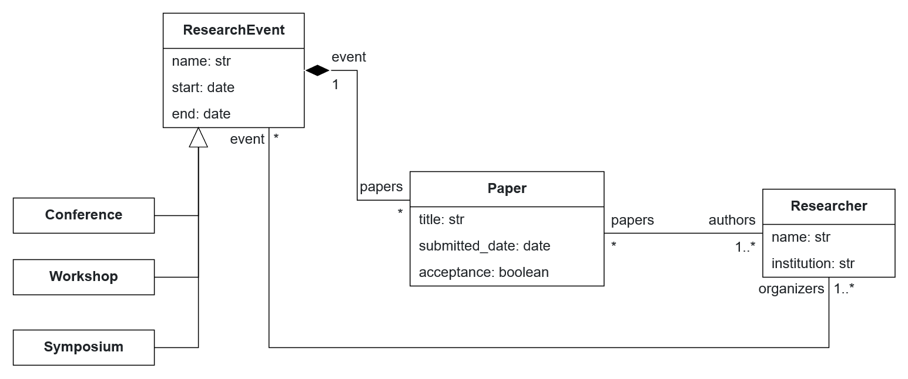
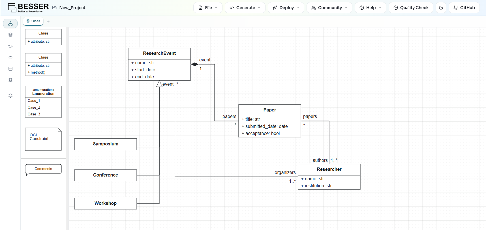

# Lab 1 — BESSER Basics

## At a glance

- **You'll learn:** How to define a B-UML model (both in Python and in the Web Modeling Editor), and how to run BESSER's built-in SQLAlchemy and Django code generators.
- **You'll produce:** A Python domain model, a SQLite database from SQLAlchemy, and a runnable Django project scaffold.
- **You'll need next:** Lab 2 builds on these same modeling concepts inside the Web Modeling Editor.

---

## Prerequisites

- **Python** 3.11 or newer
- **BESSER** — the [basic installation](https://besser.readthedocs.io/en/latest/installation.html#) is sufficient (`pip install besser[all]`)
- Familiarity with basic UML class diagrams (classes, attributes, associations, inheritance)

---

## 1. Context

In recent years, low-code development tools have seen remarkable growth in the software development landscape. These platforms empower users, regardless of their programming expertise, to build robust applications with minimal hand-coding required. Low-code tools typically provide a modelling language with a concrete syntax (graphical, textual, etc.) and pre-built templates to accelerate the development process. They have become instrumental in enabling organizations to rapidly respond to market demands, reduce development costs, and enhance collaboration between business stakeholders and IT teams.

BESSER is an open-source low-code platform for smart software development. The figure below illustrates the architecture of the BESSER platform. At the core of this architecture, we have **B-UML** (BESSER's Universal Modeling Language) — the foundational language of the BESSER platform, used for specifying domain models composed of structural models, object models, graphical interface models, and even OCL constraints. Additionally, BESSER offers code generators for various technologies such as SQLAlchemy, Django, Python, and more.

<div align="center">
  
</div>

---

## 2. Scenario

Throughout this lab you will work with a domain related to **academic research**: papers are authored by researchers and presented at various research events. `Researcher`s, affiliated with institutions, can organize `ResearchEvent`s such as `Conference`s, `Workshop`s, or `Symposium`s, each with their own start and end dates. `Paper`s are presented at these events, forming a one-to-many composition relationship between `ResearchEvent` and `Paper`. The diagram also showcases inheritance, with specific types of `ResearchEvent` inheriting attributes and behaviors from the generic `ResearchEvent` class.

<div align="center">
  
</div>

---

## 3. Walkthrough

There are several ways to create a B-UML model. This lab covers two of them (Python library and graphical editor), then uses the resulting model to run two code generators.

### 3.1 Create a B-UML model using the Python library

The first way is to instantiate the B-UML metamodel classes directly in Python. You write Python code defining the domain model. For example, the following snippet defines the `Paper` class with three attributes, using the `Class` and `Property` classes from the B-UML metamodel:

```python
from besser.BUML.metamodel.structural import Class, Property, StringType, DateType, BooleanType

# Paper class definition
title: Property = Property(name="title", type=StringType)
submitted_date: Property = Property(name="submitted_date", type=DateType)
acceptance: Property = Property(name="acceptance", type=BooleanType)
paper: Class = Class(name="Paper", attributes={title, submitted_date, acceptance})
```

The full model code is available in [`models/domain_model.py`](models/domain_model.py). Run it with Python and you should see the names of all model classes printed to the console:

```bash
$ python domain_model.py
Symposium
ResearchEvent
Researcher
Conference
Paper
Workshop
```

> **Exercise 3.1 — Add a `Score` class**
>
> Modify `domain_model.py` to add peer-review scoring:
> - Add a new class `Score` representing a score that a `Paper` receives after being reviewed by a `Researcher`.
> - Each `Paper` can have multiple `Score`s; each `Score` is provided by a single reviewer.
> - `Score` must have at least two attributes: one for the score value and one for comments/suggestions.
> - Verify your changes by printing the names of the classes and their attributes.

### 3.2 Create a B-UML model using the Web Modeling Editor

One of the most popular ways to model in BESSER is through its graphical editor at [editor.besser-pearl.org](https://editor.besser-pearl.org/). See the [editor documentation](https://besser.readthedocs.io/en/latest/web_editor.html) for an overview.

With the Modeling Editor, you can create a new class diagram, start from a template, or import an existing model. Import the provided [model in JSON format](models/domain_model.json) via *File → Import → JSON Import*.

Once imported, you should see the following model in the editor:

<div align="center">
  
</div>

> **Exercise 3.2 — Same model, graphical edition**
>
> - Recreate the tasks from **Exercise 3.1** using the [graphical editor](https://editor.besser-pearl.org/).
> - Constrain the `Score` value to one of: `strong_accept`, `accept`, `weak_accept`, `borderline`, `weak_reject`, `reject`.
> - Click **Quality Check** to verify that your model is syntactically correct.
> - Export your model via *File → Export → As B-UML* — you will use this file in the next section.

### 3.3 Run the SQLAlchemy code generator

[SQLAlchemy](https://www.sqlalchemy.org/) is a Python SQL toolkit and ORM library that provides a flexible way to work with relational databases in Python.

Open the `.py` file you exported in Exercise 3.2 and add the following code to it:

```python
from besser.generators.sql_alchemy import SQLAlchemyGenerator

alchemy_generator = SQLAlchemyGenerator(model=domain_model)
alchemy_generator.generate(dbms="sqlite")
```

After running the script, the `sql_alchemy.py` file will be generated in `<current_directory>/output/sql_alchemy.py` — it contains the declarative mapping of the database. For more details, see the [SQLAlchemy generator docs](https://besser.readthedocs.io/en/latest/generators/alchemy.html).

**Creating the database**

To create the database, execute the generated file:

```bash
python output/sql_alchemy.py
```

A `database.db` file should appear. Explore the tables and relationships to see how the model's concepts are mapped. In VSCode, the [SQLite Viewer plugin](https://marketplace.visualstudio.com/items?itemName=qwtel.sqlite-viewer) makes this easy.

> **Exercise 3.3 — Researcher subtypes**
>
> Extend the model to introduce two kinds of `Researcher`: `Junior` and `Senior` (inheritance). Regenerate the SQLAlchemy code and verify that the database now reflects both subtypes.

### 3.4 Run the Django code generator

[Django](https://www.djangoproject.com/) is a high-level Python web framework built around the Model-View-Template (MVT) architecture.

To generate a Django project, add the following lines to your script:

```python
from besser.generators.django import DjangoGenerator

django_generator = DjangoGenerator(
    model=domain_model,
    project_name="my_django_project",
    app_name="research_app",
    containerization=False,
)
django_generator.generate()
```

In addition to the B-UML model, this generator requires:

- **Project name** — e.g. `"my_django_project"`
- **App name** — e.g. `"research_app"`
- **Containerization** — `True` or `False` depending on whether you want Docker files generated

> **Exercise 3.4 — Run the generated Django app**
>
> Read the [Django generator documentation](https://besser.readthedocs.io/en/latest/generators/django.html#) and run the web application — either directly or via containerization.

---

## 4. Troubleshooting

| Symptom | Likely cause | Fix |
|---|---|---|
| `ModuleNotFoundError: No module named 'antlr4'` | BESSER installed without all dependencies | `pip install besser[all]` (note the `[all]` extras) |
| `ImportError: Couldn't import Django` during Django generation | Django not in your venv | `pip install "Django>=5.1.5"` |
| `ValueError: ... reserved name` from SQLAlchemy generator | Class/attribute named `Base`, `Enum`, `List`, `Table`, `Column`, etc. | Rename — SQLAlchemy 7.1.0+ blocks these to avoid symbol collisions |
| `UnicodeEncodeError: 'charmap' codec can't encode character` on Windows | Error messages printed via `cp1252` | Run Python with `set PYTHONIOENCODING=utf-8` |
| Django generation says "project already exists" | Leftover folder from a previous run | Delete `my_django_project/` and re-run |

---

## 5. What's next

Head to **[Lab 2 — Building a Full Application with the BESSER WME](../lab2_web_modeling_editor/README.md)** to model, generate, and deploy a complete web app using the Web Modeling Editor.

---

## Resources

- [BESSER documentation](https://besser.readthedocs.io/en/latest/)
- [BESSER GitHub](https://github.com/BESSER-PEARL/BESSER)
- [Web Modeling Editor](https://editor.besser-pearl.org/)
- [SQLAlchemy generator docs](https://besser.readthedocs.io/en/latest/generators/alchemy.html)
- [Django generator docs](https://besser.readthedocs.io/en/latest/generators/django.html)
