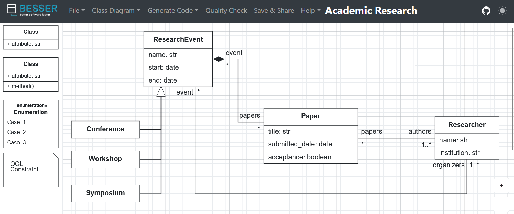

# Lab Guide 1 - BESSER Basics

## Welcome to the BESSER lab guide!

This guide will walk you through using [BESSER](https://github.com/BESSER-PEARL/BESSER.git) as an end user. Next, we'll create some models using B-UML (BESSER's modeling language) and utilize code generators to produce executable code, enabling you to deploy your application (or part of it).

## 1. Context

In recent years, low-code development tools have seen remarkable growth in the software development landscape. These platforms empower users, regardless of their programming expertise, to build robust applications with minimal hand-coding required. Low-code tools typically provide a modelling language with a concrete syntax (graphical, textual, etc..), and pre-built templates to accelerate the development process. They have become instrumental in enabling organizations to rapidly respond to market demands, reduce development costs, and enhance collaboration between business stakeholders and IT teams.

BESSER is an open-source low-code platform for smart software development. The following figure illustrates the architecture of the BESSER platform. At the core of this architecture, we have B-UML (short for BESSER’s Universal Modeling Language), the foundational language of the BESSER platform used for specifying domain models composed of structural models, object models, graphical interface models, and even OCL constraints. Additionally, BESSER offers code generators for various technologies such as SQLAlchemy, Django, Python, and more.

<div align="center">
  
</div>

## 2. Scenario

The following diagram depicts a domain related to academic research, where papers are authored by researchers, and presented at various research events. *Researcher*s, affiliated with institutions, can organize *ResearchEvent*s such as *Conference*s, *Workshop*s, or *Symposium*s, each having distinct start and end dates. *Paper*s are presented at these events, forming a one-to-many composition relationship between *ResearchEvent* and *Paper*. Additionally, the diagram showcases inheritance, with specific types of *ResearchEvent*s inheriting attributes and behaviors from the generic *ResearchEvent* class. Overall, it illustrates the interplay between papers, reviewers, researchers, and research events within the academic research domain.

<div align="center">
  
</div>

## 3. Requirements

For this lab guide, the [BESSER basic installation](https://besser.readthedocs.io/en/latest/installation.html#) is sufficient.

## 4. Creating a model with B-UML

It's time to start modeling with BESSER. To create a model using B-UML (BESSER's modeling language), there are several ways. In the following, we will look at some of the methods for creating the model.

### 4.1 Create a B-UML model using the B-UML python library

The first way consists of instantiating directly in Python the classes of the B-UML metamodel. For this, you must write the code in Python defining the domain model. For example, the following code is to define the *Paper* class with its attributes, where the classes **Class*, and *Property* are instantiated from the B-UML metamodel.

```python
from besser.BUML.metamodel.structural import Class, Property, StringType, DateType, BooleanType

# Paper class definition
tittle: Property = Property(name="tittle", type=StringType)
submitted_date: Property = Property(name="submitted_date", type=DateType)
acceptance: Property = Property(name="acceptance", type=BooleanType)
paper: Class = Class(name="Paper", attributes={tittle, submitted_date, acceptance})
```

You can find the code for the definition of [the domain model here](models/domain_model.py). Run this code using Python and you should get in console the names of the classes of your model.

```bash
$ python domain_model.py
Symposium
ResearchEvent
Researcher
Conference
Paper
Workshop
```
> ### **Exercise:**
>
> Modify the code of your model according to the following description:
> - A new class, *Score*, must be added to represent the score that a *Paper* receives after being reviewed by a *Researcher*.
> - Each *Paper* can have multiple *Score*s, and each *Score* is provided by a single reviewer.
> - The *Score* class must have at least two attributes: one for the score value, and one for comments or suggestions from the reviewer.
> - Modify the code of your model by adding the necessary model elements (classes, attributes, associations, etc.)
> - Verify that the model was correctly updated, for example printing in console the names of the classes and their attributes.

### 4.2 Creating a B-UML model using an image

Another way to define a B-UML model is to use an image (e.g., a picture of your class diagram). BESSER can transform scuh an image into a B-UML model using OpenAI's GPT4. To use this BESSER functionality, you must have a valid OpenAI token, which will be provided during the lab session.

You can try this using the figure of our [domain model](figs/research_model.png) or test with this [hand draw image](figs/library_hand_draw.png). Save the image file locally (e.g., `model.png`). BESSER offers two functions to process the image:

- Transform the image into a B-UML structural model.
- Transform the image into [PlantUML](https://plantuml.com/) code. PlantUML is an open-source tool that lets you create UML diagrams (and other types of diagrams) using plain text.

Run the following code to generate both the B-UML model and its PlantUML textual representation (replace the value of the `openai_token` parameter with your token).

```python
from besser.BUML.metamodel.structural import DomainModel
from besser.utilities import image_to_buml, image_to_plantuml

# Image to B-UML
buml_model: DomainModel = image_to_buml(image_path="model.png", openai_token="****")

# Image to PlantUML
plantUML_model: str = image_to_plantuml(image_path="model.png", openai_token="***")
print(plantUML_model)
```

**Output**
- `buml_model` store the resulting B-UML structural model. A Python script named `buml_model_from_image.py` is also generated, containing the model definition. You can inspect this script to understand how the model was constructed.
- `plantUML_model` contains the textual PlantUML representation. You can copy and paste this text into the [PlantUML online tool](https://www.plantuml.com/plantuml/uml/) to view the generated diagram.

**Note:** The accuracy of the transformation depends on the complexity and quality of the input image. For more insights, check out our [blog post on this topic](https://modeling-languages.com/image-to-uml-with-llm/).

### 4.3 Creating a B-UML model using the Web Modeling Editor

One of the most popular ways to model in BESSER is by using the graphical editor. You can access and explore the editor at the following link: [https://editor.besser-pearl.org/](https://editor.besser-pearl.org/). To familiarize yourself with the editor, refer to the [editor documentation](https://besser.readthedocs.io/en/latest/web_editor.html)

With the Modeling Editor, you can create a new class diagram, start from a template, or import an existing model. Let's import this [model in JSON format](models/domain_model.json) by clicking on *File -> Import -> JSON Import*.

Once imported, you should see the following model in the editor:

<div align="center">
  
</div>

> ### **Exercise:**
>
> - Recreate the tasks from the *Exercise* in **Section 4.1**, but this time using the [Graphical Editor](https://editor.besser-pearl.org/).
> - Modify the model to ensure that the value of an *Score* always takes one of the following predefined values: "strong_accept", "accept", "weak_accept", "borderline", "weak_reject", and "reject".
> - Click on Quality Check to verify that your model is syntactically correct.
> - Export your model by clicking on *File -> Export -> As B-UML* (this model will be used in the next section of this guide).

## 5. Using the BESSER code generators

There are two ways to use them, depending on your needs.

- Using the Modeling Editor (ideal for quick and ease of use): Once your model is complete, click on the **Generate Code** menu and select the desired code generator. The generated code will be immediately available (downloaded) on your local system.

- Implementing Code Generators in Python (ideal for development purposes): This approach is preferred if you are developing or improving a code generator in BESSER.

In the following sections, we will explore the second option, as using the Modeling Editor is straightforward.

### 5.1 SQL Alchemy code generator

[SQLAlchemy](https://www.sqlalchemy.org/) is a Python SQL toolkit and Object-Relational Mapping (ORM) library that provides a flexible way to work with databases in Python, allowing developers to interact with databases using high-level Python objects.

Open the model (`.py` file) obtained from the *Exercise* in **Section 4.3**. Add the following code to your file to use the code generator.

```python
from besser.generators.sql_alchemy import SQLAlchemyGenerator

# SQLAlchemy code generation
alchemy_generator = SQLAlchemyGenerator(model=domain_model)
alchemy_generator.generate(dbms="sqlite")
```

More information about this generator is available at the [BESSER documentation](https://besser.readthedocs.io/en/latest/generators/alchemy.html).

In this example, the database management system is set to *SQLite*.
After executing your code using Python, the `sql_alchemy.py` file with the declarative mapping of the database will be generated in `<<current_directory>>/output/sql_alchemy.py`

**Creating the Database**

To create the database, execute the generated code

  python sql_achemy.py

After running the script, the database should be created as `database.db`. Explore the tables and relationships to see how the model's concepts are mapped to the database. If you're using VSCode, you can install the [SQLite Viewer plugin](https://marketplace.visualstudio.com/items?itemName=qwtel.sqlite-viewer) to easily visualize the database.

> ### **Exercise:**
>
> Modify the model to reflect two new types of *Researcher*s: *Junior* and *Senior*. Update the model using any of the provided options from Section 4 and use the SQLAlchemy code generator to create the new database.

### 5.2 Django code generator

[Django](https://www.djangoproject.com/) is a high-level Python web framework that enables development of web applications. The architecture of web applications created with Django follows a Model-View-Template (MVT) architecture. The model layer represents the data and business logic, the view layer consists of functions or classes that handle the application logic, and the templates are HTML files that define the user interface presentation.

To generate the Django code, add the following lines to your script.

```python
from besser.generators.django import DjangoGenerator

# Django code generation
django_generator = DjangoGenerator(model=domain_model,
                                  project_name="my_django_project",
                                  app_name="research_app",
                                  containerization=False)
django_generator.generate()
```

In addition to the B-UML model, this generator requires the following parameters:

- Project name (e.g., `"my_django_project"`),
- Application name (e.g., `"research_app"`),
- Containerization (`True` or `False`, depending on whether you want to deploy your application using containers)

> ### **Exercise:**
>
> Check the [Django generator documentation](https://besser.readthedocs.io/en/latest/generators/django.html#) and run the web application, either using containerization or running it directly.
