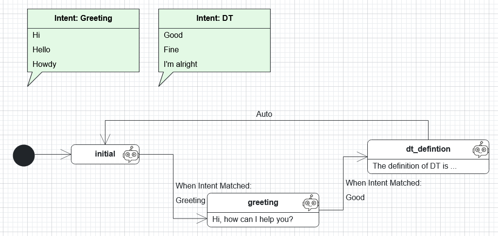
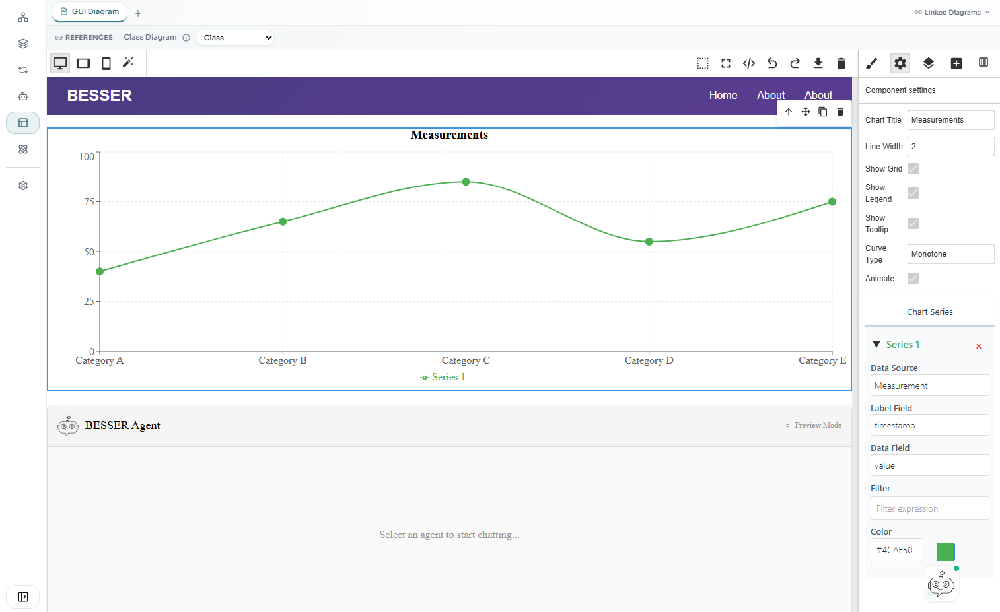
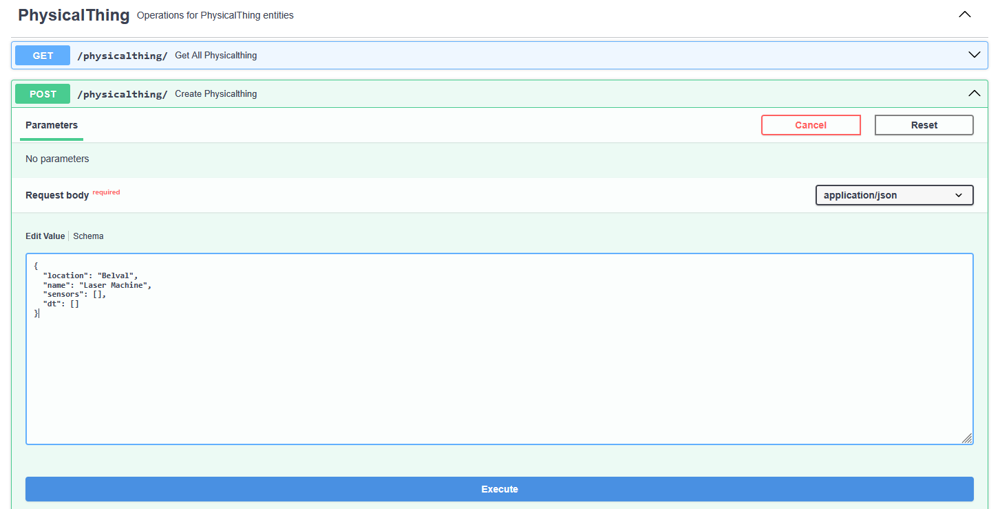
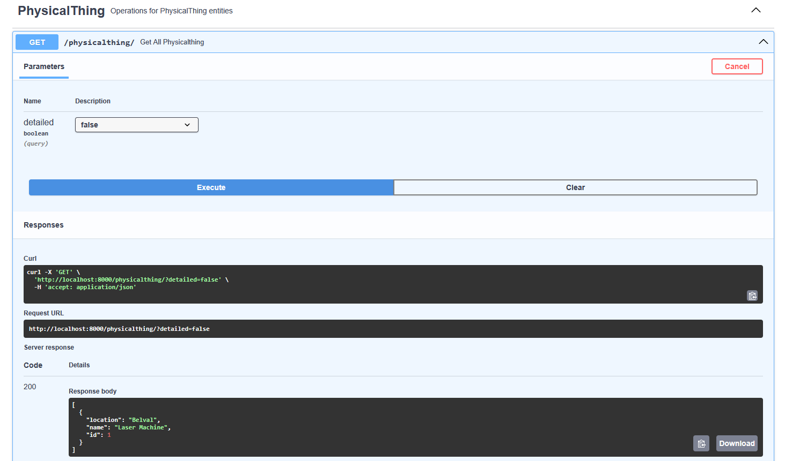

# Lab 2 – Building a Full Application with the BESSER Web Modeling Editor

## 1. Introduction
In this lab, you will use the [**BESSER Web Modeling Editor**](https://editor.besser-pearl.org/) to model and generate a complete web application.

The exercise covers:

- Creating a new BESSER project
- Modeling a simple domain using a **Class Diagram**
- Defining an agent (Chatbot)
- Creating a user interface with the **No-Code UI Editor**
- Generating and deploying the application
- Populating the database using the provided **FastAPI endpoints**
- Viewing and testing the final web application

This lab will give students hands-on experience with modeling, generation, and deployment using BESSER’s low-code capabilities.

---

## 2. Prerequisites

Before starting, ensure that you have:

- Access to the BESSER Web Modeling Editor:  
  https://editor.besser-pearl.org/
- A modern web browser (Chrome, Firefox, Edge)
- Basic understanding of class diagrams and state machines

---

## 3. Creating a New Project

1. Open the BESSER Web Modeling Editor:  
   https://editor.besser-pearl.org/
2. Create a new project by selecting **File → New Project** from the menu.
3. Name the project, e.g., `digital_twins_lab`, fill in the **Owner** and **Description** fields and click on **Create Project**.

When you create a new BESSER project, it automatically includes the following models:

- **Class Diagram**: Model the structure of your domain with classes and relationships.
- **Object Diagram**: Visualize example instances of your classes and their links.
- **State Machine Diagram**: Define dynamic behavior for system components.
- **Agent Diagram**: Model agents using a State Machine extension.
- **Graphical UI Editor**: Design user interfaces with a no-code, drag-and-drop editor.

These components provide a comprehensive starting point for modeling, behavior specification, and UI design in your application. Throughout this lab, you will create a class diagram, define an agent, and build a GUI to interact with your data, after generate and deploy a web app.

---

## 4. Modeling the Domain with a Class Diagram

### 4.1 Goal of the Model  
You will create a simple domain model based on a **digital twin scenario**.

A **digital twin** (DT) is a virtual copy of a real-world object, system, or process. It uses data from sensors and other sources to create a digital model that behaves like the real thing. This allows people to monitor, analyze, and test changes in the digital version before making decisions about the physical one. DTs are often used to improve performance, predict problems, and make better choices in areas like manufacturing, healthcare, and smart cities.

Our minimal DT class diagram will contain the following concepts:

- **PhysicalThing**: represents the real-world asset  
  - attributes: `name`, `location`

- **DigitalTwin**: virtual representation of the physical asset  
  - attributes: `status`, `lastSync`

- **Sensor**: a sensor attached to the physical thing  
  - attributes: `type`, `unit`

- **Measurement**: stores sensor-generated readings  
  - attributes: `timestamp`, `value`

Feel free to adapt or extend the scenario.

### 4.2 Steps

1. Open the **Class Diagram Editor** in BESSER.
2. Define the classes, attributes and relationships (and reason about the cardinalities of the relationship ends). For example, a **PhysicalThing** can have zero or many **Sensor**s, so the cardinality is [1..1] --- [0..*].
3. Validate the diagram by selecting the **Quality Check** menu. This option checks the syntactic correctness of the diagram. Semantic correctness (ensuring the model reflects the intended domain meaning) must still be reviewed manually, so take a moment to verify that your classes, attributes, and relationships accurately represent the scenario.

**Tip:** Before creating your class diagram, you can explore an example template:  
**File → Load Template → Library** — this contains a small diagram with classes, attributes and realtionships.

---

# 5. Creating an Agent

## 5.1 Goal

In this section you will create a simple chatbot agent.  
In BESSER, you can define agents powered by the [BESSER Agentic Framework](https://besser-agentic-framework.readthedocs.io/latest/). The agents in BESSER are modeled using a State Machine extension language, where you define states, transitions, and intents. States can be powered by LLMs, but for this lab guide, we are going to create an agent with fixed plain-string responses for each state.

You will build a small Digital Twin Assistant Bot that answers basic questions about digital twins, sensors, and measurements. The bot does not query the database; it only returns predefined messages. The aim is to learn how to model agents with states, transitions and intents.

**Tip:** Before creating your own agent, you can explore an example template:  
**File → Load Template → Greetings Agent** — this contains a short agent with states, transitions and intents.

---

## 5.2 Requirements and Steps

To complete this lab, you will create a chatbot agent that follows a hand-crafted state machine. Your agent must include at least **7 states**, including:

- **1 initial state**
- **At least 6 interactive states**
- **Several intents and transitions**

Each state must define a **fixed plain-string response**, and transitions must be triggered by simple intents (keywords or short sentences), such as `help`, `sensor`, `measurement`, `back`, or `exit`. You can also define
Bot Fallback Actions for each state, to define a default response if the user answer doen't fit the intents.

The following could be a starting point to build your agent.

<div align="center">
  
</div>


---

## 6. Creating the User Interface with the No-Code Editor

### 6.1 Goal  
Build a basic GUI with several pages, graphs, tables, and other UI elements. This GUI will later be used by a code generator to produce a full web application.

### 6.2 Steps

1. Open the **Graphical UI** modeling from the lateral panel in the WME.
2. Explore the no-code editor. You can find a description on how to use this editor in [the besser documentation] (https://besser.readthedocs.io/en/latest/web_modeling_editor/diagram%20types/gui_diagram.html)
3. Create the GUI adding pages and different widgets/elements. You should include in one of the pages at least:
   - One table element to list the sensors
   - One line chart graph to see the measurements
   - The agent (chatbot) you have modeled before

The following is a proposed design, but feel free to customize anything you want.

<div align="center">
  
</div>

**Tip:** Some UI elements can bind to data from the concepts defined in the class diagram. Make sure that elements like charts or tables correctly reference the intended classes and attributes by adjusting their component settings.

---

## 7. Generating and Deploying the Web Application

### 7.1 Generating the App

BESSER provides a set of [code generators](https://besser.readthedocs.io/en/latest/generators.html) for different technologies. Each code generator takes one or more models as input to produce code for a target technology. In this lab guide, we are going to use the [generator to produce a full web app](https://besser.readthedocs.io/en/latest/generators/full_web_app.html) for the following technologies:

- **Backend:** A FastAPI application with SQLAlchemy models, REST endpoints, and SQLite database integration.
- **Frontend:** A React application implementing your GUI design, with dynamic forms, charts, lists, and more.
- **Deployment:** Dockerfiles for both the backend and frontend, plus a Docker Compose file for easy containerized deployment.

To generate the code, after defining your class diagram, Agent, and GUI, click on the **Generate → Web Application** menu. The code will be downloaded as a ZIP file. Open it and explore the generated code.

### 7.2 Deploying the App

To deploy the generated web application using Docker Compose, follow these steps:

1. Extract the ZIP file containing the generated code.
2. Open a terminal and navigate to the root folder of the extracted project (where the `docker-compose.yml` file is located).
3. Build and start the containers by running:

```bash
docker-compose up --build
```
4. Wait until all containers are running (it could take some minutes). You should see logs indicating that both the backend and frontend services have started successfully.
5. Open your web browser and navigate to the URL specified in the logs (typically http://localhost:3000 for the frontend).

You will probably not see any data in the tables and charts because the database is empty.

---

## 8. Populating the Database Using FASTAPI

The code generator produce an API REST with FastAPI with endpoints to apply CRUD operations over the entities or classes defined in your class diagram. For example, in our DT scenario, CRUD endpoints for *Measurement*, *Sensor*, *PhysicalThing*, and *DigitalTwin* will be available.

Additionally, you will be able to access the Swager interface generated to use the REST API directly, and populate the database, or test. For example, to create a *PhysicalThing* register, you can follow this steps

1. Open the url `http://127.0.0.1:8000/docs` (Swagger UI)
2. Click on the **POST /physicalthing/** endpoint, the **Try it out** and fill the JSON Object:

<div align="center">
  
</div>

**note:** Note that *sensors* and *dt* are empty, because in our class diagram, we defined a cardinality of [0..*] for both relationships, meaning that a PhysicalThing can have zero or many *Sensor*s / *DT*s. When you populate the database, be careful of cardinalities defined in your class diagram.

3. Verify the inserted data using now the **GET /physicalthing/** endpoints. You should get a response similar to this:

<div align="center">
  
</div>

Now, fill in the database. Create at least one *DigitalTwin* for the *PhysicalThing*, one *Sensor*, and several *Measurements*.

Then reload your web page (frontend) at `http://127.0.0.1:3000`, and the data should be reflected in your charts and tables.

## 10. Additional Resources

- BESSER Web Modeling Editor  
  https://editor.besser-pearl.org/

- BESSER Documentation  
  https://besser.readthedocs.io/en/latest/

- BESSER GitHub Repository  
  https://github.com/BESSER-PEARL/BESSER

---
