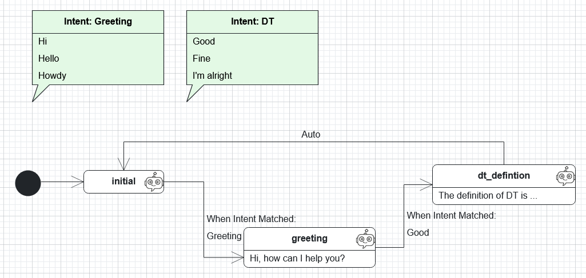
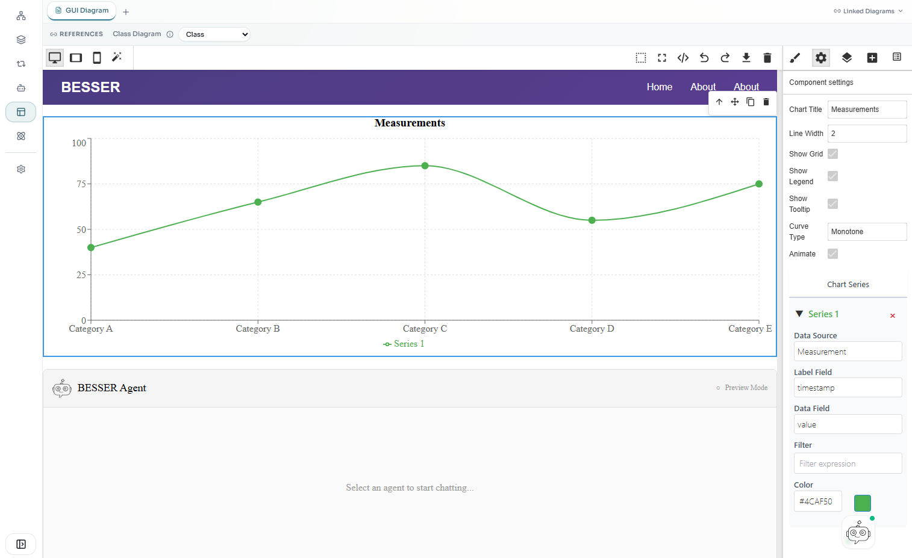
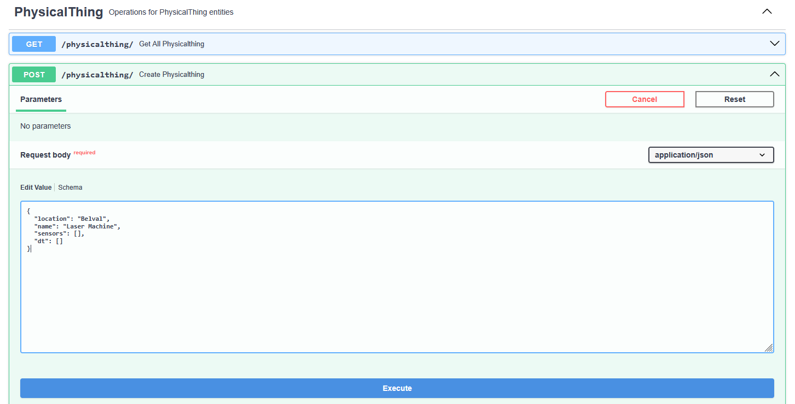
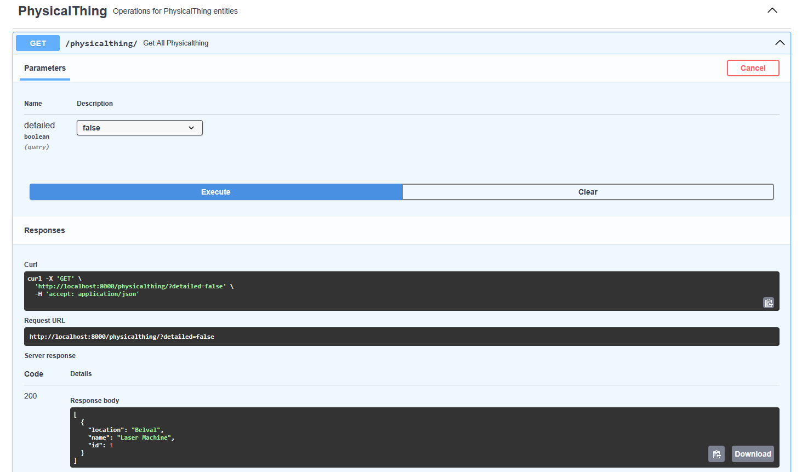

# Lab 2 — Building a Full Application with the BESSER WME

## At a glance

- **You'll learn:** How to model a domain, design a chatbot agent, build a no-code UI, generate a full web app, and deploy it with Docker.
- **You'll produce:** A running full-stack web application (FastAPI + React + SQLite) for a digital-twin scenario, populated via the generated REST API.
- **You'll need first:** [Lab 1 — BESSER Basics](../lab1_besser_basics/README.md) for the B-UML fundamentals.

---

## Prerequisites

- A modern web browser (Chrome, Firefox, Edge)
- [Docker Desktop](https://www.docker.com/products/docker-desktop/) with `docker compose` support
- Access to the [BESSER Web Modeling Editor](https://editor.besser-pearl.org/)
- Familiarity with class diagrams and state machines

---

## 1. Context

In this lab, you will use the [BESSER Web Modeling Editor (WME)](https://editor.besser-pearl.org/) to model and generate a complete web application end-to-end — from class diagram to deployed Docker stack.

The exercise covers:

- Creating a new BESSER project
- Modeling a simple domain with a **class diagram**
- Defining a chatbot agent
- Building a user interface with the **no-code UI editor**
- Generating and deploying the application
- Populating the database using the generated **FastAPI endpoints**

By the end, you will have experienced BESSER's low-code workflow: define models → generate code → deploy → interact.

---

## 2. Scenario

You will build a small application around a **digital twin** (DT) — a virtual copy of a real-world object, system, or process that uses data from sensors to monitor, analyze, and test changes in the digital version before making decisions about the physical one.

The minimal DT class diagram will contain four concepts:

| Class | Attributes |
|---|---|
| `PhysicalThing` | `name`, `location` |
| `DigitalTwin` | `status`, `lastSync` |
| `Sensor` | `type`, `unit` |
| `Measurement` | `timestamp`, `value` |

Feel free to adapt or extend the scenario.

---

## 3. Walkthrough

### 3.1 Create a new project

1. Open the [BESSER Web Modeling Editor](https://editor.besser-pearl.org/).
2. Select **File → New Project**.
3. Name it (e.g. `digital_twins_lab`), fill in the **Owner** and **Description** fields, and click **Create Project**.

A new BESSER project automatically ships with several model perspectives:

- **Class Diagram** — domain structure (classes and relationships)
- **Object Diagram** — example instances
- **State Machine Diagram** — dynamic behavior
- **Agent Diagram** — chatbots built as state machines
- **Graphical UI Editor** — no-code drag-and-drop UI design

You will use the class diagram, agent diagram, and GUI editor in this lab.

### 3.2 Model the domain

1. Open the **Class Diagram Editor**.
2. Define the four classes from section 2, their attributes, and the relationships between them. Think about cardinalities: e.g. a `PhysicalThing` can have zero or many `Sensor`s → `[1..1] — [0..*]`.
3. Click **Quality Check** to validate the syntactic correctness. Semantic correctness — whether the model reflects the intended domain — is still up to you to review.

> **Tip:** Explore an existing example first via **File → Load Template → Library**.

### 3.3 Design the chatbot agent

In BESSER, agents are defined using a state machine extension powered by the [BESSER Agentic Framework](https://besser-agentic-framework.readthedocs.io/latest/). States can be powered by LLMs, but for this lab you will use **fixed plain-string responses**.

You will build a small **Digital Twin Assistant Bot** that answers basic questions about digital twins, sensors, and measurements. The bot does not query the database; it only returns predefined messages.

Your agent must include at least **7 states**:

- **1 initial state**
- **At least 6 interactive states**
- Several intents and transitions

Each interactive state defines a fixed string response. Transitions are triggered by simple keyword intents (`help`, `sensor`, `measurement`, `back`, `exit`). Each state can also define **Bot Fallback Actions** — default responses when the user input does not match any intent.

> **Tip:** See **File → Load Template → Greetings Agent** for a minimal example.

<div align="center">
  
</div>

### 3.4 Build the GUI with the no-code editor

1. Open the **Graphical UI** perspective from the left-side panel.
2. Explore the no-code editor ([docs](https://besser.readthedocs.io/en/latest/web_modeling_editor/diagram%20types/gui_diagram.html)).
3. Create at least one page that contains:
   - A **table** listing the sensors
   - A **line chart** showing the measurements
   - The **agent (chatbot)** you modeled in section 3.3

<div align="center">
  
</div>

> **Tip:** UI elements can bind to data from classes in the class diagram. Check the component settings to make sure charts/tables correctly reference the intended classes and attributes.

### 3.5 Generate the web application

BESSER provides a [Full Web App generator](https://besser.readthedocs.io/en/latest/generators/full_web_app.html) that produces:

- **Backend** — FastAPI + SQLAlchemy + SQLite, with REST endpoints
- **Frontend** — React implementing your GUI design
- **Deployment** — Dockerfiles for backend and frontend, plus a Docker Compose file

To generate: click **Generate → Web Application**. The result downloads as a ZIP.

### 3.6 Deploy with Docker Compose

1. Extract the ZIP.
2. Open a terminal in the project root (where `docker-compose.yml` lives).
3. Build and start the containers:

   ```bash
   docker compose up --build
   ```

4. Wait a few minutes until both backend and frontend services log as started.
5. Open http://localhost:3000 in your browser.

At this point the tables and charts will be empty — the database contains no data yet.

### 3.7 Populate the database through Swagger

The generated FastAPI backend exposes a CRUD REST API for every class. Access it via the auto-generated Swagger UI at http://127.0.0.1:8000/docs.

For example, to create a `PhysicalThing`:

1. Open http://127.0.0.1:8000/docs.
2. Click **POST /physicalthing/**, then **Try it out**, and fill in the JSON:

<div align="center">
  
</div>

> **Note:** `sensors` and `dt` are empty in the payload because the class diagram declares `[0..*]` multiplicities on both ends. Respect your own cardinalities when populating the DB.

3. Verify the insert via **GET /physicalthing/**:

<div align="center">
  
</div>

Now create at least one `DigitalTwin`, one `Sensor`, and several `Measurement`s. Reload http://127.0.0.1:3000 and your charts and tables should light up.

---

## 4. Exercises

> **Exercise 4.1 — Extend the agent**
>
> Add a new state to the chatbot that explains what a "digital twin" is. Wire it up with a `definition` intent triggered by the keyword `what is`. Redeploy and test.

> **Exercise 4.2 — Seed data via a script**
>
> Write a small Python script that uses `requests` to hit the Swagger endpoints and seed the database with one `PhysicalThing`, one `DigitalTwin`, 2 `Sensor`s, and 20 `Measurement`s. Keep the script in the project folder so you can rerun it after each deployment.

---

## 5. Troubleshooting

| Symptom | Likely cause | Fix |
|---|---|---|
| `docker compose up --build` fails with "port already in use" | Something else is on 3000 or 8000 | Stop the conflicting service or edit the port mapping in `docker-compose.yml` |
| Frontend shows empty tables forever | DB is empty | Populate via Swagger (section 3.7) and reload |
| Swagger UI 404 | Backend not started yet | Wait ~30s after `docker compose up` and retry |
| `docker-compose: command not found` | Using the legacy v1 CLI | Use `docker compose` (with a space) — v2 is current |
| Agent block in GUI shows no agent to select | Agent not saved or not named | Save the agent diagram, then refresh the GUI editor |

---

## 6. What's next

Head to **[Lab 3 — Developing Code Generators](../lab3_developing_code_generators/README.md)** to learn how to write your own generators on top of BESSER. Or jump to **[Lab 6 — From Modeling to Deployment](../lab6_render_deployment/README.md)** to push this same workflow to the cloud via Render.

---

## Resources

- [BESSER Web Modeling Editor](https://editor.besser-pearl.org/)
- [BESSER documentation](https://besser.readthedocs.io/en/latest/)
- [Full Web App generator docs](https://besser.readthedocs.io/en/latest/generators/full_web_app.html)
- [BESSER GitHub](https://github.com/BESSER-PEARL/BESSER)
