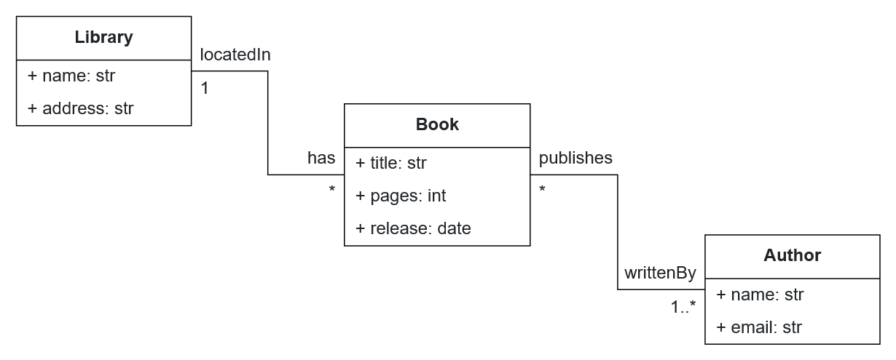

# Lab Guide 3: Create your code generator with BESSER

## Welcome to our BESSER lab guide!

In this guide, you will learn to use [BESSER](https://github.com/BESSER-PEARL/BESSER.git) from the perspective of a developer user, specifically for developing a code generator.

## 1. Context

BESSER provides the B-UML modeling language for creating different types of models. In this case, we will develop a code generator that takes as input a structural model defined with B-UML and generates Ruby on Rails code representing the models, i.e., the classes and attributes in the Ruby language.

Ruby on Rails follows the Model-View-Controller (MVC) architectural pattern. In this lab, we focus on the **Model** component, which represents the data and business logic of the application.

<div align="center">
  
</div>

To create the code generator, you can utilize the interface provided by BESSER and define a Jinja template for code generation. You can find more information about this in the [BESSER documentation](https://besser.readthedocs.io/en/latest/generators.html). The documentation provides details about BESSER's code generation capabilities, including how to create custom generators and work with Jinja templates.

## 2. Requirements

For this lab guide, the [BESSER basic installation](https://besser.readthedocs.io/en/latest/installation.html#) is sufficient.

## 3. Creating your Code Generator in BESSER

To define a code generator, you should create a class (e.g., *RailsGenerator*) that implements the ``GeneratorInterface``. This ensures that all BESSER generators follow a consistent structure. 

An example can be found in the [rails_generator.py](rails_generator.py) script. You can reuse this script for the purposes of this guide. In the code, the constructor of the `RailsGenerator` class receives a *DomainModel* (or B-UML structural model) as an input parameter, while the ``generate()`` method handles the code generation. Note that the ``rails_template.py.j2`` template is used for code generation, and we need to develop this template.

Download the [rails_generator.py](rails_generator.py) file, and let's create the Jinja template.

## 4. Jinja template example

Now that we have defined our `RailsGenerator` class, we can create the template that will structure the generated code.

### What is a Jinja Template?

[Jinja](https://jinja.palletsprojects.com/en/stable/) is a templating engine for Python that allows us to dynamically generate text-based content, such as HTML, configuration files, and in our case, Ruby code.

A Jinja template contains placeholders and control structures (e.g., loops and conditionals) that are later replaced with actual data when rendered. This makes it an ideal tool for generating code based on a model, such as our B-UML model.

### Creating a Jinja Template

Create a file named `templates/rails_template.py.j2` and add the following code:

```jinja2
This is a template example to list the name of the classes


    class {{ class.name }} < ApplicationRecord
    end

```

This template will generate a basic class declaration for each class in our B-UML model, using a for loop.

### Testing the Code Generator

Now that we have defined our Jinja template, let's test the code generator by applying it to a sample B-UML model.

We will start by defining the library model with its classes (*Library*, *Book*, and *Author*), and then use the generator to produce the corresponding Ruby code. Execute the following Python code, and check the output folder for the generated code:

```python
from besser.BUML.metamodel.structural import DomainModel, Class, Property, \
    Multiplicity, BinaryAssociation, StringType, IntegerType, DateTimeType
from rails_generator import RailsGenerator

############################
#   BUML model definition  #
############################

# Library attributes definition
library_name: Property = Property(name="name", type=StringType)
address: Property = Property(name="address", type=StringType)
# Library class definition
library: Class = Class(name="Library", attributes={library_name, address})

# Book attributes definition
title: Property = Property(name="title", type=StringType)
pages: Property = Property(name="pages", type=IntegerType)
release: Property = Property(name="release", type=DateTimeType)
# Book class definition
book: Class = Class(name="Book", attributes={title, pages, release})

# Author attributes definition
author_name: Property = Property(name="name", type=StringType)
email: Property = Property(name="email", type=StringType)
# Author class definition
author: Class = Class(name="Author", attributes={author_name, email})

# Library-Book association definition
located_in: Property = Property(name="locatedIn", type=library, multiplicity=Multiplicity(1, 1))
has: Property = Property(name="has", type=book, multiplicity=Multiplicity(0, "*"))
lib_book_association: BinaryAssociation = BinaryAssociation(name="lib_book_assoc", ends={located_in, has})

# Book-Author association definition
publishes: Property = Property(name="publishes", type=book, multiplicity=Multiplicity(0, "*"))
writed_by: Property = Property(name="writtenBy", type=author, multiplicity=Multiplicity(1, "*"))
book_author_association: BinaryAssociation = BinaryAssociation(name="book_author_assoc", ends={writed_by, publishes})

# Domain model definition
library_model: DomainModel = DomainModel(name="Library model", types={library, book, author},
                                        associations={lib_book_association, book_author_association})

############################
#      Code Generation     #
############################

generator: RailsGenerator = RailsGenerator(model=library_model)
generator.generate()
```

The B-UML model defined in the previous code (Library model) corresponds to the diagram in the next figure. Therefore, by running the above code, you should obtain a file containing the names of the three classes (*Library*, *Book*, and *Author*) as output.

<div align="center">
  
</div>


## 5. Exercise

Modify the `rails_template.py.j2` to build a Ruby on Rails code generator. In other words, your code generator should produce a set of classes in the Ruby language with their respective associations, validations, etc. For example, when providing a model like the one in the [previous figure](figs/library_model.png), your code generator should produce a file containing the following code:

```ruby
class Library < ApplicationRecord
  has_many :books
end

class Book < ApplicationRecord
  belongs_to :library
  has_and_belongs_to_many :authors
end

class Author < ApplicationRecord
  has_and_belongs_to_many :books
end
```
