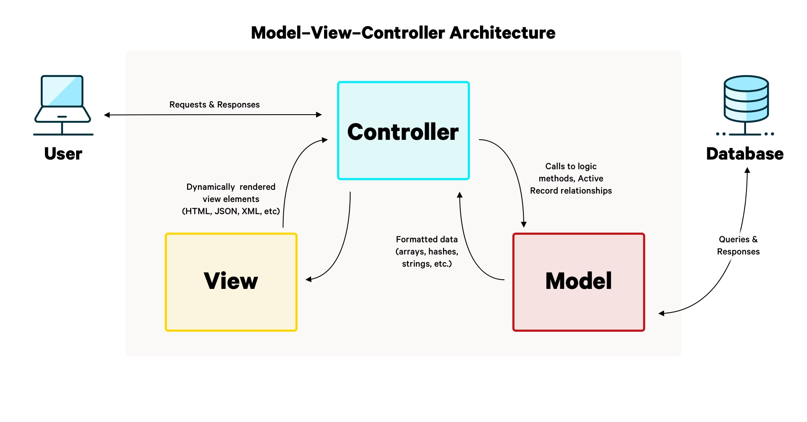
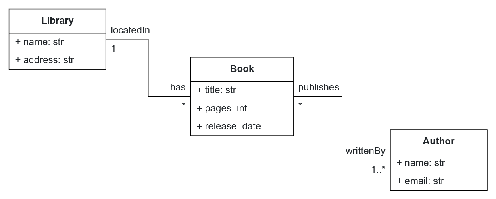

# Lab 3 — Developing a Code Generator

## At a glance

- **You'll learn:** How BESSER's code generators are structured, how to subclass `GeneratorInterface`, and how to drive model-to-text transformations with Jinja2 templates.
- **You'll produce:** A custom **Ruby on Rails** generator that turns any B-UML structural model into idiomatic Rails `ApplicationRecord` classes with associations.
- **You'll need first:** [Lab 1 — BESSER Basics](../lab1_besser_basics/README.md) for the B-UML fundamentals.

---

## Prerequisites

- **Python** 3.11+ with `besser[all]` installed
- Basic understanding of [Jinja2](https://jinja.palletsprojects.com/en/stable/) templating
- Exposure to Ruby on Rails syntax is helpful but not required
- [Lab 1](../lab1_besser_basics/README.md) completed

---

## 1. Context

In this lab, you will take on the perspective of a **BESSER developer**: instead of consuming the built-in generators, you will write a new one.

BESSER's **B-UML** modeling language lets you define structural models. A **code generator** is a model-to-text transformation that reads a B-UML model and produces source code in a target language. This lab produces Ruby on Rails code — specifically the **Model** layer in the MVC architecture, which represents data and business logic.

<div align="center">
  
</div>

BESSER generators share a consistent structure: they subclass `GeneratorInterface`, receive a `DomainModel` as input, and use Jinja2 templates to render output. See the [BESSER generator documentation](https://besser.readthedocs.io/en/latest/generators.html) for the full picture.

---

## 2. Scenario

You will write a `RailsGenerator` class that consumes a B-UML model and produces a Ruby file defining one `ActiveRecord` class per model class, with the appropriate `has_many` / `belongs_to` / `has_and_belongs_to_many` associations.

For the classic library domain:

<div align="center">
  
</div>

Expected output (`models.rb`):

```ruby
class Library < ApplicationRecord
  has_many :books
end

class Book < ApplicationRecord
  belongs_to :library
  has_and_belongs_to_many :authors
end

class Author < ApplicationRecord
  has_and_belongs_to_many :books
end
```

---

## 3. Walkthrough

### 3.1 Understand the generator skeleton

A code generator subclasses `GeneratorInterface` and implements two methods:

- `__init__(self, model: DomainModel, output_dir: str = None)` — call `super().__init__()` to wire the model and output dir
- `generate(self)` — read `self.model`, render a Jinja template, write the result to disk

The file [`rails_generator.py`](rails_generator.py) already provides this skeleton:

```python
from besser.BUML.metamodel.structural import DomainModel
from besser.generators import GeneratorInterface
from jinja2 import Environment, FileSystemLoader
import os

class RailsGenerator(GeneratorInterface):
    def __init__(self, model: DomainModel, output_dir: str = None):
        super().__init__(model, output_dir)

    def generate(self):
        file_path = self.build_generation_path(file_name="models.rb")
        templates_path = os.path.join(os.path.dirname(
            os.path.abspath(__file__)), "templates")
        env = Environment(
            loader=FileSystemLoader(templates_path),
            trim_blocks=True, lstrip_blocks=True,
            extensions=['jinja2.ext.do'],
        )
        template = env.get_template('rails_template.py.j2')
        with open(file_path, mode="w", encoding="utf-8") as f:
            f.write(template.render(model=self.model))
            print("Code generated in the location: " + file_path)
```

Key helpers from `GeneratorInterface`:

- `self.build_generation_path(file_name)` — returns a path under `./output/` (or a custom `output_dir`)
- `self.model` — the `DomainModel` you can iterate in the template

### 3.2 Write a starter Jinja template

Jinja2 is a text templating engine: a template mixes static text with `{{ expression }}` placeholders and `` blocks. Create a file `templates/rails_template.py.j2` with the following minimal content:

```jinja2
This is a template example to list the name of the classes


    class {{ class.name }} < ApplicationRecord
    end

```

This iterates every class in the model and emits one empty Rails class declaration per iteration.

### 3.3 Test the generator

Run the provided [`lab3.py`](lab3.py) script — it builds a sample library B-UML model (`Library` → `Book` → `Author`) and invokes `RailsGenerator`:

```bash
python lab3.py
```

Expected output:

```
Code generated in the location: .../output/models.rb
```

Open `output/models.rb` — you should see three bare `ApplicationRecord` classes, one per model class.

---

## 4. Exercises

> **Exercise 4.1 — Emit associations**
>
> Extend `rails_template.py.j2` so the generator produces real Rails associations matching the library model:
>
> ```ruby
> class Library < ApplicationRecord
>   has_many :books
> end
>
> class Book < ApplicationRecord
>   belongs_to :library
>   has_and_belongs_to_many :authors
> end
>
> class Author < ApplicationRecord
>   has_and_belongs_to_many :books
> end
> ```
>
> Hints:
> - Iterate `class_.associations` inside the class loop
> - Use `end.multiplicity.max` to decide between `belongs_to` / `has_many` / `has_and_belongs_to_many`
> - Remember that each `BinaryAssociation` has exactly two `ends` — one of them is the opposite side

> **Exercise 4.2 — Validations from attributes**
>
> Extend the template to emit Rails `validates` lines for the attributes. For example, a `StringType` attribute could generate `validates :name, presence: true` and a numeric attribute could add `numericality: true`. Decide on your own mapping.

---

## 5. Troubleshooting

| Symptom | Likely cause | Fix |
|---|---|---|
| `TemplateNotFound: rails_template.py.j2` | Template file isn't under `templates/` next to `rails_generator.py` | Create the file at the expected path |
| `AttributeError: 'DomainModel' object has no attribute 'get_classes'` | Old BESSER install | Upgrade with `pip install --upgrade besser[all]` |
| Output file in wrong directory | `output_dir` not set | By default the generator writes to `./output/` — check your current working directory |
| Jinja emits blank lines between classes | `trim_blocks`/`lstrip_blocks` interplay | Adjust whitespace control in the template (``) |

---

## 6. What's next

Head to **[Lab 4 — Metamodeling and Advanced Generators](../lab4_metamodeling_and_code_generators/README.md)** to extend the B-UML metamodel itself and improve existing generators.

---

## Resources

- [BESSER generator documentation](https://besser.readthedocs.io/en/latest/generators.html)
- [Jinja2 documentation](https://jinja.palletsprojects.com/en/stable/)
- [Ruby on Rails Active Record Associations](https://guides.rubyonrails.org/association_basics.html)
- [BESSER GitHub](https://github.com/BESSER-PEARL/BESSER)
