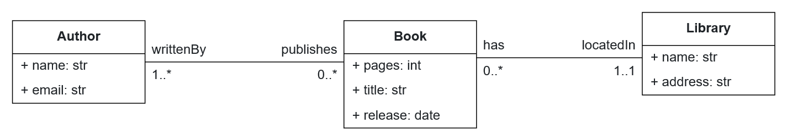
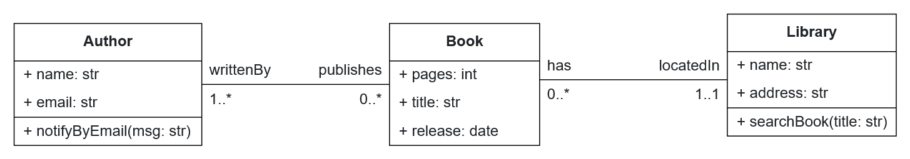

# Lab Guide 3: Metamodel extension and code generator improvements

## Welcome to our BESSER lab guide!

In this guide, you will use [BESSER](https://github.com/BESSER-PEARL/BESSER.git) from the perspective of a developer user. Specifically you will extend the B-UML metamodel and improve some code generators.

## 1. Context

BESSER provides the B-UML modeling language for creating different [types of models](https://besser.readthedocs.io/en/latest/buml_language/model_types.html) including structural, object, deployment, graphical user interface, etc. These models help define various aspects of a system's architecture and behavior.

However, when developing complex systems, new requirements may arise that go beyond the predefined elements of B-UML. For instance, you might need to specify additional features, new attributes, constraints, relationships, or behaviors that are not currently supported by the existing metamodel.

In such cases, extending the BESSER metamodel becomes necessary. By adding new concepts or refining existing ones, you can customize B-UML to better represent the details and specific needs of your system or domain.

In this guide, we will focus on:

- Extending the [Structural model](https://besser.readthedocs.io/en/latest/buml_language/model_types/structural.html) in B-UML to incorporate additional specifications.

- Improving existing code generation templates to produce richer and more detailed outputs based on the extended metamodel.

The structural model serves as the foundation for defining the static structure of an application or system. You can explore its [metamodel in the BESSER documentation](https://besser.readthedocs.io/en/latest/buml_language/model_types/structural.html), while its implementation in Python is available in the [BESSER repository](https://github.com/BESSER-PEARL/BESSER/blob/master/besser/BUML/metamodel/structural/structural.py).

## 2. Requirements

For this lab guide, [running BESSER locally](https://besser.readthedocs.io/en/latest/installation.html#running-besser-locally) is necessary as we will modify the soure code.

## 3. Code Generators to Improve

BESSER's code generators use [Jinja](https://jinja.palletsprojects.com/en/stable/), a templating engine for Python, used to dynamically generate HTML or other text-based formats by embedding logic within template files. Each generator in BESSER contains at least one jinja template, which traverses the B-UML model to generate code dinamically.

Low-code platforms can generate up to 80% of an application’s code. However, these generators can often be improved or extended to support additional specifications.

Let's explore two possible improvements.

### 3.1 SQLAlchemy Generator

BESSER provides a [code generator that creates SQLAlchemy models](https://besser.readthedocs.io/en/latest/generators/alchemy.html#) to define the structure of a relational database.

Let's consider the following basic model, where a *Library* can has several *Book*s, and a *Book* is written by at least one *Author*.

<div align="center">
  
</div>

The SQLAlchemy generator currently does not support unique fields. For example, if we want to specify that the book title should be unique (but not necessarily a ForeignKey), the current generator does not allow this.

To address this limitation, we need to extend the Structural metamodel of B-UML, to enable the definition of unique attributes in a class. And then, modify the jinja templates to produce the SQLAlchemy code covering unique fields.

> ### **Exercise:**
>
> Address the limitation above in the SQLAlchemy generator, following the next recomendations:
> - Update the code of the structural metamodel of B-UML, to include a new parameter in the *Property* class to capture the *is_unique* information. This metamodel is defined in the file *besser/BUML/metamodel/structural/structural.py*
> - Check the [SQLAlchemy documentation](https://docs.sqlalchemy.org/en/20/core/constraints.html) to identify how to define unique fields in a table.
> - Update the jinja template of the SQLAlchemy Generator to address the uniqueness of fields. The templates and the generator code are located in the directory *besser/generators/sql_alchemy*

### 3.2 Java Generator

BESSER also provides a [code generator for Java](https://besser.readthedocs.io/en/latest/generators/java.html). This generator produces a Java domain model based on a structural model to create *Classes*, *constructors*, *getters*, and *setters* methods. You can test the code generator output by using the Library example in the [Web Modeling Editor](https://editor.besser-pearl.org/): Navigate to *File -> Start from Template -> Library*, and select *Generate Code -> OPP -> Java Classes*.

Currently, the Java generator does not support class methods generation. For example, suppose your model includes new methods such as `searchBook`, and `notifyByEmail`, as shown below.

<div align="center">
  
</div>

However, the current version of the Java code generator does not process these methods, meaning they will not appear in the generated code.

> ### **Exercise:**
>
> Modify the Java generator to include method generation by following these recommendations:
> - The B-UML structural metamodel already supports method definitions, so it's not necesary to modify or extend it.
> - Modify the jinja templates to address the methods generation. The templates and the generator code are located in the directory *besser/generators/java_classes*
> - Below is a sample of the code that the generator should produce for the `searchBook` method in the *Library* class.

```java
public void searchBook(String title) {
    // Method implementation goes here
}
```
