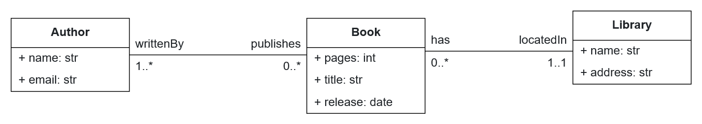
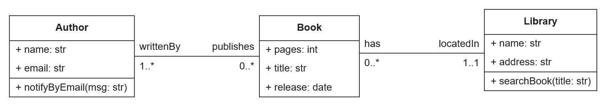

# Lab 4 — Metamodeling and Advanced Generators

## At a glance

- **You'll learn:** How to extend the B-UML **structural metamodel** to introduce new modeling concepts, and how to update existing code generators to consume them.
- **You'll produce:** A patched BESSER install where `Property` carries an `is_unique` flag, the SQLAlchemy generator emits unique constraints, and the Java generator emits class methods.
- **You'll need first:** [Lab 3 — Developing Code Generators](../lab3_developing_code_generators/README.md) for Jinja/generator fundamentals.

---

## Prerequisites

- **Python** 3.11+
- A **local dev install** of BESSER — you will modify BESSER's own source files, so `pip install besser` is not enough:
  ```bash
  git clone https://github.com/BESSER-PEARL/BESSER.git
  cd BESSER
  pip install -e ".[all]"
  ```
- [Lab 3](../lab3_developing_code_generators/README.md) completed (Jinja + `GeneratorInterface`)
- Basic Java and SQLAlchemy knowledge

---

## 1. Context

BESSER ships with a rich [B-UML metamodel](https://besser.readthedocs.io/en/latest/buml_language/model_types.html) covering structural, object, deployment, GUI, and other model types. These cover most use cases, but when you build complex systems you inevitably hit features that **aren't yet modeled** — new attributes, constraints, relationships, or behaviors.

When that happens, you **extend the metamodel**. This lab walks you through two representative extensions:

1. Adding a new property attribute to the **structural metamodel**
2. Propagating a metamodel feature that already exists into a generator that currently ignores it

Both exercises require you to run BESSER from source so your changes take effect.

The structural metamodel is the foundation of every B-UML model. Browse its implementation at [`besser/BUML/metamodel/structural/structural.py`](https://github.com/BESSER-PEARL/BESSER/blob/master/besser/BUML/metamodel/structural/structural.py).

---

## 2. Walkthrough

BESSER's generators use [Jinja2](https://jinja.palletsprojects.com/en/stable/) templates to walk a B-UML model and render target code. Each built-in generator lives in `besser/generators/<tech>/` and contains:

- `<tech>_generator.py` — the `GeneratorInterface` subclass
- `templates/` — the Jinja templates

Low-code platforms can generate up to 80% of an application's code out of the box — but there is always a last 20% where the generator has to be extended. This lab targets two such gaps.

---

## 3. Exercises

### Exercise 3.1 — Add unique-field support to SQLAlchemy

**Problem.** BESSER provides a [SQLAlchemy generator](https://besser.readthedocs.io/en/latest/generators/alchemy.html#) that produces relational models. It does not currently support **unique** columns — you cannot declare that, say, a book's title must be unique (without being a foreign key).

<div align="center">
  
</div>

**Your tasks**

1. **Extend the metamodel.** Open `besser/BUML/metamodel/structural/structural.py`. Add a new boolean parameter `is_unique` to the `Property` class (constructor, getter, setter). Default to `False`.

2. **Wire it through `DomainModel` serialization** if the project has a B-UML JSON/PlantUML converter that currently doesn't round-trip your new flag. (Optional — only if you care about reading/writing files.)

3. **Update the SQLAlchemy template.** The generator templates live in `besser/generators/sql_alchemy/templates/`. Modify the Jinja so that `Column_(..., unique=True)` is emitted when `property.is_unique` is true. The [SQLAlchemy unique constraint docs](https://docs.sqlalchemy.org/en/20/core/constraints.html) show the expected output syntax.

4. **Smoke test.** Build a small B-UML model programmatically that marks an attribute as unique and run `SQLAlchemyGenerator(...).generate()`. Inspect the generated `output/sql_alchemy.py` and confirm your new `unique=True` argument is present.

**Acceptance criteria**

- `Property(name="isbn", type=StringType, is_unique=True)` is accepted by the metamodel without error
- The generated SQLAlchemy column declaration contains `unique=True`
- Inserting a duplicate into the generated SQLite database raises an `IntegrityError`

---

### Exercise 3.2 — Add method generation to the Java generator

**Problem.** BESSER's [Java generator](https://besser.readthedocs.io/en/latest/generators/java.html) produces classes, fields, constructors, getters, and setters — but **not class methods**. Any operation you define on a class in B-UML is silently dropped at generation time.

**Your tasks**

1. **Confirm the gap.** Model the library example in the [Web Modeling Editor](https://editor.besser-pearl.org/) with an extra method, for example `searchBook(title: String)` on `Library` and `notifyByEmail()` on `Author`. Generate Java via **Generate Code → OOP → Java Classes** and verify the methods are missing.

    <div align="center">
      
    </div>

2. **Good news: the metamodel already supports methods.** B-UML's `Class.methods` is already populated — you don't need to change `structural.py`. The gap is purely in the generator template.

3. **Update the Java template.** In `besser/generators/java_classes/templates/java_template.py.j2`, add a loop over `class_obj.methods` that emits each method signature and an empty body. Target output for `searchBook`:

    ```java
    public void searchBook(String title) {
        // Method implementation goes here
    }
    ```

    Map B-UML types to Java types the same way the template already does for fields (see `java_fields.py.j2`). Loop over `method.parameters` to produce the argument list.

4. **Smoke test.** Regenerate and confirm both `searchBook` and `notifyByEmail` now appear in the Java output with the correct signatures.

**Acceptance criteria**

- The generated Java class contains one method per B-UML method
- Parameter types are mapped to idiomatic Java types
- Return type reflects the method's declared return type (default `void` when unset)

---

## 4. Troubleshooting

| Symptom | Likely cause | Fix |
|---|---|---|
| Your metamodel changes don't seem to take effect | You have a pip-installed `besser` shadowing your clone | Uninstall with `pip uninstall besser` and reinstall editable: `pip install -e ".[all]"` from your clone |
| `TypeError: Property.__init__() got an unexpected keyword argument 'is_unique'` | Editing the wrong file (or a stale `.pyc` cache) | Delete `__pycache__` in `besser/BUML/metamodel/structural/` and re-run |
| SQLAlchemy reserved-name validation fails | Class or attribute named `Base`, `Enum`, `List`, `Table`, `Column`, etc. | Rename — BESSER 7.1.0+ blocks these to avoid SQLAlchemy symbol collisions |
| Java template error: `'Class' has no attribute 'methods'` | Using an older BESSER checkout | Update to current `master` |
| Generated tests fail on your local branch | You skipped running BESSER's own test suite | Run `pytest besser/tests` before submitting a patch upstream |

---

## 5. What's next

Head to **[Lab 5 — BESSER Agentic Framework](../lab5_besser_agentic_framework/README.md)** to shift from modeling + generating to building intelligent agents with BAF. If you are happy with your metamodel extensions, consider opening a PR against [BESSER-PEARL/BESSER](https://github.com/BESSER-PEARL/BESSER) — contributions are welcome.

---

## Resources

- [B-UML model types](https://besser.readthedocs.io/en/latest/buml_language/model_types.html)
- [Structural metamodel](https://besser.readthedocs.io/en/latest/buml_language/model_types/structural.html)
- [BESSER source on GitHub](https://github.com/BESSER-PEARL/BESSER)
- [SQLAlchemy generator docs](https://besser.readthedocs.io/en/latest/generators/alchemy.html#)
- [Java generator docs](https://besser.readthedocs.io/en/latest/generators/java.html)
- [SQLAlchemy constraints reference](https://docs.sqlalchemy.org/en/20/core/constraints.html)
