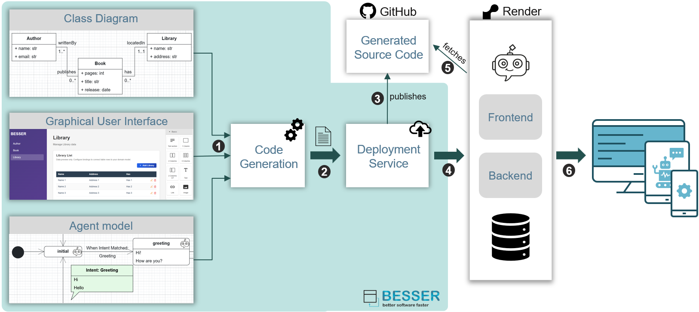
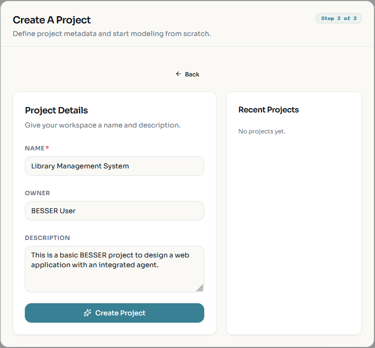
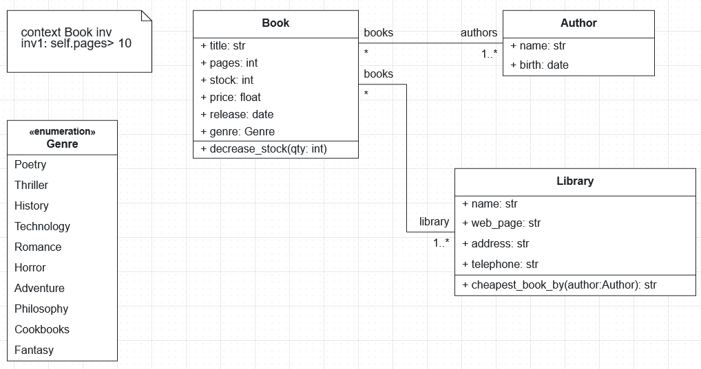
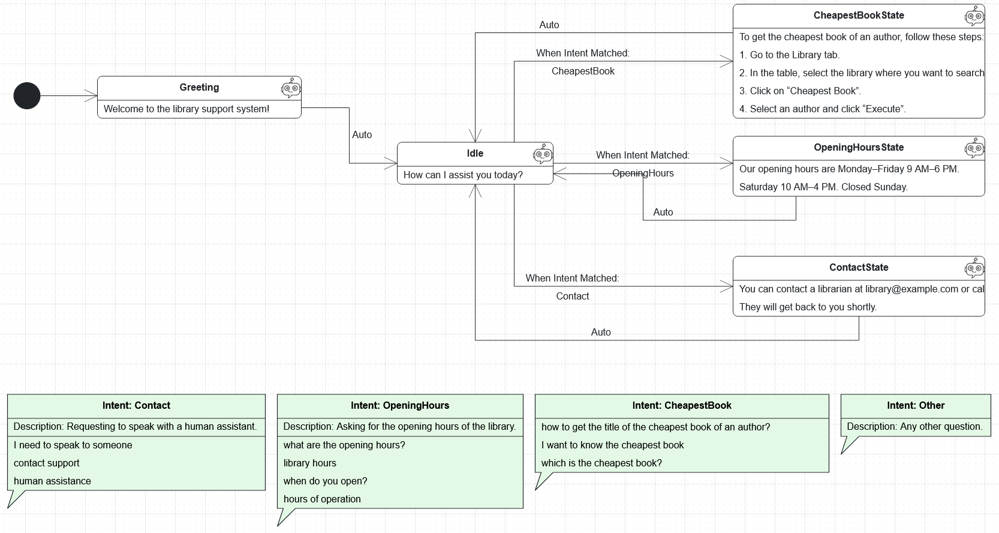
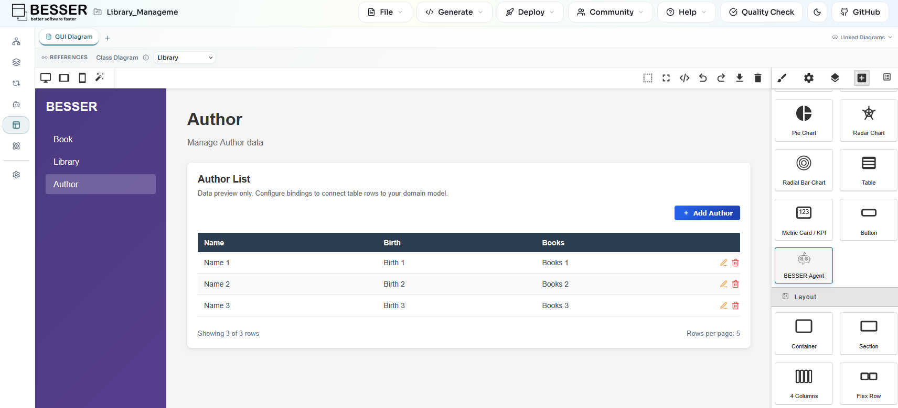
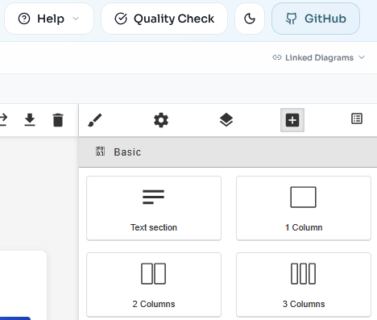
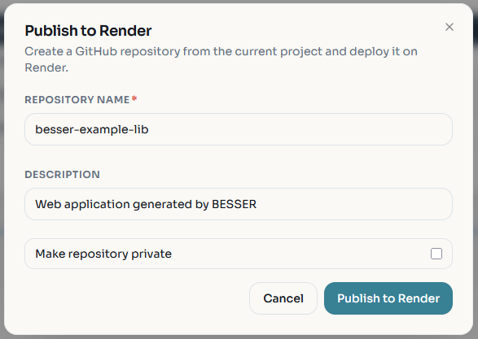
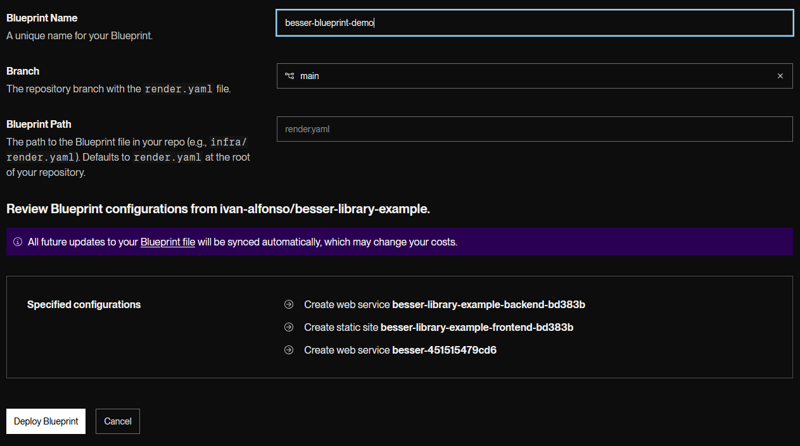
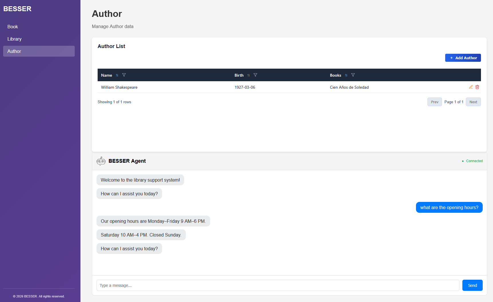
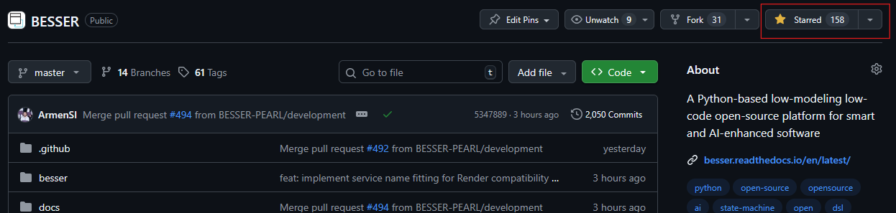

# Lab Guide 6: From Modeling to Deployment with BESSER

## Welcome to the BESSER lab guide!

In this guide, you will learn how to use [BESSER](https://github.com/BESSER-PEARL/BESSER.git) to design, generate, and deploy a complete web application. You'll work with the [BESSER Web Modeling Editor](https://editor.besser-pearl.org/) to create models, use BESSER's Full Web App Generator to produce a production-ready application, and deploy it to the cloud using [Render](https://render.com/).

## 1. Context

Modern web application development typically requires expertise in multiple technologies: frontend frameworks, backend APIs, databases, and deployment infrastructure. Low-code platforms like BESSER dramatically simplify this process by allowing developers to model their application's structure and automatically generate all necessary code.

BESSER's **Full Web App Generator** produces a complete application stack from your models:

- **Backend**: FastAPI with SQLAlchemy ORM and Pydantic validation
- **Frontend**: React with TypeScript, forms, tables, and charts
- **Database**: SQLite (default) or configurable to PostgreSQL, MySQL
- **Deployment**: Docker containers with Docker Compose orchestration
- **Smart Features**: Optional conversational agent integration

<div align="center">
  
</div>

The deployment workflow follows these steps:

1. **Model:** Design your application through multiple models, each representing a different aspect (such as the database, GUI, or agents).

2. **Code Generation:** Generate the code for your application (backend, frontend, database, etc.).

3. **Push to GitHub:** All the code of your application is automatically pushed to a repository created by BESSER and linked to your [GitHub](https://github.com) account.

4. **Deploy on Render:** BESSER uses [Render](https://render.com) to publish the web application using the free tier, which is convenient for testing and experimentation.

## 2. Scenario

In this lab, we will create a web application representing a basic **Library domain scenario**, with an integrated agent to answer common questions. The structure of this domain includes:

- **Library**: Represents a library with name and address
- **Book**: Represents books with title, pages, and release date
- **Author**: Represents authors with name and email

The Library has multiple Books, and each Book can have multiple Authors. This classic many-to-many relationship pattern is common in real-world applications.

Using BESSER, you will design this application by creating three different models or perspectives: a class diagram representing the database structure, an agent model to design the question‑answering agent, and the Graphical User Interface (GUI).

## 3. Requirements

For this lab guide, you will need:

- Access to the [BESSER Web Modeling Editor](https://editor.besser-pearl.org/) (no installation required)
- A free [GitHub account](https://github.com/) (for version control and deployment integration)
- A free [Render account](https://render.com/) (for cloud deployment)
- Basic familiarity with web applications, REST APIs, and UML.

## 4. Creating Your Project and Loading Templates

Let's start by accessing the BESSER Web Modeling Editor and setting up your project with the library example templates.

### 4.1 Create a Blank Project

1. Navigate to [https://editor.besser-pearl.org/](https://editor.besser-pearl.org/)
2. Click on **"Create Blank Project"** or **" File -> New Project"**
3. Give your project a name (e.g., "Library Management System"), owner and description
4. Click **Create Project**

<div align="center">
  
</div>


### 4.2 Load the Library Template Class Diagram

A project in **BESSER** is composed of several models that describe different parts of the application. **Class diagrams**, for example, define the structure of the database. To load the **Library** class diagram template, follow these steps:

1. Click on **File → Load Template**. You will see several examples for different types of models.  
2. Select **Class Diagram**, choose **Library**, and click **Load Template**.

You should then see a class diagram with the following structure.

<div align="center">
  
</div>

This class diagram includes three main classes: **Library**, **Book**, and **Author**, along with a **Genre** enumeration. A *Library* stores basic information (name, web page, address, and telephone) and manages a collection of books. A *Book* includes attributes such as title, pages, stock, price, release date, and genre, and provides an operation to decrease its stock. An *Author* stores information about book authors, including their name and birth date. The model defines relationships where a library contains multiple books, and books can have multiple authors (many-to-many). Additionally, an OCL constraint ensures that every book has more than 10 pages.

### 4.3 Load the Library Template in Agent Diagram

Now, let's explore the agent specification. BESSER provides a perspective to define agents, based on a language extension of state machines. Let's load our library agent example, and explore it.

1. Click on **File → Load Template**.  
2. Select **Agent Diagram**, choose **Library Agent**, and click **Load Template**.

You should then see the following model.

<div align="center">
  
</div>

This agent model defines a simple **library support agent** that helps users with common questions about the library system. The agent starts with a **greeting message** and then moves to an **Idle** state where it asks the user how it can assist. The model includes several **intents** that represent possible user requests, such as asking for the **opening hours**, requesting help to find the **cheapest book by an author**, or asking for **contact information** to speak with a human assistant. Each intent contains example user phrases used to recognize the request. When an intent is matched, the agent transitions to the corresponding **state**, where it provides the appropriate response or instructions. After responding, the agent automatically returns to the **Idle** state to continue the conversation.


## 5. Designing the GUI Model

BESSER allows you to design the graphical user interface for your web application using a visual GUI editor. This eliminates the need to write frontend code manually.

Click the **GUI** perspective from the lateral left menu. You will see a no-code editor to design the GUI of the web app. This editor contains several blocks you can drag and drop in the canvas, conect with the elements of other diagrams (e.g., classes from the class diagram), or modify the styles.

### 5.1 Auto-Generate the Default GUI

BESSER provides an **auto-generate function** that can create a default GUI by reading your class diagram. This is the quickest way to get started:

1. In the GUI diagram editor, look for the **Auto-Generate GUI from Class Diagram** button
2. Click on it to automatically generate GUI components based on your class diagram entities
3. BESSER will create:
   - A page for each class in your domain model
   - Table components for displaying and managing records
   - Forms for creating and editing entities
   - Navigation between pages

<div align="center">
  
</div>

The BESSER GUI model supports:

- **Tables** with CRUD operations (Create, Read, Update, Delete)
- **Charts** for data visualization
- **Navigation** between pages
- **Method Buttons** for executing class methods
- **Chat bots** for agents
- and **Other blocks**

### 5.2 Add the agent to your GUI

After auto-generating the GUI, you can customize it to better suit your application. For example, you can add the library agent as a chatbot in the interface. To do this, drag and drop the **BESSER Agent** block from the blocks palette on the right side.

Once you drop the agent, click on it and choose the agent you want to use. In this case, select the agent model created in step **4.3**, named **Library Agent**. The [BESSER Agentic Framework](https://github.com/BESSER-PEARL/BESSER-Agentic-Framework) powers these conversational agents, adding intelligent interaction capabilities to your application.

## 6. Generating and Deploying the Full Web Application

Now that your models are ready, it's time to generate the complete web application code.

### 6.1 Validate Your Models

Before generation, ensure that all models are valid. Go to the **class diagram** using the left panel and click **Quality Check** to validate it. Fix any errors or warnings that appear. Repeat the same step for the **Agent model** as well.

**Note:** The **Quality Check** feature is not yet available for the GUI model of the application, it will be added in the future.


### 6.2 Connect with GitHub

BESSER can generate the full code for a web application based on the models you have designed and automatically push this code to a new repository in your GitHub account. To do this, connect your GitHub account by clicking the **GitHub icon** in the upper-right corner.

<div align="center">
  
</div>

### 6.3 Generate and Deploy the App

Once connected to GitHub, click **Deploy → Publish Web App to Render**. A screen will appear where you can enter the name of the GitHub repository that will be automatically created and where the application code will be pushed. You can also add a description and choose whether the repository should be private. Then click **Publish to Render**.

<div align="center">
  
</div>

The code of the application will be generated and published in a new GitHub repository in your account. You can inspect the repository and its code by clicking **View GitHub Repository**.

The structure of the repository contains:

```
agents/
  ├── library_agent/
    ├── ...
backend/
  ├── pydantic_classes.py
  ├── main_api.py  
  ├──  ....
buml/
  ├──  ....
frontend/
  ├── src/
  ├── public/  
  ├── vite.config.ts
  ├── ...
README.md
docker-compose.yml
render.yaml
```


Return to the BESSER editor and click **Open Render Deployment**. Log in to your Render account and create your deployment. Assign a name to the **Blueprint** and click **Deploy Blueprint**.

<div align="center">
  
</div>

The free tier of Render uses servers with limited resources, so the deployment of your application may take between **4 and 12 minutes**, depending on the application, its components, and the agents used.

In Render, **three services** are deployed: one for the **backend**, one for the **frontend**, and one for the **agent**. Once all services are deployed, you can access your application by clicking on **Resources**, then selecting the frontend service, and opening the URL generated for the app.

Test the web application, the agent, and all related components.

<div align="center">
  
</div>

---

## 7. Extending the Library Application

In many real projects, applications evolve as new requirements appear. In this section, you will extend the existing system by modifying the models and redeploying the application.

You will introduce a new concept into the domain model and propagate the changes through the agent, the GUI, and the deployed application.

### 7.1 Extend the Class Diagram

The library system should now also keep track of **publishers** responsible for publishing books.

Extend the current domain model to represent this new concept.

Each **publisher** should store relevant information such as its name, the country where it is based, and the year it was founded. Books in the system should be associated with the publisher that released them. A publisher may release many books, while each book is published by a single publisher.

In addition to representing publishers in the model, the system should be able to provide simple analytics about them. In particular, a publisher should be able to determine the **average price of the books it has published**.

Update the class diagram accordingly by introducing the necessary class, attributes, relationship with books, and a method that computes this information.

**Tip:** In BESSER, method bodies can be implemented either in **Python** or using the **[BESSER Action Language (BAL)](https://besser.readthedocs.io/en/latest/besser_action_language/overview.html)**. You are free to choose either option. The current model already contains two example methods that you can use as inspiration for syntax and structure.

### 7.2 Extend the Agent Model

The library assistant should now also help users understand how to obtain information about **publishers** in the application.

Extend the agent model so that users can ask how to compute the **average price of the books published by a publisher**.

Add a new **intent** related to this question. Include a few example user phrases such as:

- "how can I get the average price of books from a publisher?"
- "average book price for a publisher"
- "how do I compute the publisher average price?"

When this intent is detected, the agent should transition from the **Idle** state to a new state that explains how to perform this action in the application.

In this new state, the agent can provide simple instructions, similar to the existing *CheapestBook* explanation. For example:

1. Go to the **Publisher** tab.  
2. Select a publisher in the table.  
3. Click on **Average Book Price**.  
4. Click **Execute** to compute the result.

After responding, the agent should automatically return to the **Idle** state, following the same transition pattern used by the other states.

### 7.3 Update the GUI

After extending the domain model and the agent, the graphical user interface must be updated to reflect these changes.

Go to the **GUI perspective** in the BESSER editor and update the interface so that the new **Publisher** entity can be managed in the application.

As a tip, you can use the **Auto‑Generate GUI from Class Diagram** feature again. This will regenerate the GUI based on the updated class diagram and automatically create the necessary interface components, including a new page for **Publisher** with its corresponding table and form.

After regenerating the GUI, note that the **agent component will be removed** by the auto‑generation process. You will therefore need to add it again manually.

# 8. Support Us

If you found this laboratory guide helpful and would like to support our work, you can:

1. **Star our GitHub repository**  
   Visit the repository below and click the ⭐ star button to show your support:  
   https://github.com/BESSER-PEARL/BESSER  

<div align="center">
  
</div>

2. **Complete a short survey (≈5 minutes)**  
   Your feedback helps us improve future materials:  
   [Take the survey](https://docs.google.com/forms/d/e/1FAIpQLSdhYVFFu8xiFkoV4u6Pgjf5F7-IS_W7aTj34N5YS2L143vxoQ/viewform)

---

Your support is greatly appreciated and helps us continue developing and improving these resources.

## 9. Additional Resources

- [BESSER Documentation](https://besser.readthedocs.io/en/latest/)
- [BESSER Web Modeling Editor Documentation](https://besser.readthedocs.io/projects/besser-web-modeling-editor/en/latest/)
- [Full Web App Generator Documentation](https://besser.readthedocs.io/en/latest/generators/full_web_app.html)
- [BESSER Agentic Framework Documentation](https://besser-agentic-framework.readthedocs.io/latest/)
- [Render Documentation](https://render.com/docs)
- [Docker Documentation](https://docs.docker.com/)
- [React Documentation](https://react.dev/)
- [FastAPI Documentation](https://fastapi.tiangolo.com/)


## 10. Summary

In this lab, you have learned how to:

✅ Use the BESSER Web Modeling Editor to load and modify templates  
✅ Design a complete web application using class diagrams and GUI models  
✅ Optionally integrate a conversational agent  
✅ Generate production-ready code with BESSER's Full Web App Generator    
✅ Deploy a full-stack web application to Render

You now have the skills to rapidly develop and deploy web applications using the BESSER low-code platform!

**Congratulations!** You have completed Lab 6: Web Application Deployment with BESSER. 🎉