A company builds digital assistants for fitness centres. Its Gym Agent greets the user, waits for a question, sorts it into training, nutrition or other, gives a generic answer and goes back to waiting. That works for an average visitor, but not for everyone: an elderly visitor may prefer spoken interaction and larger text, and a visitor who uses a wheelchair needs workouts that do not rely on the legs.

In this lab you model those two users and let BESSER adapt the agent to each. You describe each profile in a User diagram, attach a customization to it on the Agent Customization page, and generate a single agent that asks the user for their profile and then runs the matching variant. The editor part needs only a browser. Running the agent is optional and needs Python, Docker and an OpenAI key.

The lab assumes you know the editor basics from [Your first class diagram](/labs/first-model/). [Build agents with the BESSER Agentic Framework](/labs/agents-baf/) explains how the generated agent code works, but you do not need it here.

## Load the Gym Agent and inspect it

1. Open [editor.besser-pearl.org](https://editor.besser-pearl.org/), choose :ui[Start modelling], name the project `Gym Coach`, pick the :ui[Agent Developer] perspective and click :ui[Create Project]. The sidebar now shows :ui[Agent] and :ui[User].
2. Click :ui[Agent], then open :ui[File > Load Template], select the :ui[Agent Diagram] category, select :ui[Gym Agent] and click :ui[Load Template].
3. Zoom out with the :ui[-] button at the bottom right until you see the whole diagram.

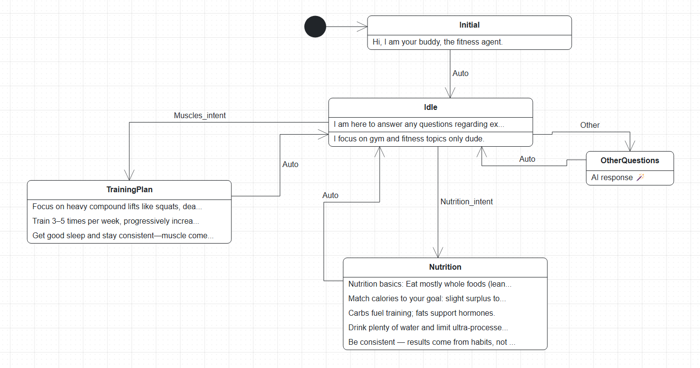

Read the diagram:

- **States** are the rounded boxes. Each row under the name is one reply the agent sends when it enters the state. `Idle` has a second, fallback reply for messages that match no intent. `OtherQuestions` has a single :ui[AI response] row: an LLM answers.
- **Transitions** are the arrows. `Auto` fires as soon as the state has replied. `Muscles_intent`, `Nutrition_intent` and `Other` fire when the user's message matches that intent.

4. Click :ui[Components] under :ui[Agent] and open :ui[Intents]. Expand :ui[Muscles_intent].

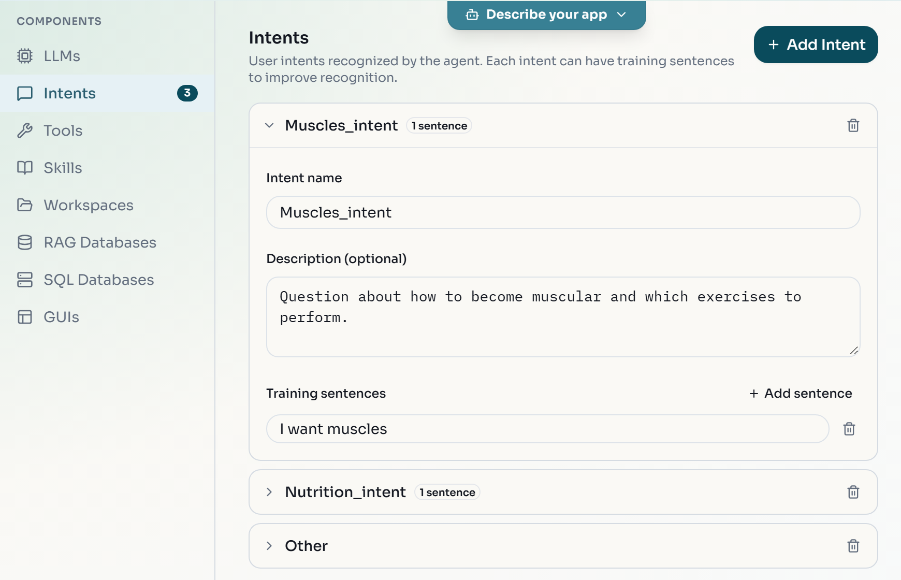

:::checkpoint
The canvas shows five states and the :ui[Intents] section lists three intents: `Muscles_intent`, `Nutrition_intent` and `Other`, each with a description.
:::

## Check the agent's LLM

The template uses an LLM in two places: to classify messages into intents and to answer in `OtherQuestions`. The personalized variants also pass their profile to this LLM. The template already declares it; check it before you create variants.

1. On :ui[Components], open :ui[LLMs]. It lists one LLM, `gpt-4o-mini` with the provider `openai`. Click its name to see its settings.

   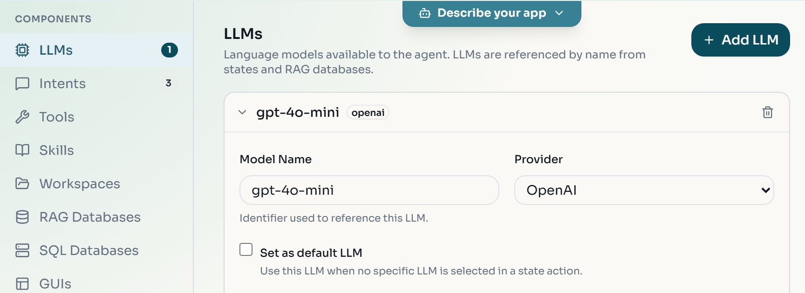

   You do not need to tick :ui[Set as default LLM]: when the agent has a single LLM, the generated code uses it as the default.

2. Click :ui[Agent Customization] under :ui[Agent]. On the :ui[Agent Runtime] tab, set :ui[Intent Recognition] to :ui[LLM-based]. Keep :ui[Platform] on :ui[WebSocket] with :ui[Use Streamlit UI] ticked.

   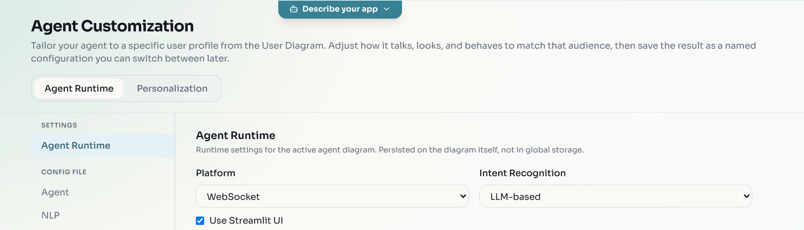

:::checkpoint
:ui[LLMs] shows a 1 and lists `gpt-4o-mini`, and :ui[Agent Runtime] shows :ui[LLM-based].
:::

## Model the Elderly profile

A User diagram describes a group of users by criteria on a fixed user model: `User` is the root, with parts such as `Personal_Information`, `Accessibility`, `Competence` and `Culture`. You can drag these parts from the palette and link them, but the form editor is faster and cannot produce an invalid structure.

1. Click :ui[User] in the sidebar. The palette on the left lists :ui[User], :ui[Personal_Information], :ui[Competence], :ui[Accessibility], :ui[Culture], :ui[Language] and more.
2. Click :ui[Edit as Form] at the top right. The :ui[User Profile Form] opens with :ui[User] as :ui[ROOT].
3. Tick :ui[Include] next to :ui[Personal Information], then click :ui[Personal Information] to expand it.
4. In the `age` row, choose `>` in the operator list and enter `65`. Leave the other fields empty: an empty field is not a criterion.

   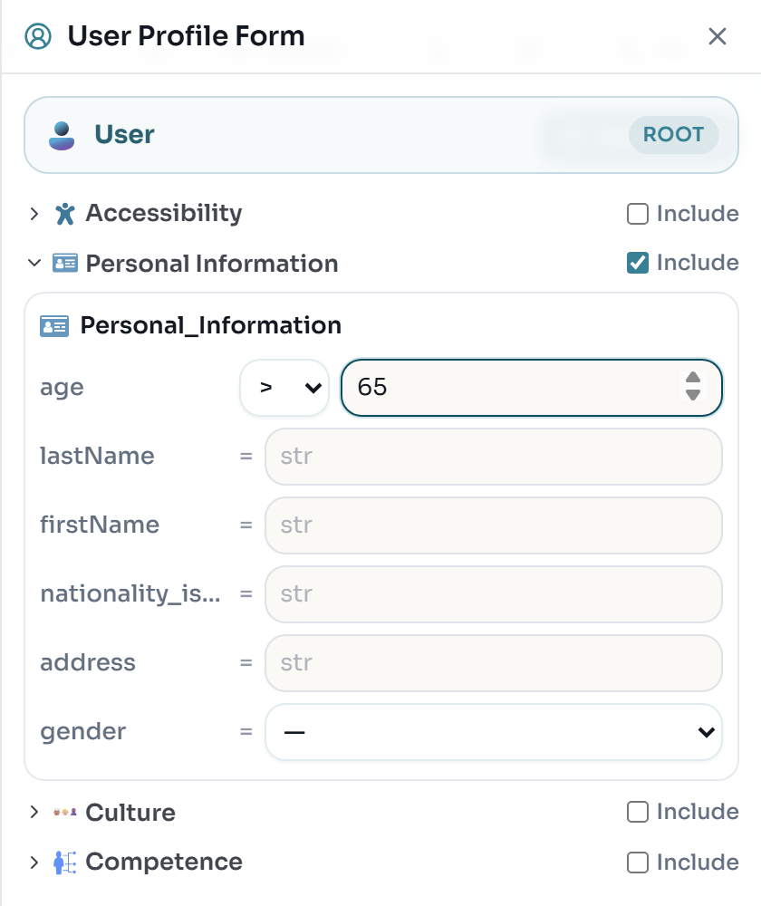

5. Close the form with the cross at its top right.
6. Double-click the diagram tab :ui[User Diagram], type `Elderly` and press :kbd[Enter].
7. Click :ui[Quality Check] in the top bar.

:::checkpoint
The tab is named `Elderly`. :ui[Quality Check] reports :ui[Valid Constraints] with the constraint `pi_age_range` evaluating to `True`.
:::

:::note
:ui[Quality Check] also shows warnings that start with `Mandatory creation cycle: Input_Modality -> Interaction_Modality`. They concern the built-in user model, not your profile, and you can ignore them. If you leave a User diagram without checking it, the editor asks you to :ui[Validate models] first; choose that option.
:::

## Model the Paraplegic profile

1. Click :ui[+] next to the `Elderly` tab to add a second User diagram.
2. Click :ui[Edit as Form], tick :ui[Include] next to :ui[Accessibility] and expand it.
3. Next to :ui[Disability], click :ui[Add], then click :ui[Disability] to expand it.
4. Fill in :ui[Disability 1]: `name` = `Paraplegic`, `description` = `Cannot use lower body`, and choose `Mobility` for `affects`.

   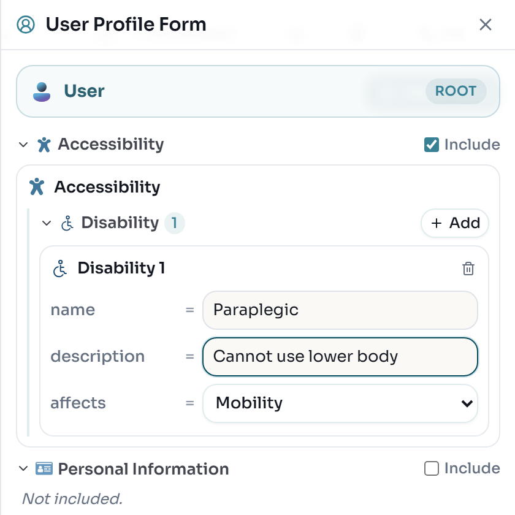

5. Close the form, rename the tab to `Paraplegic` and click :ui[Quality Check].

:::checkpoint
There are two User diagram tabs, `Elderly` and `Paraplegic`, and the sidebar shows :ui[User (2)]. :ui[Quality Check] reports the constraint `disability_description_not_empty` as `True`.
:::

## Customize the agent for the Elderly profile

1. Click :ui[Agent], then :ui[Agent Customization], and switch to the :ui[Personalization] tab.
2. Under :ui[User Profile Mapping], choose `Elderly`.

   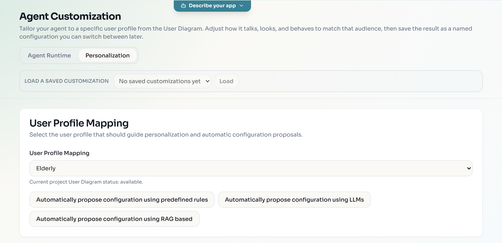

   The three :ui[Automatically propose configuration using ...] buttons fill the form for you, from predefined rules, an LLM or a RAG source. They need a GitHub sign-in (:ui[GitHub] button in the top bar); without one they show `Sign in to GitHub to use recommendations.` You can skip them and set the values by hand.

3. Under :ui[Personalization Overview], click :ui[Presentation]. Set :ui[Style] to :ui[Formal]. Under :ui[Style of text in interface], set :ui[Size] to `20` and :ui[Contrast] to :ui[High].

   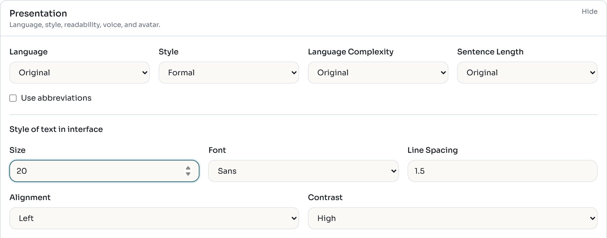

   :ui[Language], :ui[Style], :ui[Language Complexity] and :ui[Sentence Length] rewrite every fixed reply with an LLM on the BESSER server when you apply.

4. Click :ui[Modality] and tick :ui[Enable speech input] and :ui[Enable speech output].

   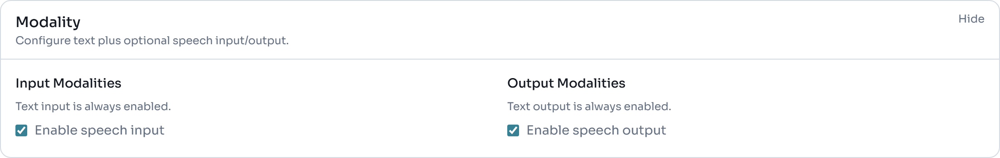

5. Scroll to :ui[Save this customization], enter `Elderly` as :ui[Customization Name] and click :ui[Save & Apply Configuration].

   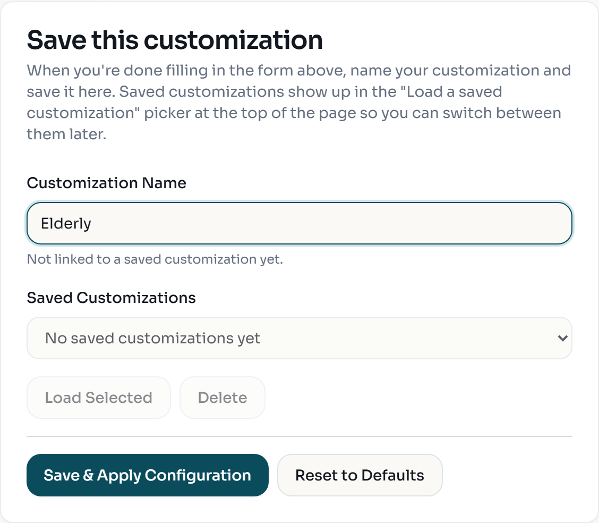

:::checkpoint
A toast says `Configuration transformed, saved, and applied successfully.` and the editor returns to the agent diagram. The variant selector in the top bar, which showed `Base agent model`, now also offers `Elderly (Elderly)`.
:::

:::troubleshoot
The server-side rewrite takes from a few seconds to a few minutes, and the page shows `Working on it...` meanwhile. Wait for the toast. If it shows `Failed to transform agent model` instead, the server could not complete the rewrite: set the four text lists back to :ui[Original] and apply again. Size, contrast and speech do not need the server LLM.
:::

## Customize the agent for the Paraplegic profile

1. Open :ui[Agent Customization] > :ui[Personalization] again. Under :ui[User Profile Mapping], choose `Paraplegic`.
2. Click :ui[Content] and tick :ui[Adapt content to user profile].

   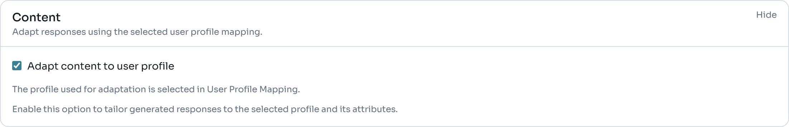

3. Enter `Paraplegic` as :ui[Customization Name] and click :ui[Save & Apply Configuration].
4. Use the variant selector in the top bar to switch between `Base agent model`, `Elderly (Elderly)` and `Paraplegic (Paraplegic)`. Each entry is a separate copy of the agent diagram; the base model stays untouched.

:::checkpoint
The variant selector lists three entries: `Base agent model`, `Elderly (Elderly)` and `Paraplegic (Paraplegic)`.
:::

:::note
With content adaptation, :ui[Save & Apply Configuration] rewrites the fixed replies of the variant for the profile, and the generated agent also hands the profile to its LLM as context, so LLM answers take the disability into account. Switch to `Paraplegic (Paraplegic)` and open `TrainingPlan`: the first reply no longer suggests squats and deadlifts but upper-body lifts you can do seated or supported. The exact wording comes from an LLM and differs from run to run. In `Elderly (Elderly)`, the replies keep their content but are rewritten in a formal style.
:::

## Generate the personalized agent

1. Select `Base agent model` in the variant selector, so the agent diagram is active.
2. Open :ui[Generate > BESSER Agent].
3. In the :ui[Select Agent Languages] dialog, under :ui[Personalization Strategy], choose :ui[Personalization (all)] and click :ui[Generate].

   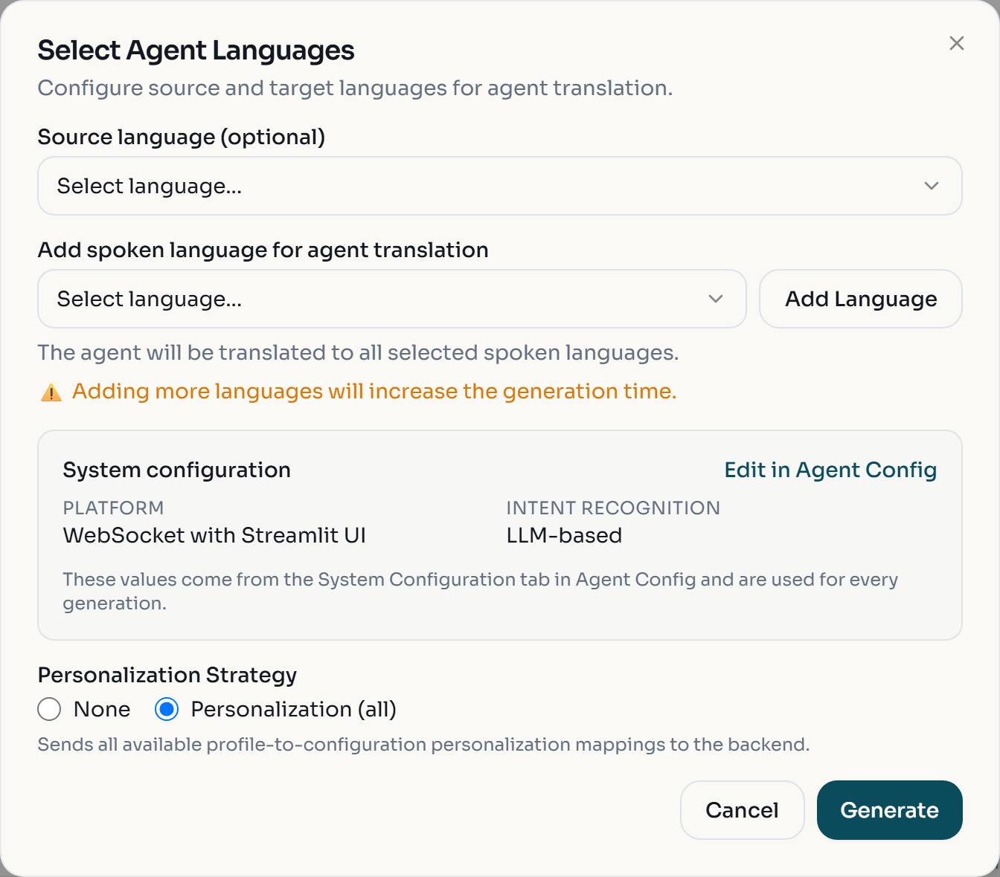

4. Unzip the downloaded `agent_output.zip`.

:::checkpoint
The folder contains `Gym_Agent.py`, `config.yaml`, `user_profiles.json`, `agent_model.py`, `readme.txt` and `BESSER_GENERATION.md`. `Gym_Agent.py` defines the base states plus a copy per profile, such as `Initial_Elderly` and `TrainingPlan_Paraplegic`, and a `router_initial_state` that jumps to the copy matching the user's profile.
:::

## Run the agent with its user database

The personalized agent asks every user to log in and to pick a profile, and stores users and sessions in PostgreSQL. You run that database in Docker.

:::caution
The agent calls the OpenAI API with your key for intent classification, for `OtherQuestions`, and for speech in the Elderly variant. Every message costs a small amount. Keep the key out of Git and stop the agent when you are done.
:::

1. Install BAF if you have not yet, in a virtual environment: `pip install "besser-agentic-framework[extras,llms]"` (see [Build agents with the BESSER Agentic Framework](/labs/agents-baf/)).
2. In a separate folder, download the [Dockerfile](/files/agent-personalization/Dockerfile) and start the database:

   ```bash
   docker build -t agentdb .
   docker run -d --name agentdb -p 5432:5432 agentdb
   ```

3. Download [config.yaml](/files/agent-personalization/config.yaml) and use it to replace the generated `config.yaml` in the unzipped agent folder. It enables the `monitoring` and `streamlit` databases with the credentials of the Dockerfile. Replace `YOUR-API-KEY` with your OpenAI key.
4. From the agent folder, run:

   ```bash
   python Gym_Agent.py
   ```

5. Open http://localhost:5000. Enter any username and password and click :ui[Login]: an unknown username creates a new account.
6. Click :ui[Choose Your User Profile], flip to the profile you want with :ui[Next >], click :ui[Confirm as fitting to me], then click :ui[Chat with Agent].

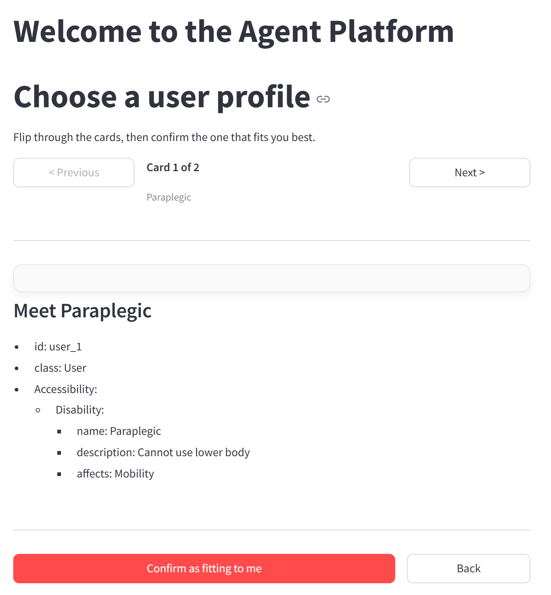

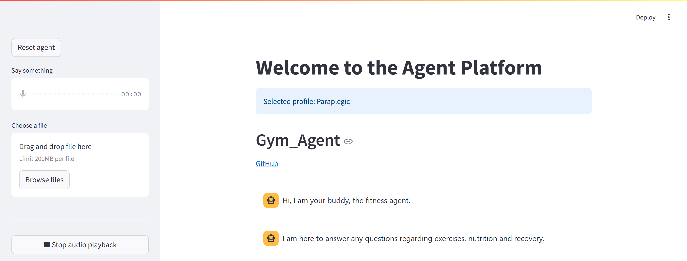

:::checkpoint
After you confirm the Paraplegic profile, the chat shows `Selected profile: Paraplegic` and the replies `Hi, I am your buddy, the fitness agent.` and `I am here to answer any questions regarding exercises, nutrition and recovery.` The terminal logs `Session variable user_profile set to Paraplegic.` Now ask a question that no intent covers, such as `How should I warm up before a session?`: `OtherQuestions` answers with the LLM, which receives the Paraplegic profile as context. Stop the agent with :kbd[Ctrl+C] and the database with `docker stop agentdb`.
:::

:::troubleshoot
`Port 5000 is already in use`, or an error about binding to port 8765, means another program uses those ports. Change `platforms.websocket.port` and `platforms.websocket.streamlit.port` in `config.yaml` and open the new Streamlit port. If the login page shows a database error, check that `docker ps` lists `agentdb` with port 5432.
:::

## Exercise: add a third user group

:::exercise[Teenage members]
Add a `Teenager` profile for users younger than 18, and a customization that suits them: informal style, abbreviations, and a font and colour of your choice. Regenerate with :ui[Personalization (all)] and check that the profile picker now shows three cards.
:::

:::solution
Add a third User diagram tab with `Personal Information` included and `age` `<` `18`, then save a customization mapped to it. For comparison, :ui[File > Load Template] > :ui[Full Project] > :ui[Personalized Gym Agent] opens a ready-made project (as a new project) with a `Teenager` and a `ParaplegicUser` profile.
:::

:::exercise[Change the base agent and re-personalize]
Add a `Recovery_intent` and a `Recovery` state with two replies about rest days and sleep, connected like `Nutrition`. Bring both variants up to date and regenerate.
:::

:::solution
Edit the `Base agent model`: add the intent on :ui[Components] > :ui[Intents], then the state and its transitions on the canvas. A variant is a snapshot taken at :ui[Save & Apply Configuration] time, and the editor re-personalizes from its stored copy of the base model, which it refreshes when you switch variants. So switch to a variant and back to `Base agent model`, load each saved customization with :ui[Load a saved customization], apply it again, and regenerate.
:::
