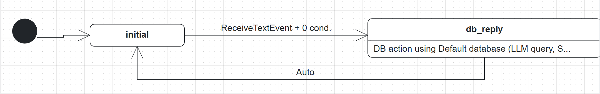
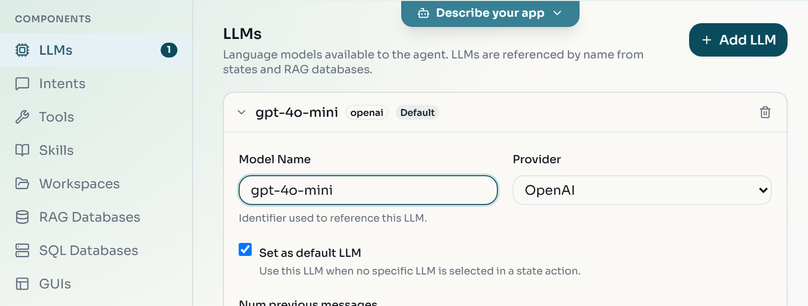
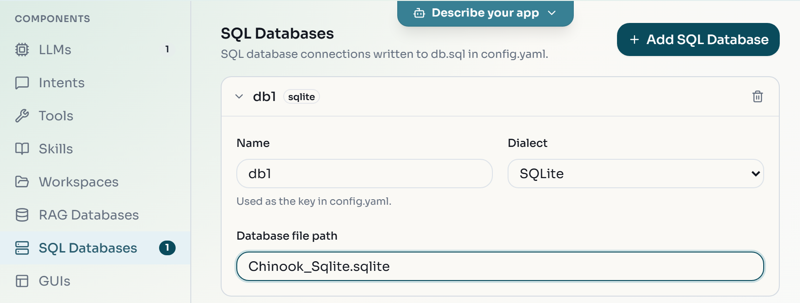
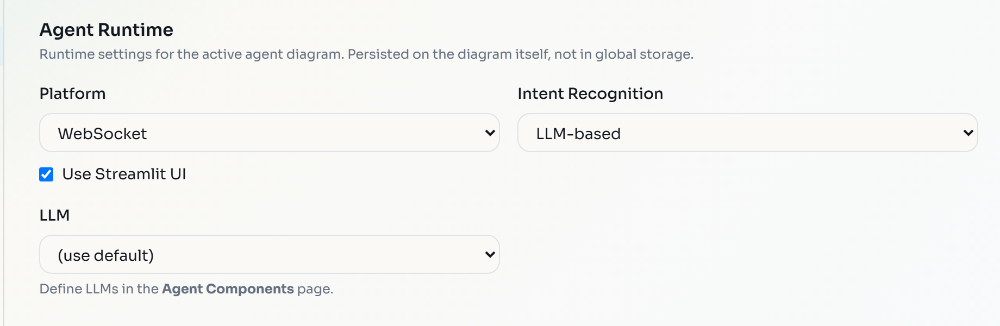
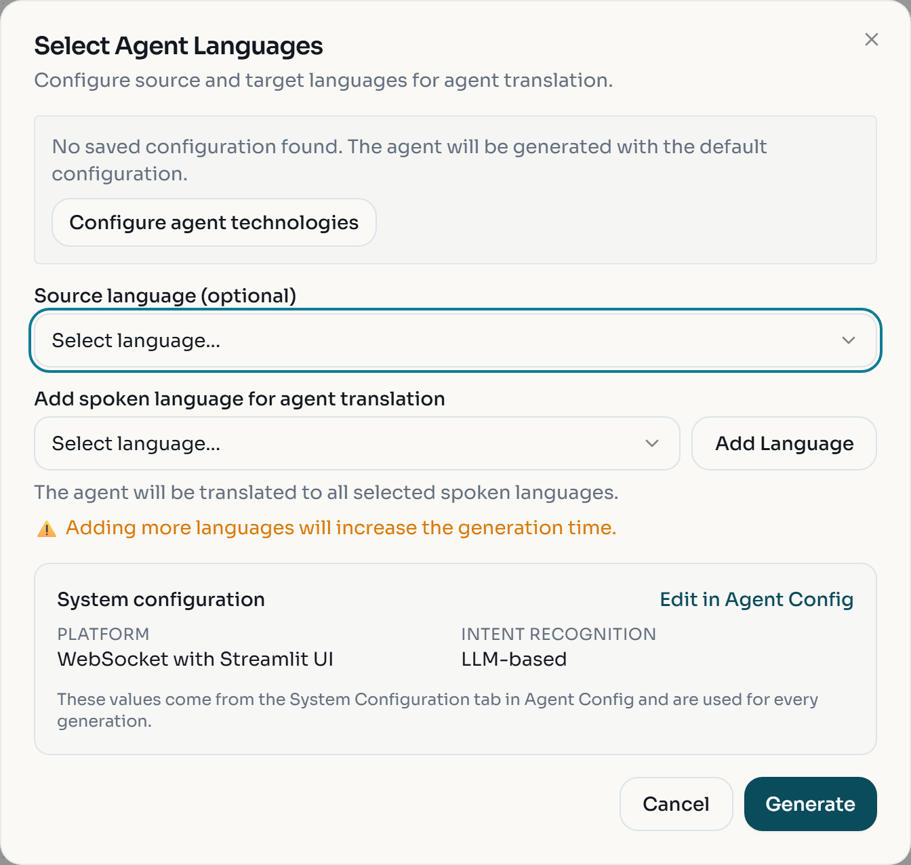
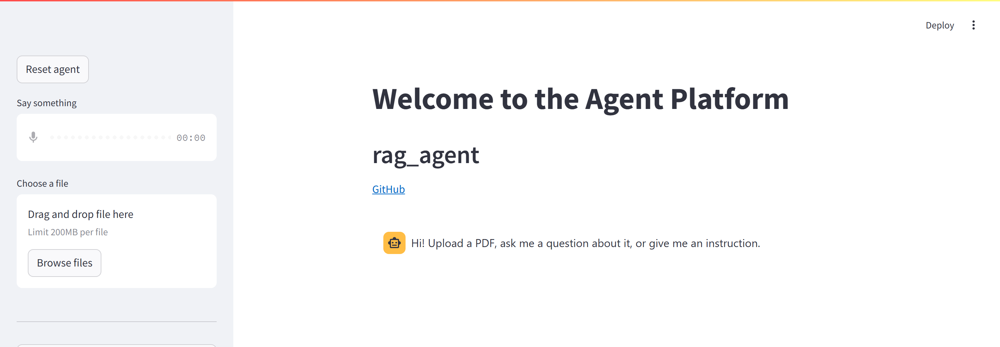

The [BESSER Agentic Framework](https://besser-agentic-framework.readthedocs.io/latest/) (BAF) is a Python library for agents whose behaviour is a state machine: the agent waits in a state, a user message or event triggers a transition, and the body of the next state runs. States can reply with fixed text, or call an LLM, a database or a retrieval engine.

You use BAF in two ways in this lab. First, with no code: you load the Database Agent template in the Web Modeling Editor, connect it to the Chinook music store database, and generate a BAF project that answers questions about the data. Then, with code: you extend a starter script into an agent that indexes PDFs you upload, answers questions about them with RAG, and handles other instructions with an LLM.

The lab was checked against BAF 4.5.2, the current release on PyPI, whose Python package is `baf`.

:::caution
Both agents call the OpenAI API with your own key. Each message you send costs money (a few cents for the whole lab with `gpt-4o-mini`, more with larger models or long PDFs). Set a usage limit in your OpenAI account, keep the key out of Git, and stop the agents when you are done.
:::

## Install BAF in a virtual environment

1. Create and activate a virtual environment in a new working folder:

   ```bash
   python -m venv .venv
   source .venv/bin/activate
   ```

   ```powershell
   python -m venv .venv
   .venv\Scripts\Activate.ps1
   ```

2. Install BAF with the `extras` (RAG, vector store, data frames) and `llms` (OpenAI and other clients) options, plus PyMuPDF for reading PDFs:

   ```bash
   pip install "besser-agentic-framework[extras,llms]" pymupdf
   ```

   This does not install PyTorch or TensorFlow. You do not need them, because every agent in this lab classifies intents with an LLM. The `[all]` option in the BAF docs pulls in both and is much larger.

3. Check the installation. Save this as `check_install.py` and run `python check_install.py`:

   ```python
   from importlib.metadata import version
   from baf.core.agent import Agent

   print('BAF', version('besser-agentic-framework'))
   print('Agent created:', Agent('test_agent').name)
   ```

:::checkpoint
The last two lines of the output are:

```text
BAF 4.5.2
Agent created: test_agent
```

Two warnings like `besser GUI dependencies could not be imported` may appear first. They are harmless: they only concern GUI features that this lab does not use.
:::

:::troubleshoot
`ModuleNotFoundError: No module named 'baf'` means an old BAF (4.2 or earlier, package `besser.agent`) is installed or the virtual environment is not active. Activate `.venv` and run `pip install --upgrade "besser-agentic-framework[extras,llms]"`.
:::

## Load the Database Agent template

1. Open [editor.besser-pearl.org](https://editor.besser-pearl.org/), choose :ui[Start modelling], name the project `Music Store Agent`, pick the :ui[Agent Developer] perspective and click :ui[Create Project].
2. In the left sidebar, click :ui[Agent].
3. Open :ui[File > Load Template], select the :ui[Agent Diagram] category, select :ui[Database Agent] and click :ui[Load Template].



The `db_reply` state has one action: a database query on the default database in LLM query mode. The LLM turns the user's question into SQL, the agent runs it, and the LLM phrases the result as an answer.

:::checkpoint
The canvas shows the states `initial` and `db_reply`, a transition labelled `ReceiveTextEvent + 0 cond.` and an `Auto` transition back to `initial`.
:::

## Connect an LLM and the Chinook database

The template has no LLM and no database yet. You add both on the :ui[Components] page under :ui[Agent] in the sidebar.

1. Click :ui[Components], stay on :ui[LLMs] and click :ui[Add LLM]. Enter `gpt-4o-mini` as :ui[Model Name], keep :ui[Provider] on :ui[OpenAI] and tick :ui[Set as default LLM].

   

2. Click :ui[SQL Databases], then :ui[Add SQL Database]. Enter `db1` as :ui[Name], choose :ui[SQLite] as :ui[Dialect] and enter `Chinook_Sqlite.sqlite` as :ui[Database file path].

   

3. Click :ui[Agent Customization]. On the :ui[Agent Runtime] tab, set :ui[Intent Recognition] to :ui[LLM-based] and leave :ui[LLM] on :ui[(use default)].

   

:::checkpoint
:ui[Components] shows a 1 next to :ui[LLMs] and next to :ui[SQL Databases], and :ui[Agent Runtime] shows :ui[LLM-based].
:::

## Generate and run the Database Agent

1. Click :ui[Agent] in the sidebar so the agent diagram is active, then open :ui[Generate > BESSER Agent].
2. In the :ui[Select Agent Languages] dialog, leave both language fields empty. :ui[System configuration] shows :ui[WebSocket with Streamlit UI] and :ui[LLM-based]. Click :ui[Generate].

   

3. Unzip the downloaded `agent_output.zip` into a folder. It contains `Database_Agent.py`, `config.yaml`, `agent_model.py`, `readme.txt` and `BESSER_GENERATION.md`.
4. Download `Chinook_Sqlite.sqlite` from the [Chinook releases page](https://github.com/lerocha/chinook-database/releases) (asset of release v1.4.5) into the same folder.
5. Open `config.yaml` and make two edits:
   - Under `nlp:` > `openai:`, replace `YOUR-API-KEY` with your key.
   - At the end, under `db:` > `sql:` > `db1:`, rename the key `database:` to `file:`. BAF reads SQLite paths from `file`; the editor writes `database`.

   ```yaml
   db:
     sql:
       - db1:
           dialect: sqlite
           file: Chinook_Sqlite.sqlite
   ```

   The generated file also has `host` and `port` lines under `db1`. SQLite ignores them, so you can leave or delete them.

6. From that folder, with your virtual environment active, run the agent:

   ```bash
   python Database_Agent.py
   ```

7. Open http://localhost:5000 and ask, for example, `How many artists are in the database?`.

:::checkpoint
The terminal prints `Database_Agent's WebSocketPlatform starting at ws://localhost:8765` and `You can now view your Streamlit app in your browser.` The answer should mention 275 artists, the number of rows in the `Artist` table. Stop the agent with :kbd[Ctrl+C].
:::

:::troubleshoot
If every answer is empty or says it cannot find the data, look for `Missing required DB properties for 'db1' (dialect=sqlite): file` in the terminal: the `database:` key was not renamed to `file:`. If the terminal says `Port 5000 is already in use` or cannot bind to port 8765, another program uses those ports. Change `platforms.websocket.port` and `platforms.websocket.streamlit.port` in `config.yaml` and open the new Streamlit port.
:::

## Start the RAG agent from the starter

Now you write an agent yourself. It will have the state machine below: `awaiting_state` is the hub, a PDF upload goes to `load_document_state`, a question goes to `rag_state`, and any other instruction goes to `llm_state`. Every state returns to `awaiting_state`.

1. In a new folder, download [rag_agent.py](/files/agents-baf/rag_agent.py) and [config.yaml](/files/agents-baf/config.yaml).
2. Put your OpenAI key in `config.yaml` under `nlp.openai.api_key`.
3. Read `rag_agent.py`. It already:
   - creates `Agent('rag_agent')` and loads `config.yaml`;
   - starts the WebSocket platform with `use_ui=True`, which also serves a Streamlit chat page;
   - creates the OpenAI LLM `gpt-4o-mini`;
   - configures an LLM intent classifier that matches messages by the intent descriptions (`use_intent_descriptions=True`);
   - defines `initial_state` and `awaiting_state`, with a fallback `when_no_intent_matched()` transition back to `awaiting_state`.
4. Run it with `python rag_agent.py` and open http://localhost:5000.



:::checkpoint
The chat shows `Hi! Upload a PDF, ask me a question about it, or give me an instruction.` Stop the agent with :kbd[Ctrl+C] before you edit the file.
:::

## Add the RAG component and PDF upload

RAG needs three parts: a text splitter that cuts documents into chunks, a vector store that keeps an embedding of each chunk, and an LLM that writes the answer from the retrieved chunks.

1. Add these imports at the top of `rag_agent.py`:

   ```python
   from baf.nlp.rag.rag import RAG, RAGMessage
   from langchain_community.embeddings import OpenAIEmbeddings
   from langchain_community.vectorstores import Chroma
   from langchain_text_splitters import RecursiveCharacterTextSplitter
   ```

2. Replace the `# TODO: splitter, vector store and RAG go here` line with the RAG setup. The embeddings reuse the key from `config.yaml`:

   ```python
   embeddings = OpenAIEmbeddings(openai_api_key=agent.get_property(nlp.OPENAI_API_KEY))
   vector_store = Chroma(embedding_function=embeddings, persist_directory='vector_store')
   splitter = RecursiveCharacterTextSplitter(chunk_size=1000, chunk_overlap=100)
   rag = RAG(
       agent=agent,
       vector_store=vector_store,
       splitter=splitter,
       llm_name='gpt-4o-mini',
       k=4,                     # number of chunks to retrieve
       num_previous_messages=0  # chat history added to the prompt
   )
   ```

3. Replace the `# TODO: create load_document_state, rag_state and llm_state` line:

   ```python
   load_document_state = agent.new_state('load_document_state')
   rag_state = agent.new_state('rag_state')
   llm_state = agent.new_state('llm_state')
   ```

4. Make a PDF upload move the agent from `awaiting_state` to `load_document_state`. Put this line just before the existing `when_no_intent_matched()` transition, then add the body of the new state. `rag.add_file` reads the uploaded file, splits it and stores the chunks:

   ```python
   awaiting_state.when_file_received(allowed_types='application/pdf').go_to(load_document_state)


   def load_document_body(session: Session):
       n_chunks = rag.add_file(session.event.file)
       session.reply(f'Document loaded ({n_chunks} chunks).')


   load_document_state.set_body(load_document_body)
   load_document_state.go_to(awaiting_state)
   ```

5. Run the agent and upload your PDF with :ui[Browse files] in the chat sidebar.

:::checkpoint
The agent replies `Document loaded (N chunks).` and the terminal logs `[RAG] Added N chunks from '<your file>.pdf' to RAG's vector store.` A `vector_store` folder appears next to the script.
:::

:::note
The vector store persists between runs. Uploading the same PDF twice stores its chunks twice. Delete the `vector_store` folder to start again from an empty store.
:::

## Answer questions with RAG and instructions with the LLM

The LLM intent classifier decides between two intents using only their descriptions.

1. Replace the `# TODO: create question_intent and instruction_intent` line:

   ```python
   question_intent = agent.new_intent(
       'question_intent',
       description='The message is a question, finishing with a question mark (?)'
   )
   instruction_intent = agent.new_intent(
       'instruction_intent',
       description='The message is an instruction. Do not consider questions as instructions.'
   )
   ```

2. Add the two intent transitions next to the file transition, before `when_no_intent_matched()`, which now catches everything else:

   ```python
   awaiting_state.when_intent_matched(question_intent).go_to(rag_state)
   awaiting_state.when_intent_matched(instruction_intent).go_to(llm_state)
   ```

3. Add the bodies. The RAG state retrieves chunks and lets the WebSocket platform show the answer with its sources. The LLM state sends the message straight to the model:

   ```python
   def rag_body(session: Session):
       rag_message: RAGMessage = session.run_rag(session.event.message)
       websocket_platform.reply_rag(session, rag_message)


   rag_state.set_body(rag_body)
   rag_state.go_to(awaiting_state)


   def llm_body(session: Session):
       answer = gpt.predict(session.event.message)
       session.reply(answer)


   llm_state.set_body(llm_body)
   llm_state.go_to(awaiting_state)
   ```

4. Run the agent. Ask a question about your PDF that ends with `?`, then send an instruction such as `Write a haiku about state machines.`

:::checkpoint
The terminal logs the transition for each message: the question produces a line ending in `[awaiting_state] --> [rag_state]`, the instruction one ending in `[awaiting_state] --> [llm_state]`. The RAG answer refers to your document and has a :ui[Details] expander that lists the retrieved chunks with their source file and page.
:::

:::troubleshoot
`openai.AuthenticationError` or `RateLimitError` in the terminal comes from OpenAI, not from BAF: the key in `config.yaml` is wrong, or the account has no credit left. `AttributeError: 'Session' object has no attribute 'message'` means code copied from an older BAF guide: use `session.event.message` and `session.event.file`.
:::

## Exercise: write a custom processor

A [processor](https://besser-agentic-framework.readthedocs.io/latest/wiki/core/processors.html) transforms every user message, every agent message, or both, before the state machine or the user sees it. BAF ships a language detection processor and an LLM-based user adaptation processor in `baf.core.processors`.

:::exercise[Normalize internet slang]
Add a processor to the RAG agent that rewrites slang in user messages before intent classification, so `idk who r u` reaches the classifier as `I don't know who are you`. Then pick a second idea and build it: a sentiment processor that stores `positive`, `neutral` or `negative` in the session, or a translator for agent replies.
:::

:::solution
Subclass `baf.core.processors.processor.Processor`. Call `super().__init__(agent=agent, user_messages=True)` and implement `process(self, session, message) -> str`, returning the rewritten message. Creating the processor object is enough to register it with the agent. A dictionary lookup over the words of the message is enough for the slang case; store results with `session.set('sentiment', ...)` for the sentiment case.
:::

:::exercise[Show raw database results as a table]
The generated Database Agent asks the LLM to phrase every result as a sentence. Change `db_reply_body` in `Database_Agent.py` so that it shows the rows returned by `session.db_handler.select(...)` as a table instead.
:::

:::solution
Convert the result to a pandas `DataFrame`: a list of dicts becomes one row per dict, a single dict becomes one row, and a single value becomes a one-cell frame. Send it with `platform.reply_dataframe(session, df)` instead of the second LLM call. Keep the first call with `llm=default_llm`, which turns the question into SQL.
:::
