A class diagram describes structure: which data exists and how it is connected. Real systems also have rules and behavior. A paper has a page limit, an accepted paper must be marked as accepted, a review goes through stages. In this lab you add all three kinds to the research model from [Draw your first class diagram](/labs/first-model/): an OCL constraint, methods with real bodies, and a state machine.

Then you generate a backend from the model and run it. The constraint becomes input validation, and each method becomes an HTTP endpoint you can call.

## Open the research project and add a page count

1. In the [editor](https://editor.besser-pearl.org), open your `Research_Lab` project from the first lab. If you do not have it, download the [starter project](/files/behavior/research_lab.json) and open :ui[File > Import > Project file (.json / .py)] to import it.
2. Double-click `Paper` and add the attribute `pages: int` in the `+ attribute: str` field.

:::checkpoint
`Paper` has four attributes: `title`, `submitted`, `acceptance` and `pages: int`.
:::

## Write an OCL constraint

OCL (Object Constraint Language) states rules that every valid instance must satisfy. An invariant is a rule about one class: `context <Class> inv <name>: <boolean expression>`, where `self` is the instance being checked.

1. Drag :ui[OCL Constraint] from the palette onto the canvas, next to `Paper`, and double-click it.
2. In the :ui[OCL Constraint] field, type:

```text
context Paper inv page_limit: self.pages <= 12
```

3. In :ui[Description (shown to end-users when validation fails) Optional], type `A paper can have at most 12 pages.` This text is the message people see when the rule is broken.

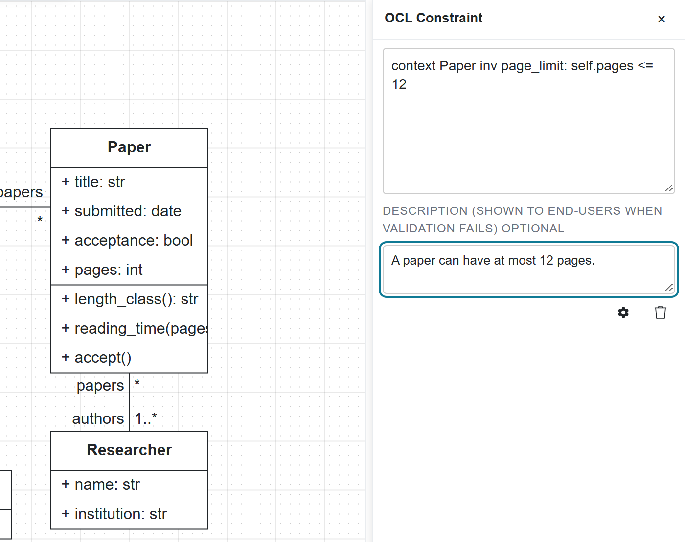

4. Click :ui[Quality Check].

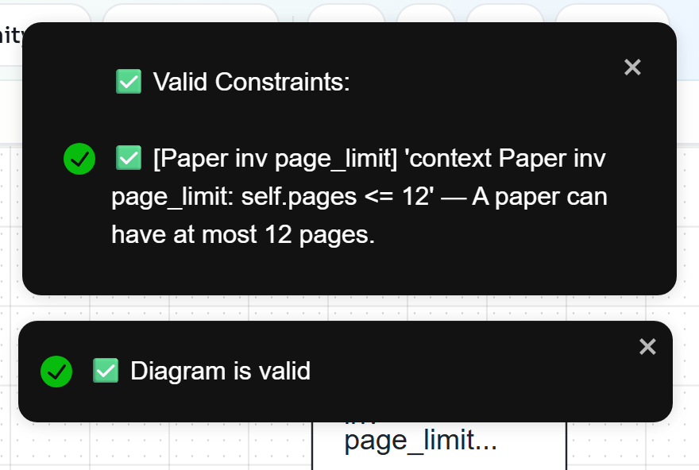

:::note
The editor reads the class from the `context` part of the text. You can draw a line from the note to `Paper` to document the link, but the line is only visual. Write `context Paper` exactly like that: some older examples write `Context "Person"`, with quotes, which the parser does not read as a class name.
:::

:::checkpoint
Quality Check lists `[Paper inv page_limit]` under :ui[Valid Constraints] and reports "Diagram is valid".
:::

## Test the constraint on an object diagram

Quality Check on a class diagram only checks that the constraint is well formed. To see it judge data, you build concrete objects in an object diagram.

1. Click :ui[Object] in the left sidebar. The palette lists one object per class of your class diagram, such as `paper_1 : Paper` and `researcher_1 : Researcher`. The :ui[References] bar at the top shows which class diagram the objects come from.
2. Drag `paper_1 : Paper` onto the canvas and double-click it. Set `title` to `Low-code for research software`, pick a date for `submitted`, type `false` for `acceptance` and `15` for `pages`.

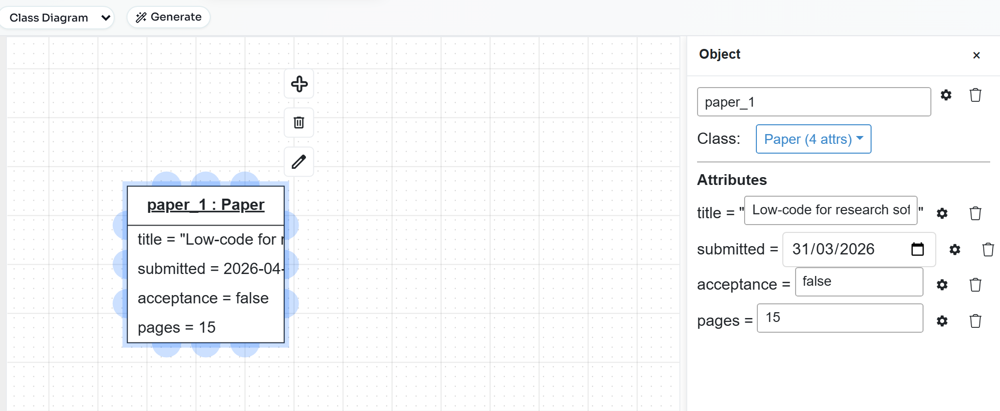

3. Drag `researcher_1 : Researcher` below it and give it a name and an institution. Drag `conference_1 : Conference` next to it and fill in its name, dates and acronym.
4. A paper needs an author and an event, as the multiplicities say. Select `paper_1` and drag from one of its connection points to `researcher_1`. Double-click the new link, open the dropdown that shows :ui[No Association] and choose `authorship`.

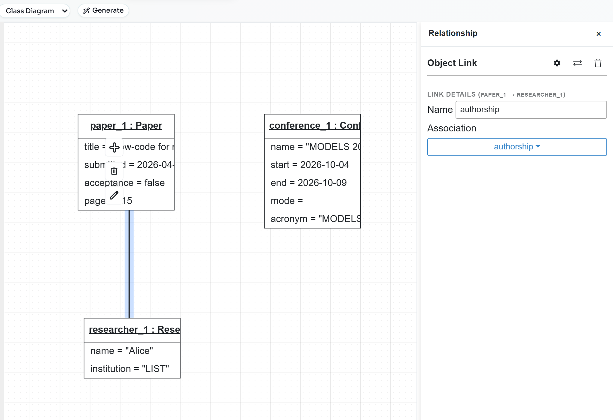

5. Link `paper_1` to `conference_1` the same way and choose `presented_at`.

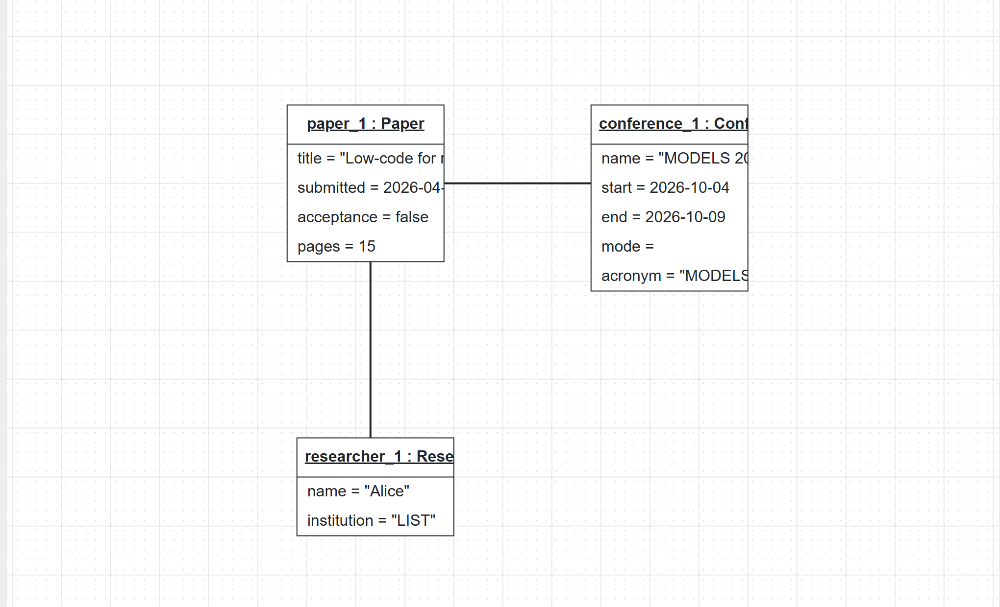

6. Click :ui[Quality Check]. The constraint is now evaluated against `paper_1`:

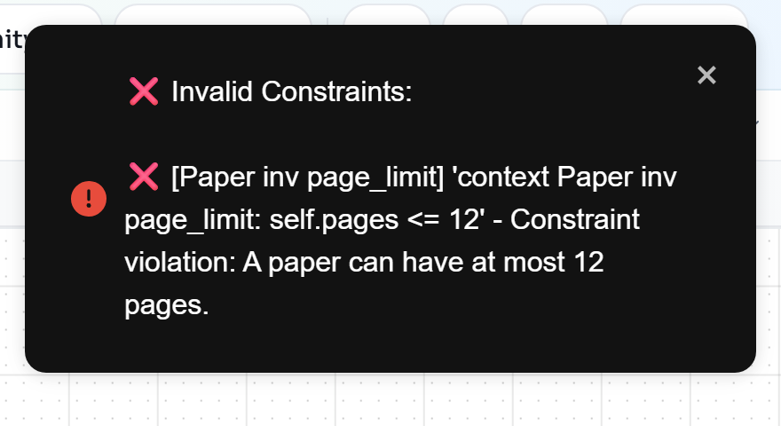

7. Double-click `paper_1`, change `pages` to `10` and run :ui[Quality Check] again.

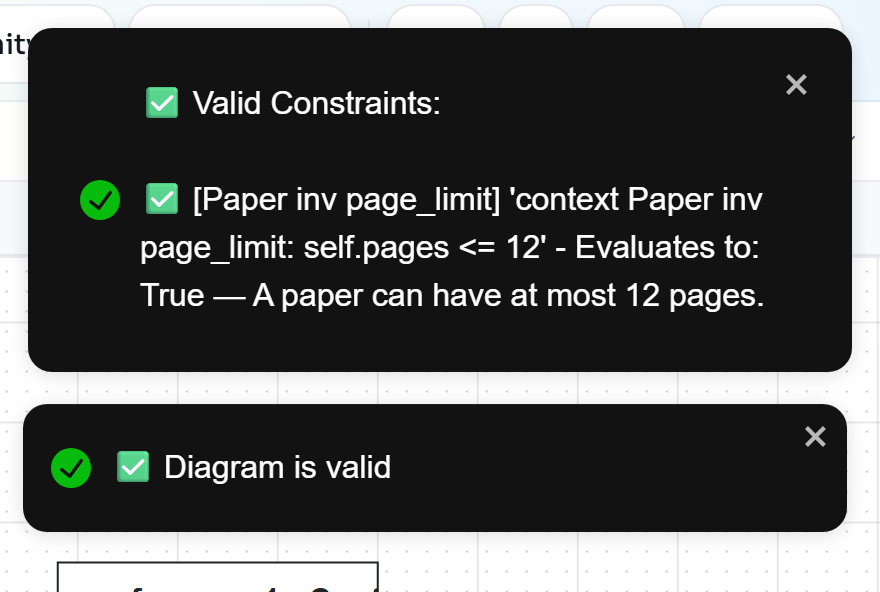

:::troubleshoot
If Quality Check reports `Object 'paper_1' violates multiplicity 1..* for association end 'authors' of association 'authorship' (found 0 links)`, a link is missing or has no association. Double-click each link and check that its :ui[Association] dropdown shows `authorship` or `presented_at`, not :ui[No Association].
:::

:::checkpoint
With `pages = 15`, Quality Check reports a constraint violation with your description. With `pages = 10`, it reports "Diagram is valid".
:::

## Implement methods in BAL

The BESSER Action Language (BAL) is a small, statically typed language for method bodies. Its syntax resembles Java and Python: `def name(param: type) -> return_type { ... }`, `this` for the current object, `if (...) { ... } else { ... }`, statements ending in `;`. The [BAL overview](https://besser.readthedocs.io/en/latest/besser_action_language/overview.html) lists everything else.

1. Click :ui[Class] in the sidebar and double-click `Paper`.
2. Under :ui[Methods], type `+ length_class(): str` in the `+ method(param: str): str or →` field and press :kbd[Enter].
3. Below the new method, open the :ui[Type:] dropdown, which shows :ui[None (UML)], and choose :ui[BESSER Action Language]. A code editor opens with a template that starts with `def length_class() -> nothing {`.
4. Replace the whole template with:

```text
def length_class() -> str {
    if (this.pages > 8) {
        return "long";
    } else {
        return "short";
    }
}
```

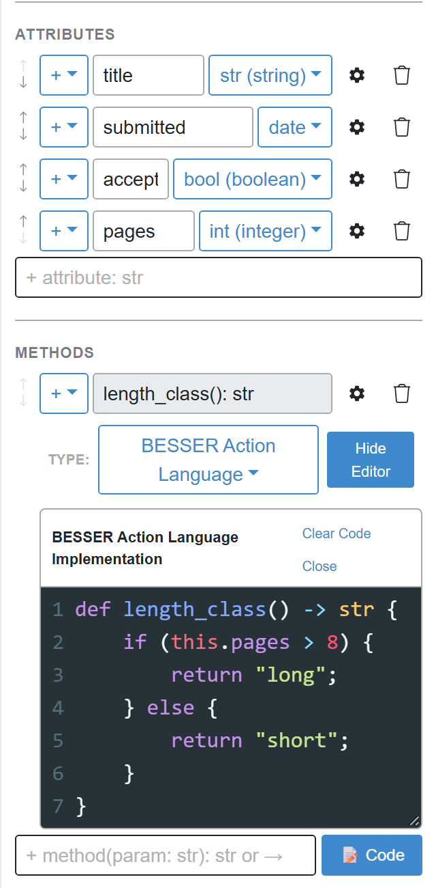

5. Add a second method with a parameter. Type `+ reading_time(pages_per_hour: int): float`, choose :ui[BESSER Action Language], and replace the template with:

```text
def reading_time(pages_per_hour: int) -> float {
    return this.pages * 1.0 / pages_per_hour;
}
```

BAL checks types. `this.pages / pages_per_hour` divides two `int` values and is an `int`, which does not match the declared `float`; the generator then stops with `A return statement in function reading_time is returning an invalid type, returns int rather than float`. Multiplying by `1.0` first makes the expression a `float`.

:::troubleshoot
If Quality Check reports `Invalid return type 'nothing' for the method 'length_class'`, the template is still in the code editor, above or instead of your code. The signature is taken from the first `def` line, so delete everything except your function.
:::

:::checkpoint
`Paper` shows `+ length_class(): str` and a `reading_time` method on the canvas, and Quality Check still reports "Diagram is valid". Long signatures are cut off on the canvas; the panel shows them in full.
:::

## Add a Python method that changes the paper

A method can also be written in Python. You use it here for a method that changes the object.

1. In the `Paper` panel, add `+ accept(): bool`.
2. Set its :ui[Type:] to :ui[Python Code] and replace the template with:

```python
def accept(self):
    """Mark the paper as accepted."""
    self.acceptance = True
    return self.acceptance
```

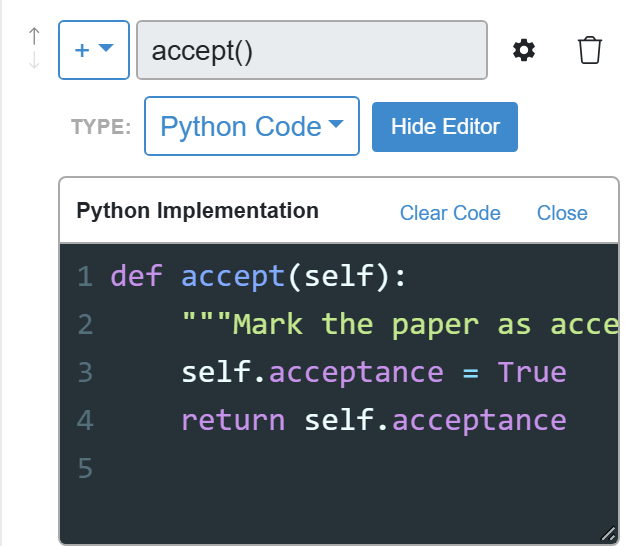

:::note
In BESSER 8.0.x (checked with 8.0.1), the generated backend runs BAL bodies that read attributes and parameters and compute a result, like the two above. BAL bodies that assign to an attribute (`this.acceptance = true;`) or navigate an association (`this.papers.size()`) fail when called, with errors such as `name 'update_paper' is not defined`. Use Python for those methods until this is fixed.
:::

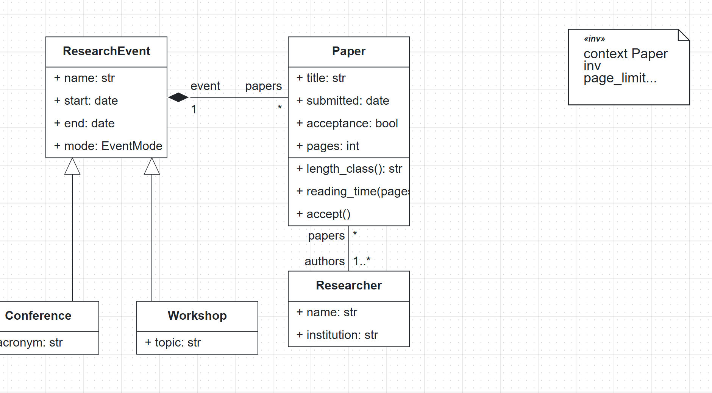

:::checkpoint
`Paper` lists three methods. In the panel, `length_class` and `reading_time` have the type :ui[BESSER Action Language] and `accept` has :ui[Python Code].
:::

## Link a state machine to a method

A method can also be implemented by a state machine. The Data Modeler perspective hides state machines, so turn them on first.

1. Click :ui[Settings] in the sidebar. Under :ui[Modeling Perspectives], tick :ui[State Machine Diagram]. A :ui[State] entry appears in the sidebar.

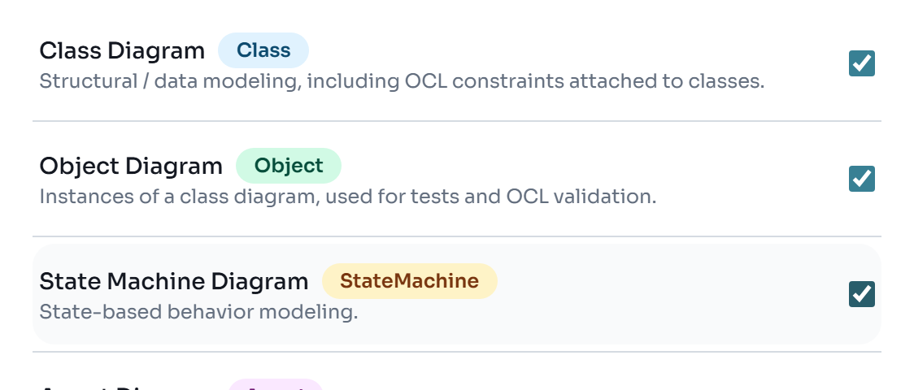

2. Click :ui[State]. From the palette, drag an initial node (the filled circle), two :ui[State] elements and a final node (the circle with a ring) onto the canvas. Double-click the states and name them `Submitted` and `Reviewed`.
3. Connect them from left to right: select an element and drag from one of its connection points to the next one.

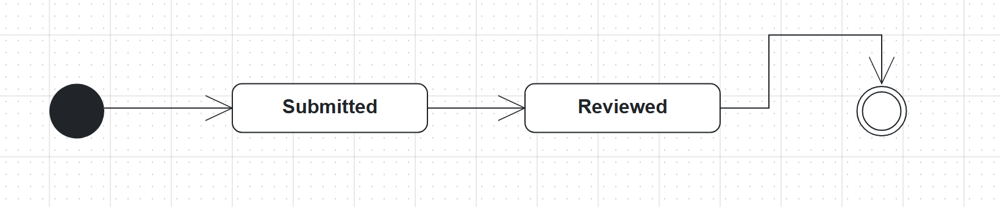

4. Go back to :ui[Class], double-click `Paper` and add `+ review()`. Set its :ui[Type:] to :ui[State Machine]. A second dropdown appears; choose :ui[State Machine Diagram], the name of the state machine's tab.

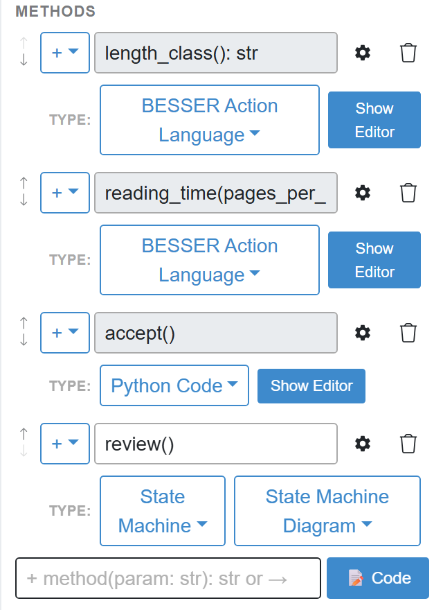

:::note
State machines have no generator of their own: with a state diagram active, the :ui[Generate] menu says "State machines are used as method implementations in Class Diagrams. Generate code from the Class Diagram." The deterministic backend generator does not turn a state machine into code yet. The next step shows what `review` does in the generated backend.
:::

:::checkpoint
The sidebar shows :ui[State]. The state diagram has four nodes and three transitions, and `review()` in `Paper` has the type :ui[State Machine].
:::

## Generate the backend and call the methods

1. With the class diagram active, open :ui[Generate > Web > Full Backend]. The editor downloads `backend_output.zip`.

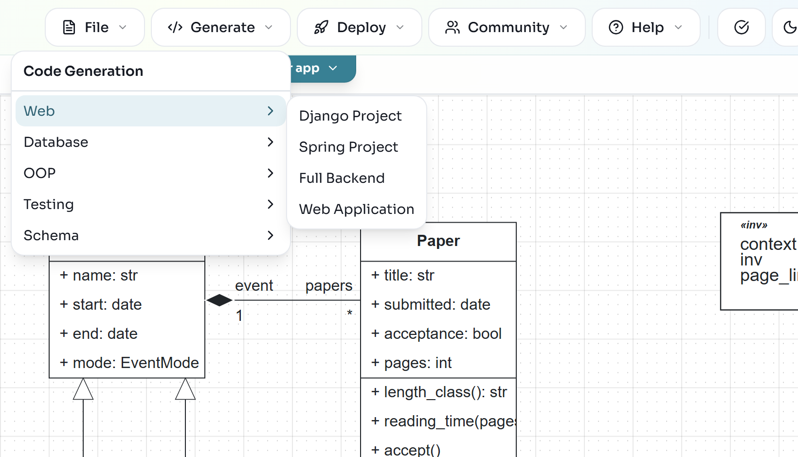

2. Unzip it into a new folder. It contains `main_api.py`, `routers/`, `pydantic_classes.py`, `sql_alchemy.py`, `database.py`, `bal_stdlib.py` and `requirements.txt`. Open a terminal in that folder, create and activate a virtual environment as in [Model in Python with B-UML](/labs/buml-python/), then install and start the server:

```bash
python -m pip install -r requirements.txt
uvicorn main_api:app --reload
```

3. Open [http://127.0.0.1:8000/docs](http://127.0.0.1:8000/docs). Swagger UI lists every endpoint. The methods are under :ui[Paper Methods]:

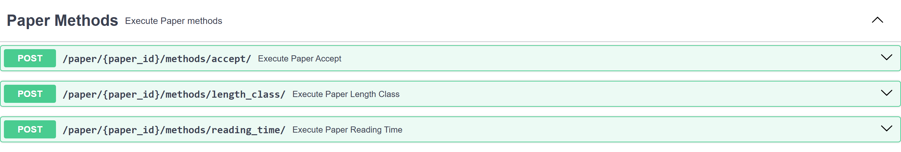

4. Create the data. In Swagger UI, open an endpoint, click :ui[Try it out], paste the body and click :ui[Execute]. Create a conference with `POST /conference/`, then a researcher with `POST /researcher/`:

```json
{"name": "MODELS 2026", "start": "2026-10-04", "end": "2026-10-09", "mode": "in_person", "acronym": "MODELS"}
```

```json
{"name": "Alice", "institution": "LIST"}
```

5. Try to create a paper that breaks the page limit with `POST /paper/`:

```json
{"title": "Too long", "submitted": "2026-04-01", "acceptance": false, "pages": 15, "authors": [1], "event": 1}
```

The server answers with code 422. Your OCL invariant became a validator in `pydantic_classes.py`:

```json
{"detail":[{"type":"value_error","loc":["body","pages"],"msg":"Value error, pages must be <= 12","input":15,"ctx":{"error":{}},"url":"https://errors.pydantic.dev/2.6/v/value_error"}]}
```

6. Send the same body with `"title": "Low-code for research software"` and `"pages": 10`. This time you get code 200 and a paper with `"id": 1`.
7. Call the methods on paper 1. For `POST /paper/{paper_id}/methods/length_class/`, enter `1` as `paper_id` and execute:

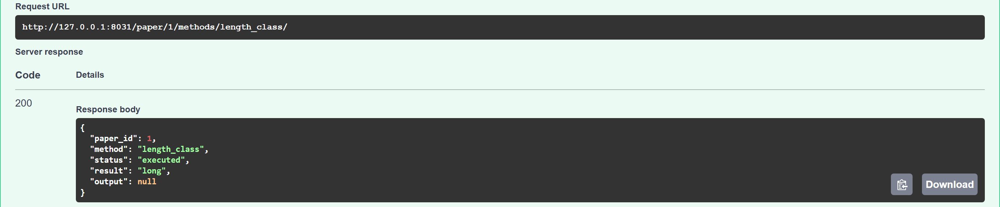

For `reading_time`, send the parameter inside `params`:

```json
{"params": {"pages_per_hour": 4}}
```

```json
{"paper_id":1,"method":"reading_time","status":"executed","result":"2.5","output":null}
```

Then call `accept` with an empty body (`{}`) and read the paper back with `GET /paper/{paper_id}/`:

```json
{"paper":{"id":1,"acceptance":true,"event_id":1,"pages":10,"title":"Low-code for research software","submitted":"2026-04-01"},"researcher_ids":[1]}
```

8. Finally, call `POST /paper/{paper_id}/methods/review/`. It answers with code 501 and `Method 'review' of Paper is modeled but has no implementation - 501, never a fake success`: the endpoint exists because the method is in the model, but its state machine is not translated into code.

:::troubleshoot
If `uvicorn` is not found, the virtual environment is not active or `pip install -r requirements.txt` did not run in it. Activate it and install again. If port 8000 is taken, start the server with `uvicorn main_api:app --reload --port 8001` and use that port in the browser.
:::

:::checkpoint
Creating a paper with 15 pages returns 422 with `pages must be <= 12`, `length_class` returns `long`, `reading_time` returns `2.5`, and after `accept` the paper shows `"acceptance": true`.
:::

The data is stored in SQLite, in `data/Class_Diagram.db` inside the backend folder; delete that file to start with an empty database. Stop the server with :kbd[Ctrl+C].

## Exercise: more rules and more behavior

:::exercise[An event cannot end before it starts]
Add an invariant to `ResearchEvent` that requires the end date to be on or after the start date. Generate the backend again and try to create a conference whose `end` is before its `start`.
:::

:::solution
The expression compares two attributes of the same object: `context ResearchEvent inv dates_in_order: self.end >= self.start`. The generated backend then rejects such an event with code 422 and `Constraint 'dates_in_order' violated: self.end >= self.start`. Because `Conference` inherits from `ResearchEvent`, the rule applies to conferences and workshops too.
:::

:::exercise[Does the paper fit a limit?]
Add a BAL method `fits(limit: int): bool` to `Paper` that returns whether the paper has at most `limit` pages. Call it from Swagger UI with two different limits.
:::

:::solution
The body is a single `return` of a comparison between `this.pages` and the parameter. Send the parameter as `{"params": {"limit": 8}}`. Remember that BAL statements end with `;`.
:::

Further reading: [OCL in B-UML](https://besser.readthedocs.io/en/latest/buml_language/model_types/ocl.html), [the BESSER Action Language](https://besser.readthedocs.io/en/latest/besser_action_language.html), the [object diagram guide](https://besser.readthedocs.io/projects/besser-web-modeling-editor/en/latest/user-guide/diagrams/object-diagram.html) and the [backend generator](https://besser.readthedocs.io/en/latest/generators/backend.html).
