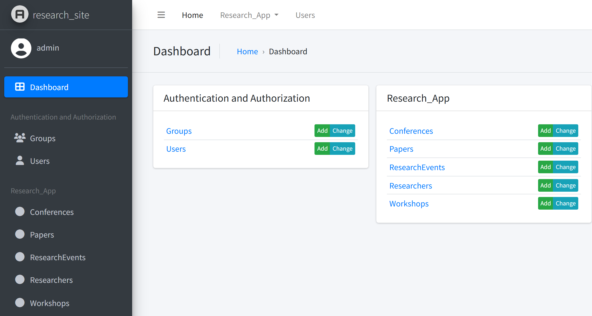
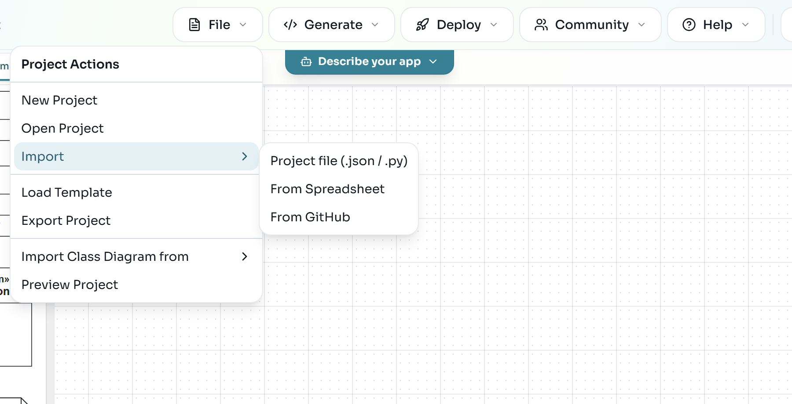
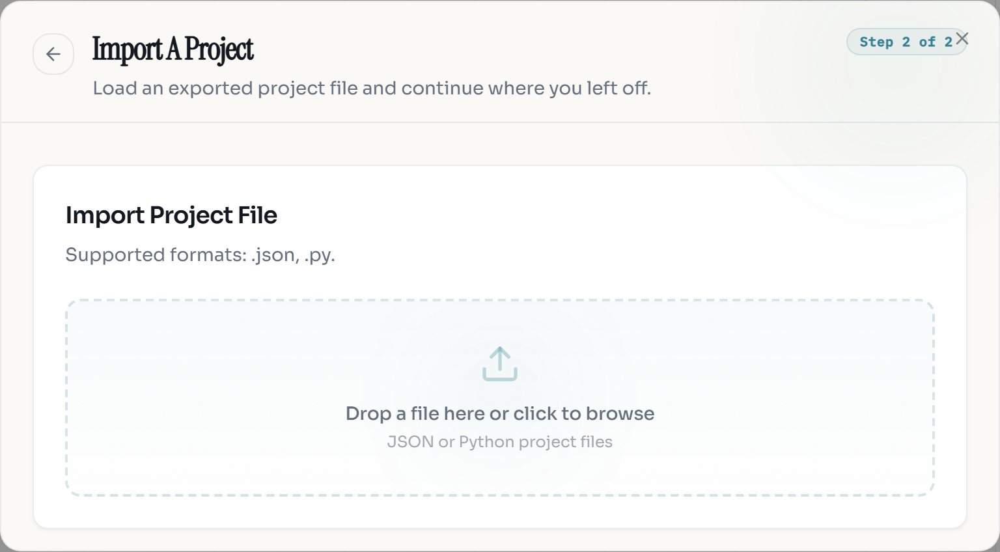
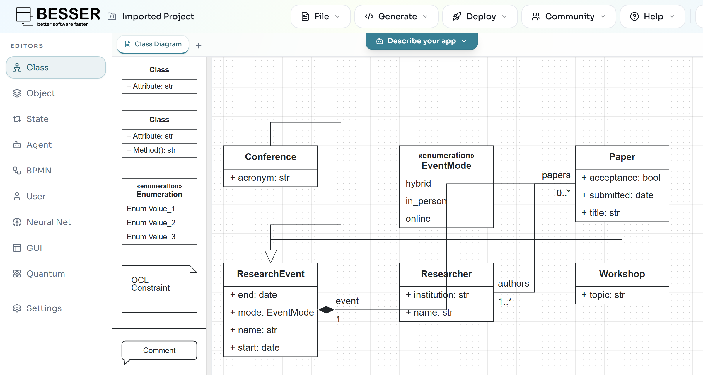

In [Draw your first class diagram](/labs/first-model/) you drew the research domain in the editor. Every editor model is a B-UML model underneath, and B-UML is also a Python library. In this lab you build the same model in Python, which is how you script models, test them, or plug BESSER into your own tools.

You then hand the model to two code generators: SQLAlchemy, which gives you a database, and Django, which gives you a web app with an admin interface. At the end you move a model from the editor into Python and the other way around.

## Install BESSER in a virtual environment

1. Create a folder for this lab, for example `buml-lab`, and open a terminal in it.
2. Create and activate a virtual environment, then install BESSER:

```bash
python -m venv venv
source venv/bin/activate
python -m pip install besser
```

```powershell
python -m venv venv
venv\Scripts\activate
python -m pip install besser
```

3. Check the installed version:

```bash
python -c "from importlib.metadata import version; print(version('besser'))"
```

```text
8.0.1
```

:::troubleshoot
If the version command prints 6.x or older, your Python is older than 3.11 and pip quietly installed the last release that supports it. BESSER 8 needs Python 3.11 or newer. Check with `python --version`, install 3.11 or 3.12, and create the virtual environment again with that interpreter.
:::

:::checkpoint
The version command prints `8.0.1` (or a later 8.x release), and your prompt shows `(venv)`.
:::

## Define the classes and their attributes

Download [domain_model.py](/files/buml-python/domain_model.py) into your lab folder and open it. It builds the model from the first lab. The first part creates the enumeration and the classes:

```python
from besser.BUML.metamodel.structural import (
    BinaryAssociation, BooleanType, Class, DateType, DomainModel, Enumeration,
    EnumerationLiteral, Generalization, Multiplicity, Property, StringType,
)

# Enumeration
EventMode = Enumeration(name="EventMode", literals={
    EnumerationLiteral(name="in_person"),
    EnumerationLiteral(name="online"),
    EnumerationLiteral(name="hybrid"),
})

# Classes and their attributes
Researcher = Class(name="Researcher", attributes={
    Property(name="name", type=StringType),
    Property(name="institution", type=StringType),
})

Paper = Class(name="Paper", attributes={
    Property(name="title", type=StringType),
    Property(name="submitted", type=DateType),
    Property(name="acceptance", type=BooleanType),
})

ResearchEvent = Class(name="ResearchEvent", attributes={
    Property(name="name", type=StringType),
    Property(name="start", type=DateType),
    Property(name="end", type=DateType),
    Property(name="mode", type=EventMode),
})

Conference = Class(name="Conference", attributes={Property(name="acronym", type=StringType)})
Workshop = Class(name="Workshop", attributes={Property(name="topic", type=StringType)})
```

Each attribute is a `Property` with a name and a type. The primitive types are ready-made objects: `StringType`, `IntegerType`, `FloatType`, `BooleanType`, `DateType`, `DateTimeType`, `TimeType`, `TimeDeltaType` and `AnyType`. An enumeration is used as a type in the same way, as `mode` shows.

:::note
Older tutorials import `String` or `Integer`. Those names do not exist in BESSER 8; use `StringType`, `IntegerType` and so on.
:::

:::checkpoint
`domain_model.py` is in your lab folder, and you can find the five classes and the `EventMode` enumeration in it.
:::

## Connect the classes and group them in a domain model

The second part of the file adds the relationships and wraps everything in a `DomainModel`:

```python
# Associations: each end is a Property named after the role it plays.
authorship = BinaryAssociation(name="authorship", ends={
    Property(name="papers", type=Paper, multiplicity=Multiplicity(0, "*")),
    Property(name="authors", type=Researcher, multiplicity=Multiplicity(1, "*")),
})

# Composition: an event owns its papers (is_composite goes on the whole's end).
presented_at = BinaryAssociation(name="presented_at", ends={
    Property(name="papers", type=Paper, multiplicity=Multiplicity(0, "*")),
    Property(name="event", type=ResearchEvent, multiplicity=Multiplicity(1, 1), is_composite=True),
})

# Generalizations: a Conference is a ResearchEvent, and so is a Workshop.
conference_is_event = Generalization(general=ResearchEvent, specific=Conference)
workshop_is_event = Generalization(general=ResearchEvent, specific=Workshop)

# The domain model groups everything.
domain_model = DomainModel(
    name="Research_Lab",
    types={Researcher, Paper, ResearchEvent, Conference, Workshop, EventMode},
    associations={authorship, presented_at},
    generalizations={conference_is_event, workshop_is_event},
)
```

A `BinaryAssociation` has exactly two ends. Each end is a `Property` whose `type` is the class at that end and whose name is the role, the same values you typed in the editor's :ui[Role] fields. `Multiplicity(0, "*")` is the editor's `*`, and `Multiplicity(1, "*")` is `1..*`.

Run the file. Its last lines print every class with its own attributes:

```bash
python domain_model.py
```

```text
Conference(acronym: str)
Paper(acceptance: bool, submitted: date, title: str)
ResearchEvent(end: date, mode: EventMode, name: str, start: date)
Researcher(institution: str, name: str)
Workshop(topic: str)
```

:::checkpoint
The command prints the five classes above, without errors.
:::

## Validate the model and inspect it

B-UML checks some rules as you build the model and others when you ask for a full validation. Create `inspect_model.py` next to `domain_model.py`:

```python
from domain_model import domain_model, Conference

result = domain_model.validate(raise_exception=False)
print("valid:", result["success"], "errors:", result["errors"], "warnings:", result["warnings"])

print("Conference inherits from:", [p.name for p in Conference.parents()])
print("Conference attributes:", sorted(a.name for a in Conference.all_attributes()))

for assoc in sorted(domain_model.associations, key=lambda a: a.name):
    for end in sorted(assoc.ends, key=lambda e: e.name):
        m = end.multiplicity
        upper = "*" if m.max == 9999 else m.max
        print(f"{assoc.name}: {end.name} -> {end.type.name} [{m.min}..{upper}]"
              f"{' (composite)' if end.is_composite else ''}")
```

```bash
python inspect_model.py
```

```text
valid: True errors: [] warnings: []
Conference inherits from: ['ResearchEvent']
Conference attributes: ['acronym', 'end', 'mode', 'name', 'start']
authorship: authors -> Researcher [1..*]
authorship: papers -> Paper [0..*]
presented_at: event -> ResearchEvent [1..1] (composite)
presented_at: papers -> Paper [0..*]
```

`all_attributes()` includes the inherited ones, so `Conference` has `name`, `start`, `end` and `mode` from `ResearchEvent`. B-UML stores an unbounded upper multiplicity (`*`) as 9999.

Rules that are checked immediately raise an error at the line that breaks them. For example, names cannot contain spaces:

```python
Class(name="Research Event")
```

```text
ValueError: 'Research Event' is invalid. Name cannot contain spaces.
```

Marking both ends of an association with `is_composite=True` fails the same way, with `ValueError: The composition attribute cannot be tagged at both ends`.

:::checkpoint
`inspect_model.py` prints `valid: True` and lists both ends of both associations, with `event` marked as composite.
:::

## Generate a SQLite database with SQLAlchemy

[SQLAlchemy](https://www.sqlalchemy.org/) maps Python classes to database tables. The BESSER generator writes that mapping for you. Create `generate_sql.py`:

```python
from besser.generators.sql_alchemy import SQLAlchemyGenerator
from domain_model import domain_model

SQLAlchemyGenerator(model=domain_model).generate(dbms="sqlite")
```

```bash
python generate_sql.py
```

```text
Code generated successfully!
```

The generator writes `output/sql_alchemy.py`. Run that file from inside `output` to create the database:

```bash
cd output
python sql_alchemy.py
cd ..
```

The script creates `output/data/Research_Lab.db` (the file is named after the model). To see the tables, create `show_tables.py` in the lab folder:

```python
import sqlite3

con = sqlite3.connect("output/data/Research_Lab.db")
for (table,) in con.execute("SELECT name FROM sqlite_master WHERE type='table' ORDER BY name"):
    columns = [row[1] for row in con.execute(f"PRAGMA table_info('{table}')")]
    print(f"{table}: {', '.join(columns)}")
```

```bash
python show_tables.py
```

```text
authorship: authors, papers
conference: id, acronym
paper: id, title, submitted, acceptance, event_id
researcher: id, name, institution
researchevent: id, name, start, end, mode, type_spec
workshop: id, topic
```

Read the result against the model:

- Every class got a table with a generated `id` primary key.
- The many-to-many association `authorship` became a link table with one column per end.
- The composition `presented_at` became the foreign key `paper.event_id`, because a paper has exactly one event.
- The generalization became joined tables: `conference` and `workshop` hold only their own columns and share the `id` of a `researchevent` row, whose `type_spec` column records which subclass the row is.

You can also use the generated classes directly. Save this as `output/add_data.py` and run it from inside `output`:

```python
from datetime import date
from sqlalchemy.orm import Session
from sql_alchemy import engine, Conference, EventMode, Paper, Researcher

with Session(engine) as session:
    models = Conference(name="MODELS 2026", acronym="MODELS", start=date(2026, 10, 4),
                        end=date(2026, 10, 9), mode=EventMode.in_person)
    alice = Researcher(name="Alice", institution="LIST")
    paper = Paper(title="Low-code for research software", submitted=date(2026, 4, 1),
                  acceptance=True, event=models, authors=[alice])
    session.add(paper)
    session.commit()
    for p in session.query(Paper).all():
        print(p.title, "|", p.event.name, "|", [a.name for a in p.authors])
```

```text
Low-code for research software | MODELS 2026 | ['Alice']
```

:::note
`dbms` also accepts `postgresql`, `mysql`, `mssql`, `mariadb` and `oracle`. The generated file then contains a placeholder connection string for that database, which you override with the `DATABASE_URL` environment variable, and you install the database driver yourself. See the [SQLAlchemy generator documentation](https://besser.readthedocs.io/en/latest/generators/alchemy.html).
:::

:::checkpoint
`show_tables.py` lists the six tables above, and `add_data.py` prints one paper with its event and author.
:::

## Generate and run a Django project

[Django](https://www.djangoproject.com/) is a Python web framework. The BESSER Django generator creates a complete project whose admin interface lets you create, edit and delete instances of every class. Create `generate_django.py`:

```python
from besser.generators.django import DjangoGenerator
from domain_model import domain_model

DjangoGenerator(
    model=domain_model,
    project_name="research_site",
    app_name="research_app",
    containerization=False,
).generate()
```

```bash
python generate_django.py
```

The script prints a line ending in `Django project generation completed successfully!` and creates the folder `research_site` with `manage.py`, `requirements.txt`, the project package `research_site` and the app `research_app`.

:::troubleshoot
On Windows, if the script stops with `UnicodeEncodeError: 'charmap' codec can't encode character '✅'`, the console cannot print the check-mark character in the success message (this happens, for example, when the output is redirected). Run it as `python -X utf8 generate_django.py`, or set the environment variable `PYTHONIOENCODING=utf-8` first, and generate again. This is fixed in the next BESSER release after 8.0.1.
:::

Install the project's dependencies and create its database. `requirements.txt` pins its own Django version, so it may replace the one BESSER installed in your virtual environment; that is expected.

```bash
cd research_site
python -m pip install -r requirements.txt
python manage.py makemigrations
python manage.py migrate
```

`makemigrations` reads the generated models:

```text
Migrations for 'research_app':
  research_app\migrations\0001_initial.py
    + Create model ResearchEvent
    + Create model Researcher
    + Create model Conference
    + Create model Workshop
    + Create model Paper
```

Create an admin account (it asks for a user name, an e-mail address and a password), then start the server:

```bash
python manage.py createsuperuser
python manage.py runserver
```

Open [http://127.0.0.1:8000/admin/](http://127.0.0.1:8000/admin/) and log in with the account you just created.



Add a conference, a researcher and a paper through the admin. In the generated `research_app/models.py`, `authorship` became a `ManyToManyField` and `presented_at` a `ForeignKey` with `on_delete=models.CASCADE`, so the paper form requires authors and an event, and deleting an event deletes its papers, as the composition says. Stop the server with :kbd[Ctrl+C].

:::checkpoint
The admin dashboard lists the five model classes under `Research_App`, each with :ui[Add] and :ui[Change].
:::

## Move models between the editor and Python

**From the editor to Python.** In the editor, open the project from the first lab and choose :ui[File > Export Project], then :ui[Export as B-UML]. The editor downloads `research_lab_project.py`. It is plain B-UML code, built with the same classes you used above, and it ends with a `Project` that holds the domain model:

```python
domain_model = DomainModel(
    name="Class_Diagram",
    types={ResearchEvent, Paper, Researcher, Conference, Workshop, EventMode},
    associations={authorship, presented_at},
    generalizations={gen_Conference_ResearchEvent, gen_Workshop_ResearchEvent},
    metadata=None
)
```

The domain model is named after the diagram tab (`Class Diagram`, with the space replaced). Put the file in your lab folder and use it like your own model. Create `from_editor.py`:

```python
from besser.generators.sql_alchemy import SQLAlchemyGenerator
from research_lab_project import domain_model

print(domain_model.name, sorted(c.name for c in domain_model.get_classes()))
SQLAlchemyGenerator(model=domain_model, output_dir="editor_output").generate(dbms="sqlite")
```

```text
Class_Diagram ['Conference', 'Paper', 'ResearchEvent', 'Researcher', 'Workshop']
Code generated successfully!
```

**From Python to the editor.** Open :ui[File > Import > Project file (.json / .py)].



In the :ui[Import A Project] dialog, drop `domain_model.py` on the drop zone or click it to browse. A plain model file works: it does not need a `Project` definition.



The editor converts the file, shows the notification `Imported project "Imported Project".` and opens the class diagram. It places the classes automatically, so drag them around until the diagram is readable.



:::note
The editor does not run your file as a normal Python program. The server reads it with a restricted loader made for model-building code, so keep model files to model definitions. `domain_model.py`, including its printing code at the end, imports without changes.
:::

:::checkpoint
`from_editor.py` prints `Class_Diagram` and the five class names, and the editor shows a new project with the five classes and the `EventMode` enumeration from `domain_model.py`.
:::

## Exercise: junior and senior researchers

:::exercise[Specialise Researcher]
Researchers come in two kinds: `Junior` researchers, who have a supervisor, and `Senior` researchers, who have an h-index. Add both to `domain_model.py` as subclasses of `Researcher`, each with one attribute of a sensible type. Validate the model, generate the SQLAlchemy code again and recreate the database. Which new tables appear, and which columns do they have?
:::

:::solution
Create the two classes like `Conference`, add them to the `types` of the domain model, and add two `Generalization(general=Researcher, specific=...)` objects to its `generalizations`. You can also call `domain_model.add_type(...)` and `domain_model.add_generalization(...)` on the existing model. Delete `output/data/Research_Lab.db` before running `sql_alchemy.py` again. The database then has the tables `junior` and `senior` next to `researcher`.
:::

:::exercise[Reviews in Python]
Add the `Score` class and the `ScoreValue` enumeration from the exercise of the first lab, this time in Python, and check that `validate()` still succeeds.
:::

:::solution
`ScoreValue` is an `Enumeration` with six `EnumerationLiteral`s. `Score` needs two `BinaryAssociation`s: one to `Paper` (put `is_composite=True` on the `Paper` end) and one to `Researcher` with a `reviewer` end of multiplicity `Multiplicity(1, 1)`.
:::

The full API is described in the [structural model documentation](https://besser.readthedocs.io/en/latest/buml_language/model_types/structural.html), and the generators in the [Django generator documentation](https://besser.readthedocs.io/en/latest/generators/django.html).
