A class diagram already describes the data your application stores. In this lab you use the Web Modeling
Editor to turn the Library template into database code: plain SQL DDL for two dialects, SQLAlchemy models
that create a SQLite database, and a complete FastAPI backend with a REST API on top of it.

You read the real generated output at every step, so you learn the mapping rules by example: which UML
construct becomes a table, a column, a foreign key or a separate association table. Along the way you change
one association and add a subclass, and watch the schema change with them.

## Load the Library template and check it

1. Open [editor.besser-pearl.org](https://editor.besser-pearl.org/) and create a new project with
   :ui[File > New Project] (on a first visit, click :ui[Start modelling] on the :ui[Model it] card).
   Name it `Library DB` and click :ui[Create Project].
2. Open :ui[File > Load Template]. In the dialog, :ui[Class Diagram] is selected on the left and
   :ui[Library] is preselected. Click :ui[Load Template].

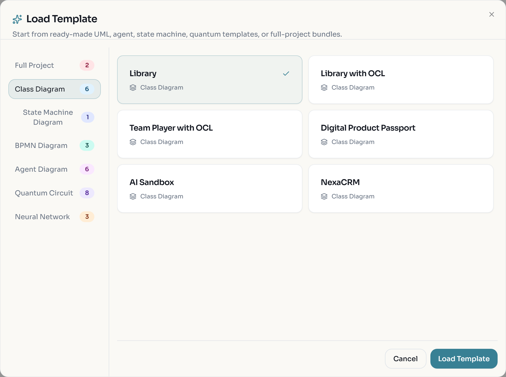

3. Click :ui[Quality Check] in the top bar (the check-mark icon). A message reports the OCL constraint
   `inv1` as valid and ends with "Diagram is valid".

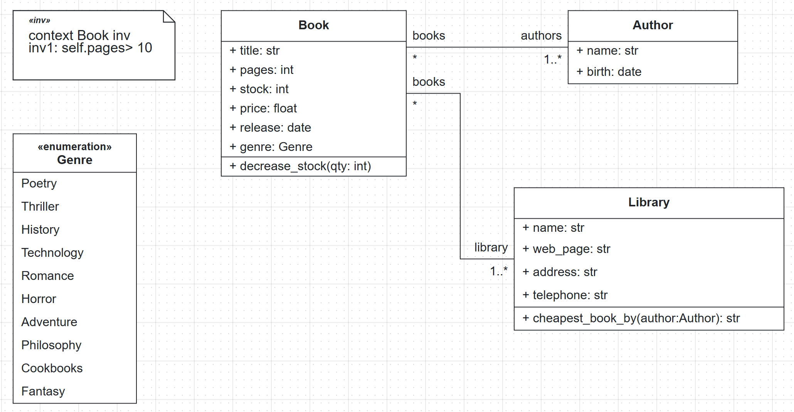

Look at the model with a database designer's eye before you generate anything:

- `Book`, `Author` and `Library` are classes, so each becomes a table.
- `Genre` is an enumeration. `Book.genre` is typed with it.
- Book and Author are linked by an association with multiplicity `*` on the Book end and `1..*` on the Author end.
- Book and Library are linked by an association with `*` on the Book end and `1..*` on the Library end.
  Both ends allow many, so this is also many-to-many: a book can belong to several libraries.
- Both associations are named `books`.

:::checkpoint
The canvas shows Book (six attributes and the `decrease_stock` method), Author, Library, the Genre
enumeration with ten literals and the OCL note `context Book inv inv1: self.pages> 10`. Quality Check
says the diagram is valid.
:::

## Generate SQL DDL for SQLite and PostgreSQL

1. Open :ui[Generate > Database > SQL DDL].

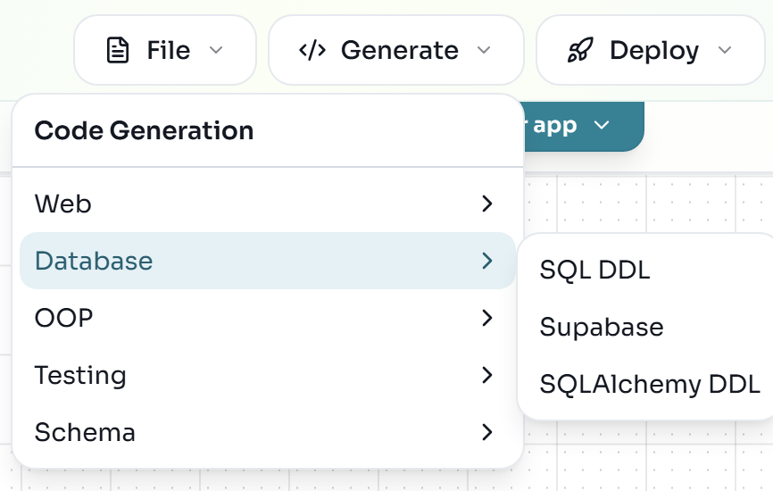

2. In the :ui[SQL Dialect Selection] dialog, keep :ui[Dialect] on :ui[SQLite] and click :ui[Generate].
   The browser downloads `tables.sql`. Rename it to `tables_sqlite.sql`.
3. Open :ui[Generate > Database > SQL DDL] again, choose :ui[PostgreSQL] and click :ui[Generate].
   Rename this download to `tables_postgresql.sql`.

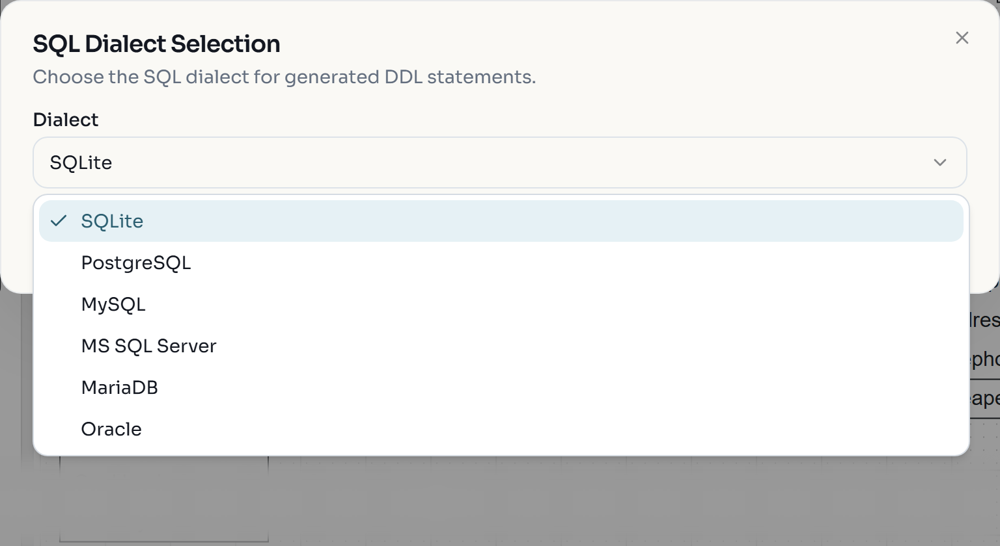

:::note
The dialog remembers the dialect you used last. Check the :ui[Dialect] field every time you generate.
:::

Open both files side by side. This is the `book` table and the two association tables from the SQLite file:

```sql
CREATE TABLE book (
	id INTEGER NOT NULL, 
	title VARCHAR(100) NOT NULL, 
	pages INTEGER NOT NULL, 
	stock INTEGER NOT NULL, 
	price FLOAT NOT NULL, 
	release DATE NOT NULL, 
	genre VARCHAR(10) NOT NULL, 
	PRIMARY KEY (id)
)

CREATE TABLE books (
	books INTEGER NOT NULL, 
	library INTEGER NOT NULL, 
	PRIMARY KEY (books, library), 
	FOREIGN KEY(books) REFERENCES book (id), 
	FOREIGN KEY(library) REFERENCES library (id)
)

CREATE TABLE books_1 (
	authors INTEGER NOT NULL, 
	books INTEGER NOT NULL, 
	PRIMARY KEY (authors, books), 
	FOREIGN KEY(authors) REFERENCES author (id), 
	FOREIGN KEY(books) REFERENCES book (id)
)
```

And the same `book` table in the PostgreSQL file:

```sql
CREATE TYPE genre AS ENUM ('Poetry', 'Thriller', 'History', 'Technology', 'Romance', 'Horror', 'Adventure', 'Philosophy', 'Cookbooks', 'Fantasy');

CREATE TABLE book (
	id SERIAL NOT NULL, 
	title VARCHAR(100) NOT NULL, 
	pages INTEGER NOT NULL, 
	stock INTEGER NOT NULL, 
	price FLOAT NOT NULL, 
	release DATE NOT NULL, 
	genre genre NOT NULL, 
	PRIMARY KEY (id)
)
```

What the two files tell you:

| UML construct | Becomes | Dialect difference |
|---|---|---|
| Class `Book` | Table `book` with a surrogate key `id` | SQLite `INTEGER`, PostgreSQL `SERIAL` (auto-increment) |
| Attribute `title: str` | Column `VARCHAR(100) NOT NULL` | none |
| Enumeration `Genre` | Values of `book.genre` | SQLite stores a `VARCHAR(10)` (the longest literal); PostgreSQL creates a real `genre` type |
| Many-to-many association | A separate table, named after the association, with a composite primary key of two foreign keys | none |

Because both associations are called `books`, the second table is renamed `books_1`. The columns are named
after the association ends (`authors`, `books`, `library`), so role names matter in the schema.

:::checkpoint
You have `tables_sqlite.sql` and `tables_postgresql.sql`. Both contain the tables `author`, `book`,
`library`, `books` and `books_1`. Only the PostgreSQL file starts with `CREATE TYPE genre AS ENUM` and uses
`SERIAL` and a `genre` column of type `genre`.
:::

## Turn one association into a foreign key and add a subclass

Many-to-many is not the usual design for libraries and books. Make each book belong to exactly one library,
and add an `EBook` subclass so you can see how inheritance is stored.

1. Double-click the association line between Book and Library. The properties panel opens on the right.
2. Under :ui[Library], change :ui[Multiplicity] from `1..*` to `1`. Leave the Book end at `*`.

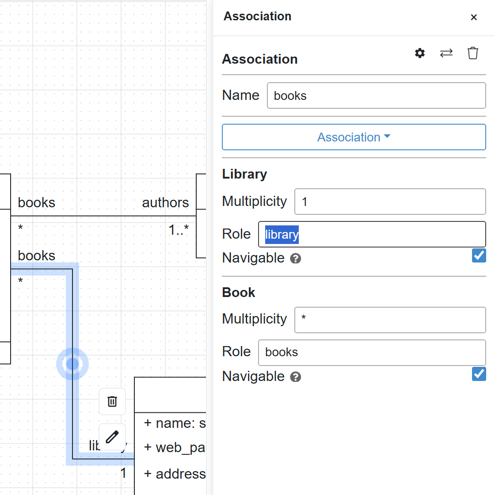

3. Drag the first :ui[Class] element from the palette onto the empty area below Book. Double-click it,
   rename it to `EBook`, and rename its attribute to `file_format` (type `str`).
4. Click EBook, then drag from one of the blue connection points on its top edge to the bottom edge of Book.
5. Double-click the new line. In the properties panel, open the dropdown that reads :ui[Association] and
   choose :ui[Generalization].

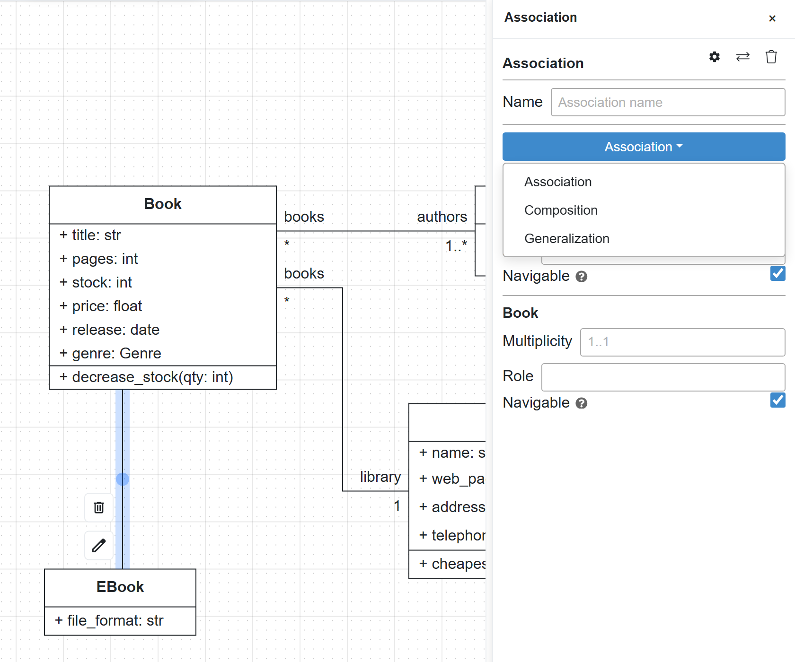

6. Click :ui[Quality Check] again.

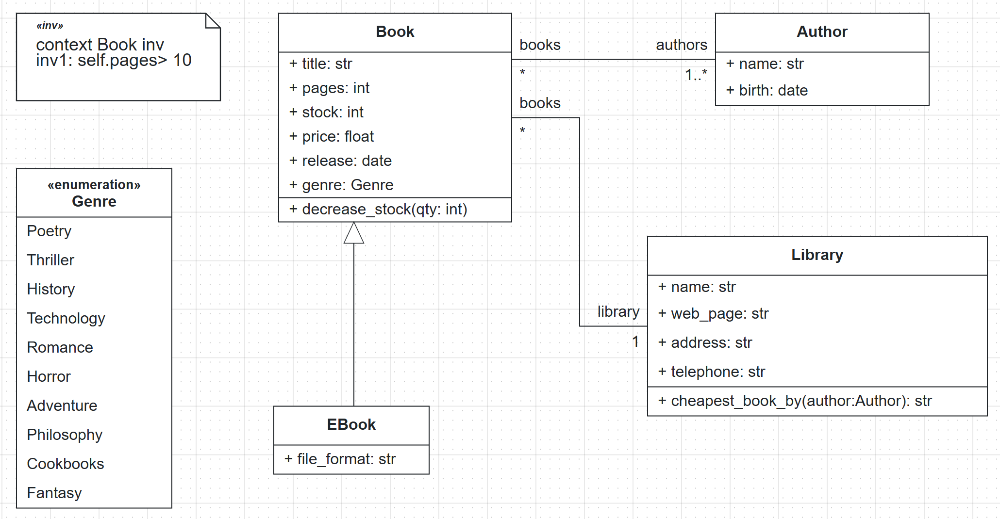

7. Generate the SQL DDL again for SQLite and for PostgreSQL, as in the previous step.

The new SQLite `book` and `ebook` tables:

```sql
CREATE TABLE book (
	id INTEGER NOT NULL, 
	title VARCHAR(100) NOT NULL, 
	pages INTEGER NOT NULL, 
	stock INTEGER NOT NULL, 
	price FLOAT NOT NULL, 
	release DATE NOT NULL, 
	genre VARCHAR(10) NOT NULL, 
	library_id INTEGER NOT NULL, 
	type_spec VARCHAR(50) NOT NULL, 
	PRIMARY KEY (id), 
	FOREIGN KEY(library_id) REFERENCES library (id)
)

CREATE TABLE ebook (
	id INTEGER NOT NULL, 
	file_format VARCHAR(100) NOT NULL, 
	PRIMARY KEY (id), 
	FOREIGN KEY(id) REFERENCES book (id)
)
```

Two mapping rules are visible here:

- **One-to-many becomes a foreign key.** The `books` association table is gone. The "many" side, `book`,
  gets a column `library_id` that references `library (id)`. It is `NOT NULL` because the multiplicity is
  exactly `1`. The Book and Author association is still many-to-many, so `books_1` stays.
- **Inheritance becomes joined tables.** `ebook` holds only the attribute EBook adds, and its `id` is both
  its primary key and a foreign key to `book.id`. The parent table gets a `type_spec` column that records
  which class each row belongs to. Reading an e-book joins the two tables.

:::checkpoint
The new DDL has five tables: `author`, `library`, `book` (with `library_id` and `type_spec`), `books_1`
and `ebook`. There is no table called `books` any more.
:::

## Create a SQLite database with SQLAlchemy

The SQL file is text. SQLAlchemy code is Python that can create the database for you and is the same layer
the generated backend uses.

1. Open :ui[Generate > Database > SQLAlchemy DDL]. In :ui[SQLAlchemy DBMS Selection], make sure
   :ui[DBMS] is :ui[SQLite] and click :ui[Generate]. The browser downloads `sql_alchemy.py`.

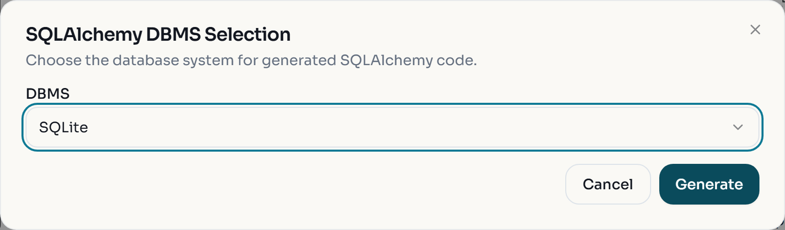

2. Create a working folder, move `sql_alchemy.py`, `tables_sqlite.sql` and
   [list_tables.py](/files/databases/list_tables.py) into it, and install SQLAlchemy:

```bash
python -m pip install "sqlalchemy>=2.0"
```

3. Run the generated file. It creates a `data` folder and the database `data/Library.db`:

```bash
python sql_alchemy.py
```

4. List the tables and their columns with the provided script, which uses only Python's built-in `sqlite3` module:

```python
import sqlite3

con = sqlite3.connect("data/Library.db")
for (name,) in con.execute("SELECT name FROM sqlite_master WHERE type='table' ORDER BY name"):
    cols = [row[1] for row in con.execute(f"PRAGMA table_info({name})")]
    print(f"{name}: {', '.join(cols)}")
```

```bash
python list_tables.py
```

```text
author: id, name, birth
book: id, title, pages, stock, price, release, genre, library_id, type_spec
books_1: authors, books
ebook: id, file_format
library: id, name, web_page, address, telephone
```

Open `sql_alchemy.py` and find the same rules in Python form: `class Genre(enum.Enum)`, a `Table_("books_1", ...)`
for the many-to-many association, `library_id ... ForeignKey_("library.id")` on `Book`, and
`class EBook(Book)` with `"polymorphic_on": "type_spec"`. The connection string is read from the
`DATABASE_URL` environment variable and falls back to `sqlite:///./data/Library.db`.

5. Optional: run the SQL file directly. Save this as `run_ddl.py` and run it:

```python
import sqlite3

con = sqlite3.connect("ddl_test.db")
con.executescript(open("tables_sqlite.sql", encoding="utf-8").read())
print([name for (name,) in con.execute("SELECT name FROM sqlite_master WHERE type='table'")])
```

```text
['author', 'library', 'book', 'books_1', 'ebook']
```

:::note
Near the top of `Library`, `sql_alchemy.py` contains a comment saying the code of `cheapest_book_by` does
not compile. That method is written in the BESSER Action Language, and this standalone file only keeps
Python method bodies. The backend you generate next turns the same method into a working REST endpoint.
:::

:::troubleshoot
`ModuleNotFoundError: No module named 'sqlalchemy'` means the `pip install` went to a different Python than
the one running the script. Use `python -m pip install ...` with exactly the same `python` command you use
to run the file, or create a virtual environment as in the next step.
:::

:::checkpoint
`data/Library.db` exists and `list_tables.py` prints the five tables above.
:::

## Generate the Full Backend and run it

The Full Backend generator adds Pydantic schemas, routers and a FastAPI application on top of the same
SQLAlchemy models.

1. Open :ui[Generate > Web > Full Backend]. There is no dialog: the browser downloads `backend_output.zip`.

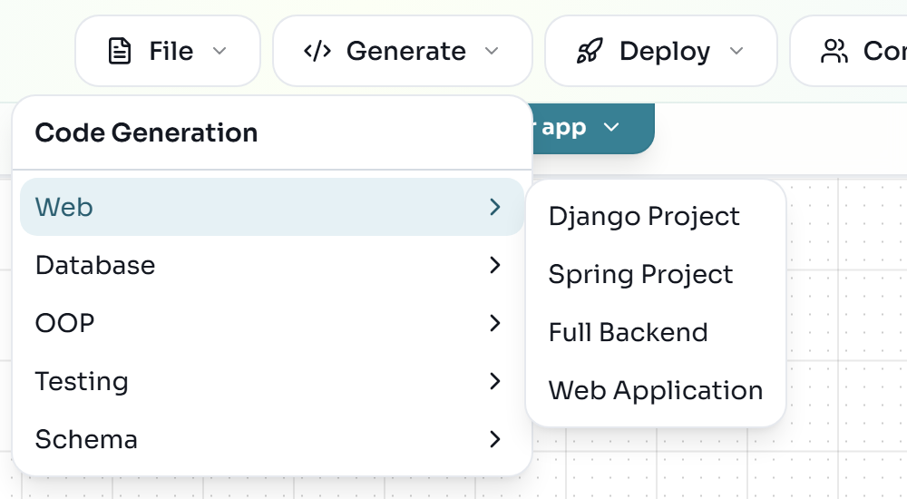

2. The zip has no top-level folder, so create one first and extract into it, for example `library_backend/`.
   You get `main_api.py`, `database.py`, `sql_alchemy.py`, `pydantic_classes.py`, `bal_stdlib.py`,
   `requirements.txt` and a `routers/` folder with one router per class plus `book_methods.py` and
   `library_methods.py`.
3. Create a virtual environment, install the requirements and start the server from inside that folder:

```bash
cd library_backend
python -m venv .venv
source .venv/bin/activate
pip install -r requirements.txt
uvicorn main_api:app --reload
```

```powershell
cd library_backend
python -m venv .venv
.venv\Scripts\Activate.ps1
pip install -r requirements.txt
uvicorn main_api:app --reload
```

The server prints `Uvicorn running on http://127.0.0.1:8000`. On startup it creates `data/Library.db`
inside `library_backend/`, separate from the database of the previous step.

:::troubleshoot
If PowerShell refuses to run `Activate.ps1`, run `Set-ExecutionPolicy -Scope Process -ExecutionPolicy Bypass`
in the same window and activate again. If port 8000 is taken, start with `uvicorn main_api:app --reload --port 8001`
and use that port in the URLs below.
:::

4. Open [http://127.0.0.1:8000/docs](http://127.0.0.1:8000/docs).

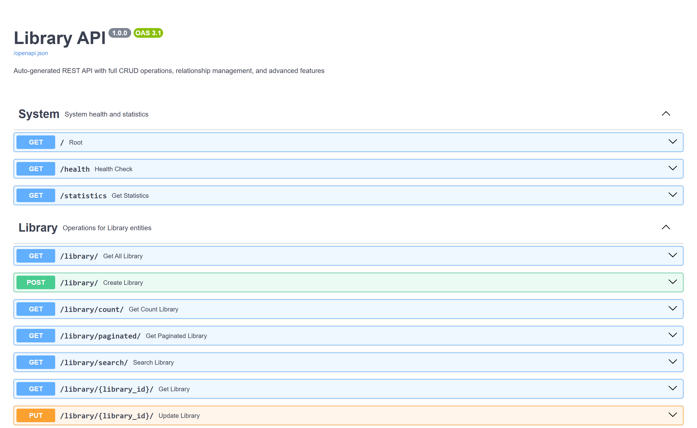

:::checkpoint
Swagger shows "Library API" with groups for System, Library, Book, EBook and Author, plus
"Relationships" and "Methods" groups. `GET /health` returns `"status": "healthy"`.
:::

## Create, read, update and delete records through Swagger

The order matters because of the multiplicities: a Book needs exactly one Library and at least one Author,
so create those first.

1. Expand :ui[POST /library/], click :ui[Try it out], replace the example body with the following and click :ui[Execute]:

```json
{
  "name": "City Library",
  "address": "1 Main Street",
  "telephone": "+352 123 456",
  "web_page": "https://library.example.org"
}
```

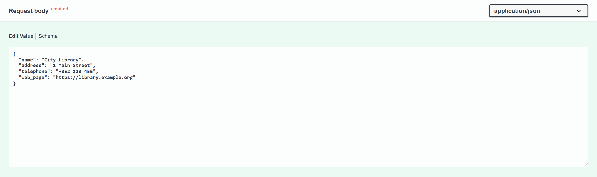

The response is `200` with `"id": 1` and `"books_ids": []`.

2. Create an author with :ui[POST /author/]:

```json
{
  "name": "Ada Writer",
  "birth": "1970-05-01"
}
```

3. Try to create a book that breaks the OCL invariant. Use :ui[POST /book/] with `"pages": 5`:

```json
{
  "title": "Tiny",
  "pages": 5,
  "stock": 1,
  "price": 2.5,
  "release": "2024-03-15",
  "genre": "Poetry",
  "library": 1,
  "authors": [1]
}
```

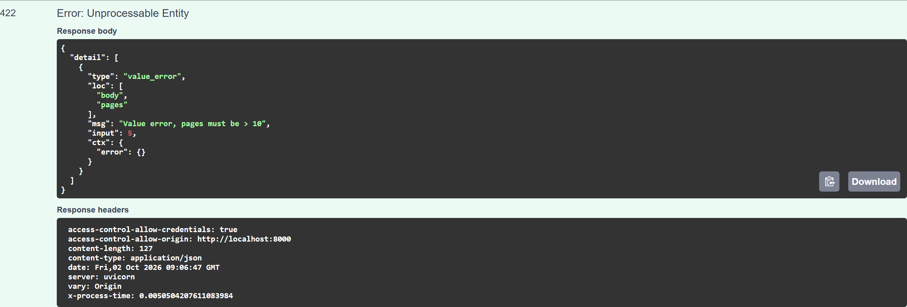

4. Execute :ui[POST /book/] again with a valid book. `library` is the foreign key you saw in the DDL,
   `authors` fills the `books_1` association table, and `genre` must be one of the enumeration literals:

```json
{
  "title": "Modeling 101",
  "pages": 240,
  "stock": 5,
  "price": 29.9,
  "release": "2024-03-15",
  "genre": "Technology",
  "library": 1,
  "authors": [1]
}
```

The response contains `"library_id": 1`, `"type_spec": "book"` and `"author_ids": [1]`.

5. Read the relationship back with :ui[GET /library/{library_id}/books/] and `library_id` = `1`.

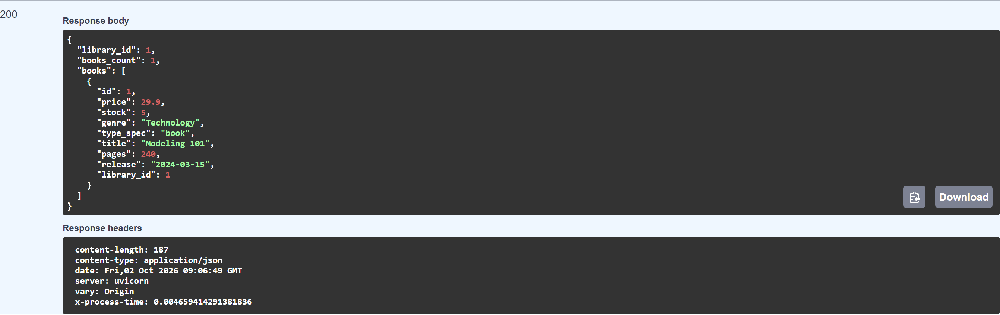

6. Update: use :ui[PUT /book/{book_id}/] with `book_id` = `1` and the same body as in step 4 but `"stock": 4`.
7. Call a modeled method: :ui[POST /book/{book_id}/methods/decrease_stock/] with `book_id` = `1` and the body
   `{"params": {"qty": 1}}`. The response reports `"status": "executed"`, and a new `GET /book/1/` shows `"stock": 3`.
8. Delete: create an e-book with :ui[POST /ebook/] (the valid book body plus `"file_format": "EPUB"`), then
   remove it with :ui[DELETE /ebook/{ebook_id}/]. Before you delete it, run :ui[GET /book/]: the e-book is
   listed among the books with `"type_spec": "ebook"`, because its common columns live in the `book` table.

:::note
Object diagrams do not fill the database. The Web Application and Full Backend generators ignore them, and
:ui[Generate > Data > JSON Object Export] only writes a JSON file. Seed data goes in through the API, as you
did here, or through your own script.
:::

:::checkpoint
`GET /book/` returns one book with `"stock": 3`, the 422 error shows that the OCL constraint is enforced, and
`GET /book/count/` returns `{"count": 1}` after you deleted the e-book.
:::

## Exercise: extend the model with loans

:::exercise[Model book loans]
Add a `Member` class (`name`, `email`) and a `Loan` class (`start: date`, `due: date`, `returned: bool`).
A member has many loans, each loan is for exactly one book, and a book can be on many loans over time.
Before you generate anything, write down the tables and foreign keys you expect. Then generate the
PostgreSQL DDL and compare it with your prediction. Finally regenerate the Full Backend and create a member,
a loan and a book through Swagger.
:::

:::solution
Two one-to-many associations (Member 1 to Loan `*`, Book 1 to Loan `*`) give `loan` two `NOT NULL` foreign
key columns and no association table. If you made either end `0..1` instead of `1`, check how that changes
the `NOT NULL` on the foreign key.
:::

:::exercise[Change the inheritance]
Make `Book` abstract and add a second subclass `PrintedBook` with `weight_g: int`. Regenerate the SQL DDL.
Does `book` still get its own table, and does `type_spec` still appear? Read the warning about inheritance
in the [SQLAlchemy generator documentation](https://besser.readthedocs.io/en/latest/generators/alchemy.html)
to explain what you see.
:::

:::solution
Joined-table inheritance is the default. The documentation describes when the generator switches to a
different strategy for abstract parents, and the condition depends on whether the parent has relationships.
Book has two, so compare your output with that rule.
:::
