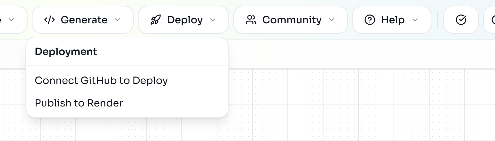
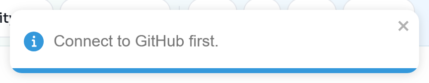
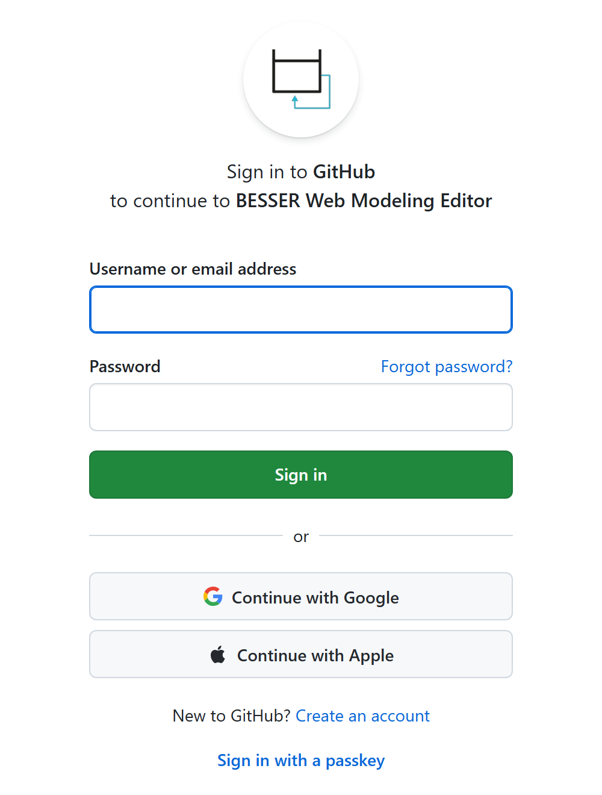
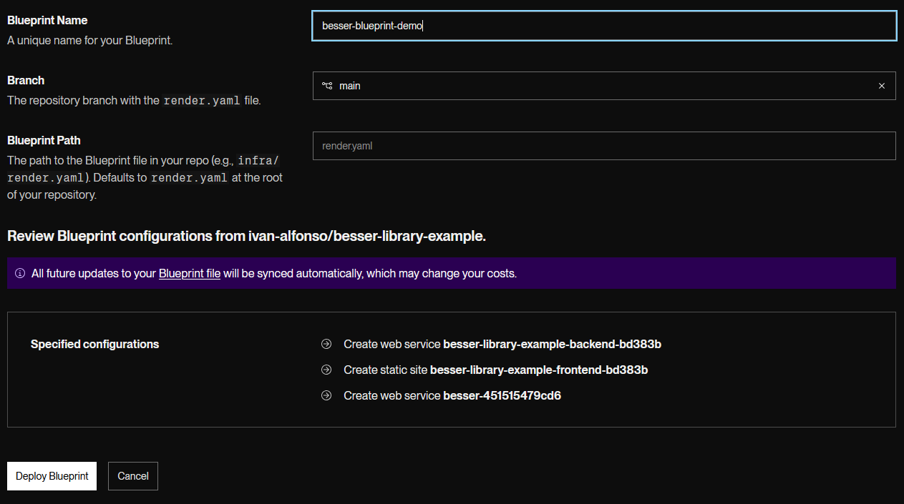
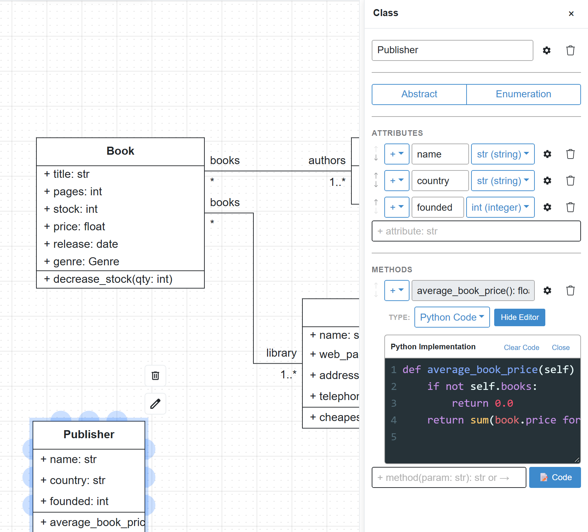

In the [web-app lab](/labs/web-app/) you ran the generated application on your own machine. Here you put
the same application on the internet. The editor generates the code, pushes it to a new repository in your
GitHub account together with a `render.yaml` Blueprint, and Render builds and hosts the three services that
Blueprint describes.

Then you do what real projects do next: change the requirements. You add publishers to the domain model,
teach the agent a new question, update the GUI and publish again to the same repository.

:::caution
This lab creates a repository in your GitHub account (public by default) and three services in your Render
account. The services use Render's free plan, which costs nothing but sleeps after 15 minutes without
traffic. Delete the Blueprint on Render and the repository on GitHub when you no longer need them.
:::

## Open the project and check the models

1. Open [editor.besser-pearl.org](https://editor.besser-pearl.org/) in the same browser you used for the
   web-app lab. Projects live in the browser's storage, so `Library App` is still there: open it with
   :ui[File > Open Project].
   If you use a different browser, download the [starting project](/files/deploy-render/library-app.json) and open it
   with :ui[File > Import > Project file (.json / .py)].
2. Run :ui[Quality Check] on the :ui[Class] and on the :ui[Agent] diagram. Both report "Diagram is valid".
3. Open the :ui[GUI] editor and check that the Book page still has the Library assistant widget with
   `Greeting Agent` selected in its :ui[Agent] field.

:::note
Publishing needs a class diagram and a GUI model (for a web app) or an agent diagram (for a standalone
agent). :ui[Deploy > Publish to Render] is only enabled while a Class, GUI or Agent diagram is open.
:::

:::checkpoint
The project has a valid Library class diagram, a valid Greeting Agent, and a GUI whose Book page contains the
table, the chart and the chat widget.
:::

## Connect GitHub

1. Open the :ui[Deploy] menu. While you are not signed in, it shows two items.



If you click :ui[Publish to Render] now, the editor only shows a reminder:



2. Click :ui[Deploy > Connect GitHub to Deploy] (or the GitHub icon in the top bar). The editor redirects you
   to GitHub.



3. Sign in and authorize the application. It asks for the `repo`, `gist` and `user` scopes, because it creates
   repositories and pushes code on your behalf.
4. Back in the editor, a toast says "Signed in as" followed by your GitHub user name.

:::troubleshoot
If you return to the editor and still see :ui[Connect GitHub to Deploy], the sign-in did not complete. Try
again in a normal (not private) window and allow pop-ups and redirects for editor.besser-pearl.org. The
session lasts 24 hours; after that, sign in again.
:::

:::checkpoint
The :ui[Deploy] menu now shows only :ui[Publish to Render], and the top bar shows your GitHub account.
:::

## Publish the project to a new repository

1. With the :ui[Class] or :ui[GUI] diagram open, choose :ui[Deploy > Publish to Render]. The
   :ui[Publish to Render] dialog opens with the text "Create a GitHub repository from the current project and
   deploy it on Render."
2. Fill in the fields:
   - :ui[Deployment Target]: :ui[Web App (Class + GUI)]. This field only appears when the project could
     also be published as a :ui[Standalone Agent].
   - :ui[Repository Name]: proposed from the project name in lower case, here `library_app`. Use something unique
     in your account, such as `library-app-lab`.
   - :ui[Description]: defaults to "Web application generated by BESSER".
   - :ui[Make repository private]: leave it off. The dialog warns that private repositories may require
     manual Render permission setup.
3. Click :ui[Publish to Render]. The button reads "Publishing..." while the editor generates the code and
   pushes it.
4. The result dialog is titled :ui[Repository Created Successfully]. It shows `<your-user>/<repository>`, the
   number of files uploaded, and two buttons: :ui[Open Render Deployment] and :ui[View GitHub Repository].

:::note
No screenshots of these two dialogs are included because they only appear after a GitHub sign-in. The
labels above are taken from the editor's source code (BESSER 8.0).
:::

:::checkpoint
The result dialog says :ui[Repository Created Successfully], and the repository exists on github.com under
your account.
:::

## Inspect the generated repository

Click :ui[View GitHub Repository]. The commit pushed by BESSER is called "Initial commit - Generated by
BESSER Web Editor", and the repository contains:

```text
library-app-lab/
├── README.md              overview, project structure and a Deploy to Render button
├── render.yaml            the Render Blueprint
├── docker-compose.yml     the local setup you used in the web-app lab
├── BESSER_GENERATION.md   BESSER version and generator used
├── backend/               FastAPI + SQLAlchemy
├── frontend/              React + TypeScript (Vite)
├── agents/
│   └── greeting_agent/    the BESSER Agentic Framework agent
└── buml/
    ├── domain_model.py    the class diagram as B-UML Python code
    ├── gui_model.py       the GUI model as B-UML Python code
    ├── agent_model_greeting_agent.py
    └── diagrams.json      the project, re-importable in the editor
```

Open `render.yaml`. It declares one service per part of the application. This is its shape (names are
shortened; yours contain the repository name and a six-character suffix):

```text
services:
  # Backend API (Free tier - 750 hours/month, spins down after 15 min idle)
  - type: web
    name: library-app-lab-backend-<suffix>
    runtime: python
    plan: free
    buildCommand: pip install -r backend/requirements.txt
    startCommand: cd backend && uvicorn main_api:app --host 0.0.0.0 --port $PORT

  # Frontend (Free static site)
  - type: web
    name: library-app-lab-frontend-<suffix>
    runtime: static
    buildCommand: cd frontend && npm install && npm run build

  # Agent Service: Greeting_Agent (Free tier - WebSocket-based AI agent)
  - type: web
    name: library-app-lab-greeting-agent-agent-<suffix>
    runtime: python
    plan: free
```

The frontend is built with the backend's and the agent's public `onrender.com` addresses, and the agent's
start command rewrites its `config.yaml` to listen on `0.0.0.0` and Render's port. That is why the
`host: 0.0.0.0` edit from the web-app lab is not needed on Render.

:::checkpoint
You can name the three services the Blueprint will create and find the folders that each one builds from.
:::

## Deploy the Blueprint on Render

1. Back in the editor, click :ui[Open Render Deployment]. It opens Render's deploy page for your repository
   (`https://render.com/deploy?repo=https://github.com/<your-user>/<repository>`). The
   :ui[Deploy to Render] button in the repository's README opens the same page.
2. Sign in to Render (signing in with GitHub is the simplest) and, if Render asks, give it access to the new
   repository.
3. Enter a :ui[Blueprint Name], keep the :ui[Branch] `main` and the default :ui[Blueprint Path]
   `render.yaml`, review the three services, and click :ui[Deploy Blueprint].



:::caution
If Render asks for a value for `OPENAI_API_KEY`, it belongs to the agent service. It is only needed for
agents that call a language model (LLM-based intent recognition or LLM replies). The Greeting Agent uses
fixed replies; enter a key only if your own agent needs one, and never commit it to the repository.
:::

4. Wait. On the free plan the three services take between 4 and 12 minutes to build and start. Render shows
   the progress of each service.
5. When all three are live, open the frontend service (its name contains `-frontend-`) and click its
   `onrender.com` address.

The app is the one you ran locally, but empty: the Render backend has its own SQLite database. Add a
library, an author and a book through `https://<backend-service>.onrender.com/docs`, exactly as in the
web-app lab, and reload the frontend.

:::troubleshoot
A service that has not been used for 15 minutes sleeps, so the first page load or chat message after a pause
can take a minute. If the chat widget stays on "Connecting to agent...", open the agent service on Render
and check that it is live and that its log shows the WebSocket platform starting.
:::

:::checkpoint
The Blueprint shows three services as deployed, the public frontend URL shows the Book page, and the chat
widget answers "Hello" with "Hi" and "How are you?".
:::

## Extend the domain, the agent and the GUI

The library now needs to track publishers. A publisher has a name, a country and a founding year; it
publishes many books, and each book has one publisher. The application must also compute the average price
of a publisher's books.

1. **Class diagram.** Add a `Publisher` class with `name: str`, `country: str` and `founded: int`. Connect it
   to Book with an association: multiplicity `1` on the Publisher end and `*` on the Book end.
2. Add the method. In the Publisher properties panel, click :ui[Code] under :ui[METHODS], rename the new method
   to `average_book_price(): float`, set :ui[TYPE] to :ui[Python Code], and write the body in the
   :ui[Python Implementation] editor:



The code in the screenshot:

```python
def average_book_price(self) -> float:
    if not self.books:
        return 0.0
    return sum(book.price for book in self.books) / len(self.books)
```

Run :ui[Quality Check]. If you prefer the BESSER Action Language, the Library class's `cheapest_book_by`
method is an example of its syntax.

3. **Agent.** Open :ui[Agent] > :ui[Components] and, in the :ui[Intents] section, click :ui[Add Intent].
   Name it `publisher_price_intent` and use :ui[Add sentence] to add, for example:
   - `how can I get the average price of books from a publisher?`
   - `average book price for a publisher`
   - `how do I compute the publisher average price?`
4. In the Agent diagram, add a state `publisher_help` whose body is a :ui[Text] reply such as "Open the
   Publisher page, select a publisher in the table and click average_book_price." Draw a transition from
   `initial` to `publisher_help`, open it, choose :ui[Intent Matched] and the new intent. Draw a second
   transition from `publisher_help` back to `initial` of type :ui[Auto].
5. **GUI.** Run :ui[Auto-Generate GUI from Class Diagram] again. It creates the new Publisher page with its
   table and an :ui[average_book_price] button.

:::caution
Auto-generation rebuilds the whole GUI and removes the BESSER Agent widget and the bar chart you added in the
web-app lab. Add them again afterwards, and choose `Greeting Agent` in the widget's :ui[Agent] field.
:::

:::checkpoint
Quality Check passes on the Class and Agent diagrams, the :ui[Pages] panel lists Book, Library, Author and
Publisher, and the Book page has the chat widget again.
:::

## Redeploy and test the changes

1. Choose :ui[Deploy > Publish to Render] again. Because the project is linked to the repository, the dialog
   now says "Update the existing repository with your latest changes.", shows "Previously deployed to:" with
   your repository, and offers a :ui[Commit Message] field (leave it empty for the default
   "Update app - Generated by BESSER Web Editor"). Files you added to the repository by hand are kept.
2. Click :ui[Update & Publish]. The result dialog is titled :ui[Repository Updated Successfully] and offers
   :ui[Open Live App], :ui[Open Render Blueprint] and :ui[View GitHub Repository].
3. Render normally redeploys after a push. If your changes do not appear after a few minutes, open the
   Blueprint on Render and click :ui[Manual Sync]: it redeploys every service from the latest commit.
4. Open the live app and check that:
   - the Publisher page exists and you can create a publisher;
   - after you create books for that publisher through the API (the book body now also needs the publisher's
     id; the `BookCreate` schema in Swagger shows the field name), :ui[average_book_price] returns their
     average price;
   - the agent answers "average book price for a publisher" with your instructions.

:::note
Choosing "Create new repo instead" in the dialog publishes to a fresh repository and needs a new Blueprint,
which means three more services in your Render account.
:::

:::checkpoint
The repository has a second commit, the live app shows the Publisher page, and the agent answers the new
question.
:::

## Exercise: keep evolving the application

:::exercise[Add a statistics question to the agent]
Add a method `book_count(): int` to Publisher, a matching intent and agent state, and a :ui[Metric Card / KPI]
or chart on the Publisher page. Publish the update and verify each part in the live app.
:::

:::solution
`book_count` can reuse the same association end as `average_book_price` (`len(self.books)`). Remember the
order of the GUI work: auto-generate first, then re-add the widgets that auto-generation removes.
:::

:::exercise[Publish only the agent]
Open the Agent diagram and choose :ui[Deploy > Publish to Render]. Switch the :ui[Deployment Target] to
:ui[Standalone Agent] and compare the generated repository and `render.yaml` with the web app's.
:::

:::solution
The dialog proposes a repository name ending in `-agent`, and the button reads :ui[Publish Agent to Render].
Look at how many services the agent Blueprint declares and which user interface it starts.
:::
