In this lab you model a small academic research domain. Researchers write papers, papers are presented at research events, and an event is either a conference or a workshop. You draw it as a UML class diagram in the BESSER Web Modeling Editor, let the editor check it, and generate Python code from it.

You need no UML background. Each step introduces one concept: a class, an attribute, an association, a composition, a generalization and an enumeration. The same model comes back in the next labs, where you build it in Python and add behavior to it.

## Open the editor and create a project

1. Open [https://editor.besser-pearl.org](https://editor.besser-pearl.org). On a first visit the editor asks how you want to build.
2. Under :ui[Model it], click :ui[Start modelling]. The other card, :ui[Describe it], opens the AI assistant instead; you use it in a later lab.

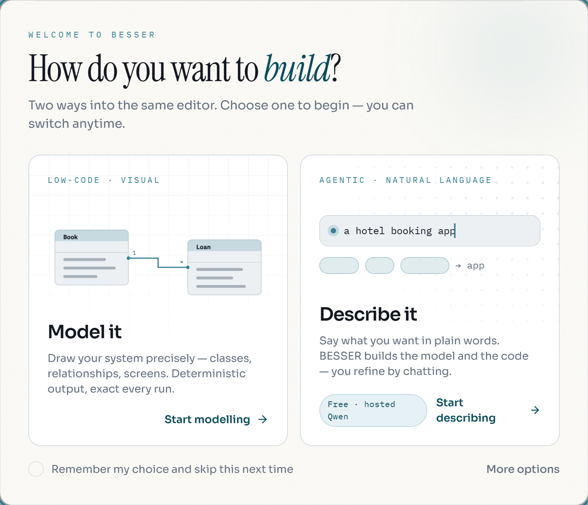

3. The :ui[Create A Project] form opens. Type `Research Lab` as :ui[Name]. Leave :ui[Owner] and :ui[Description] as they are.
4. Under :ui[View], keep :ui[Low-code]. Under :ui[Modeling perspective], choose :ui[Data Modeler]. This perspective shows only the class and object diagrams, which is all you need here.
5. Click :ui[Create Project].

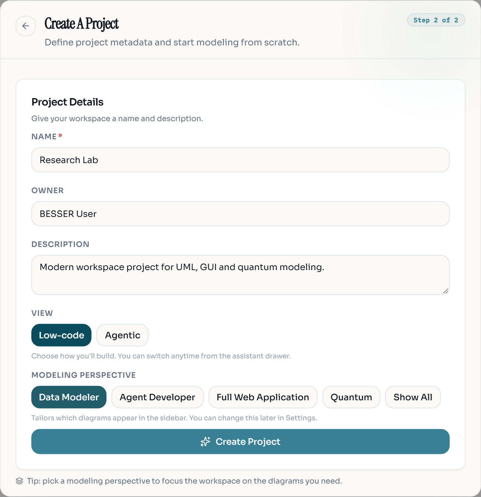

:::caution
Projects are stored only in this browser (its local storage). Nothing is saved on a server. If you clear the site data, switch to another browser or use a private window, the project is gone. The last step of this lab shows how to export a backup file.
:::

:::checkpoint
The top bar shows the project name `Research_Lab` (spaces become underscores). The left sidebar lists :ui[Class] and :ui[Object], and the :ui[Class Diagram] tab shows a palette next to an empty canvas.
:::

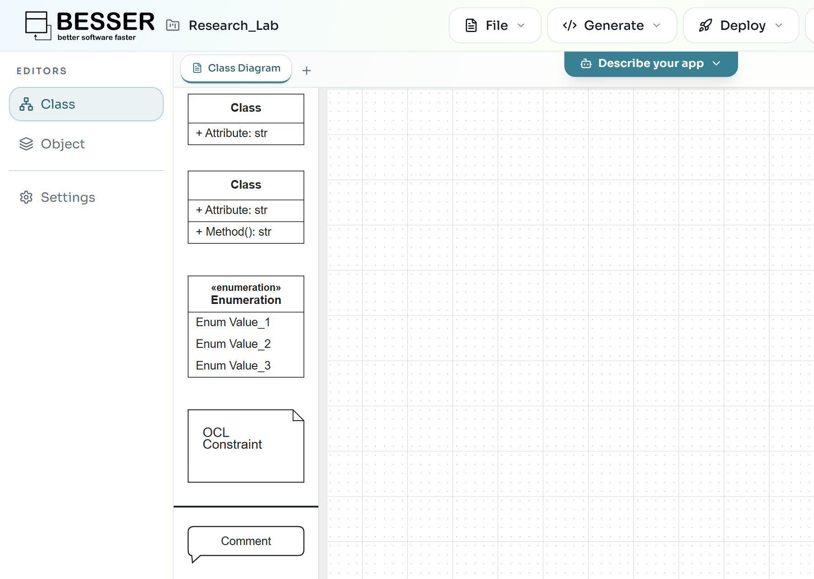

## Add classes with typed attributes

A class describes a kind of thing in the domain. Its attributes are the data every instance of the class holds, each with a type such as `str` (text), `int` (whole number), `bool` (true or false) or `date`.

1. Drag the first palette element, the :ui[Class] box with one attribute, onto the canvas.
2. Double-click the new class. A panel opens on the right.
3. In the name field at the top of the panel, replace `Class` with `Paper`.
4. Under :ui[Attributes], the class already has one attribute called `Attribute`. Rename it to `title`. Its type stays :ui[str (string)].
5. Click the empty field below it (it shows `+ attribute: str`), type `submitted: date` and press :kbd[Enter]. Then type `acceptance: bool` and press :kbd[Enter]. The text after the colon becomes the attribute type.
6. Close the panel with its :ui[×] button or by clicking an empty spot on the canvas.

, a name and a type dropdown.")

Repeat this for two more classes, placed so there is room between them:

| Class | Attributes |
|---|---|
| `ResearchEvent` | `name: str`, `start: date`, `end: date` |
| `Researcher` | `name: str`, `institution: str` |

You can also change a type afterwards with the type dropdown in the attribute row, for example to :ui[int (integer)] or :ui[date].

:::note
B-UML names cannot contain spaces or hyphens. Use `ResearchEvent` or `research_event`, not `Research Event`.
:::

:::checkpoint
Three classes are on the canvas: `Paper` with three attributes, `ResearchEvent` with three and `Researcher` with two, each shown as `+ name: type`.
:::

## Connect papers and researchers with an association

An association says that instances of two classes are related. Here, a paper has one or more authors, and a researcher can write any number of papers. Those numbers are the multiplicities of the two ends.

1. Click `Paper` once to select it. Blue connection points appear around it.
2. Press on a connection point on the bottom edge of `Paper` and drag to `Researcher`. Release over `Researcher`. A line appears.
3. Double-click the line. The :ui[Association] panel opens.
4. Set :ui[Name] to `authorship`.
5. The panel has one section per end. In the :ui[Paper] section, set :ui[Multiplicity] to `*` and :ui[Role] to `papers`. In the :ui[Researcher] section, set :ui[Multiplicity] to `1..*` and :ui[Role] to `authors`.

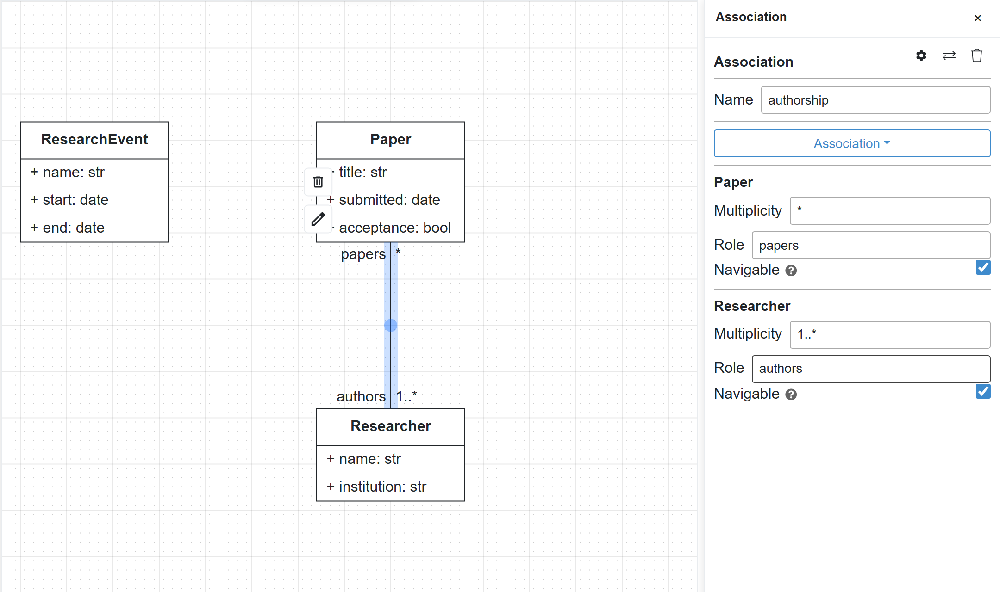

Multiplicities are written as `min..max`: `1` means exactly one, `0..1` at most one, `*` any number, and `1..*` at least one.

:::checkpoint
A line connects `Paper` and `Researcher`. It shows `papers` and `*` near `Paper`, and `authors` and `1..*` near `Researcher`.
:::

## Make events own their papers with a composition

A composition is a strong association: the part cannot exist without its whole. In this domain a paper belongs to exactly one event, and deleting the event deletes its papers.

1. Select `Paper`, then drag from a connection point on its left edge to `ResearchEvent`.
2. Double-click the new line. Set :ui[Name] to `presented_at`.
3. In the :ui[Paper] section, set :ui[Multiplicity] to `*` and :ui[Role] to `papers`. In the :ui[ResearchEvent] section, set :ui[Multiplicity] to `1` and :ui[Role] to `event`.
4. Click the dropdown that shows :ui[Association] and choose :ui[Composition].

. The part's Navigable box is locked, because a whole can always reach its parts.")

:::troubleshoot
If the diamond appears at `Paper` instead of `ResearchEvent`, you drew the line in the other direction. Click the two-arrow button next to the bin icon at the top of the panel to swap the ends, then check the multiplicities again.
:::

:::checkpoint
A line with a filled black diamond at `ResearchEvent` connects it to `Paper`, labelled `event` / `1` and `papers` / `*`.
:::

## Add Conference and Workshop as kinds of ResearchEvent

A generalization says that one class is a special kind of another. A `Conference` is a `ResearchEvent`, so it inherits `name`, `start` and `end` and adds what is specific to it.

1. Add a class `Conference` with the attribute `acronym: str`, and a class `Workshop` with `topic: str`. Place both below `ResearchEvent`.
2. Select `Conference` and drag from a connection point on its top edge to `ResearchEvent`.
3. Double-click the line and change the dropdown from :ui[Association] to :ui[Generalization]. The panel title changes to :ui[Generalization] and the name and multiplicity fields disappear.
4. Do the same from `Workshop` to `ResearchEvent`.

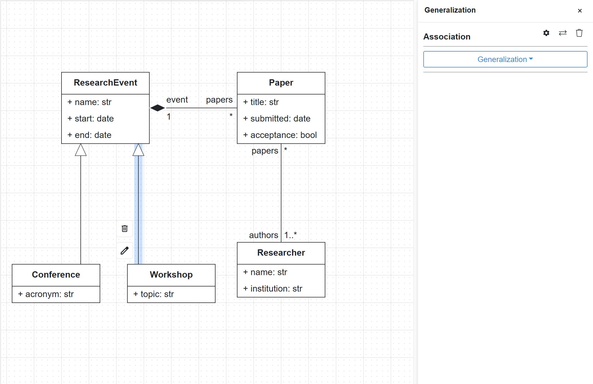

:::checkpoint
Two lines with hollow triangles point from `Conference` and `Workshop` up to `ResearchEvent`. If a triangle points at a subclass, swap the ends with the two-arrow button.
:::

## Add an enumeration for the event mode

An enumeration is a type with a fixed list of values, called literals. An event takes place in person, online or both.

1. Drag the :ui[Enumeration] element from the palette onto the canvas and double-click it.
2. Rename it to `EventMode`. Under :ui[Literals], rename `Enum Value_1`, `Enum Value_2` and `Enum Value_3` to `in_person`, `online` and `hybrid`.

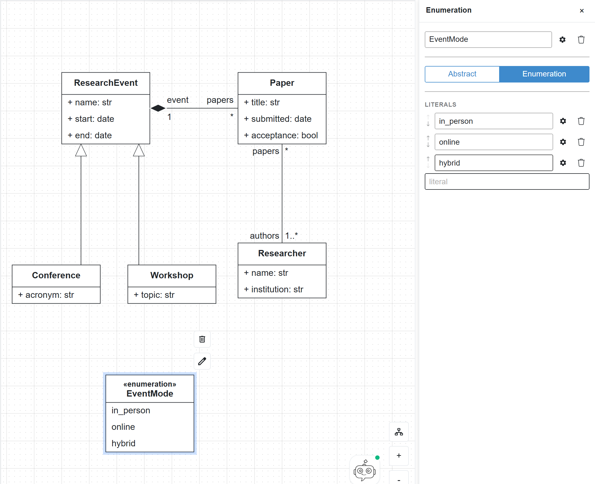

3. Double-click `ResearchEvent`, type `mode: EventMode` in the `+ attribute: str` field and press :kbd[Enter]. The enumeration is now available as a type, next to the built-in ones.

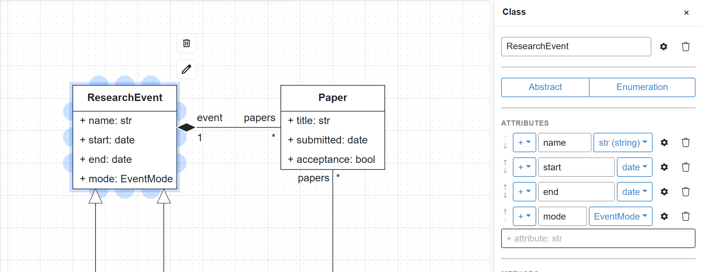

:::checkpoint
`ResearchEvent` has four attributes, the last one `+ mode: EventMode`, and the `EventMode` box shows the stereotype «enumeration» above its name.
:::

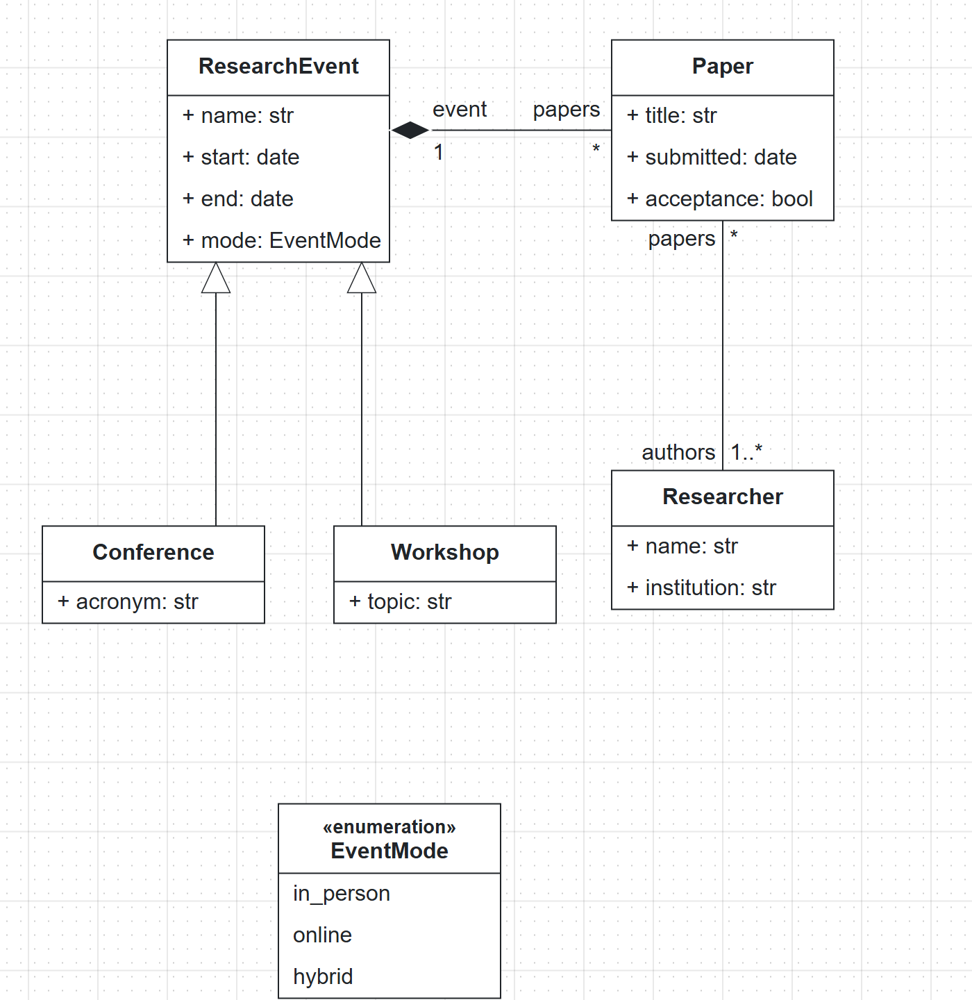

## Check the model and generate Python classes

1. Click :ui[Quality Check] in the top bar (the round button with a check mark, left of the theme toggle). The editor converts the diagram to a B-UML model and validates it.

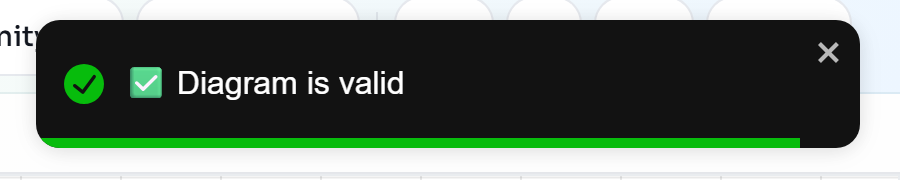

2. Open :ui[Generate > OOP > Python Classes]. The editor downloads a file called `classes.py`. No account or API key is needed.

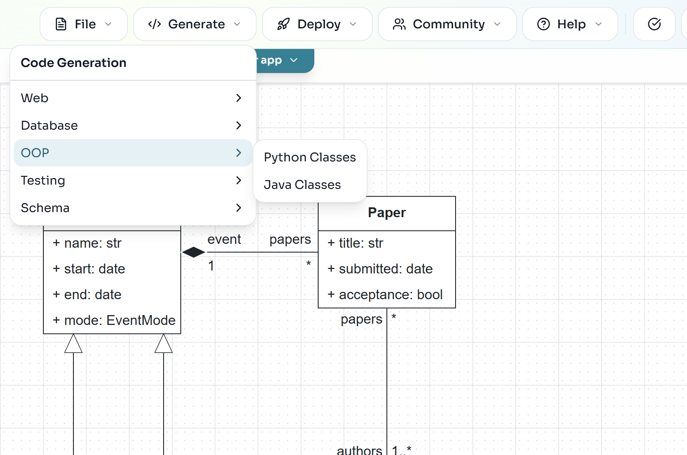

3. Open `classes.py` in any editor. Each class became a Python class with typed constructor parameters, the generalization became inheritance, and each association end became a property that keeps both sides in sync:

```python
class EventMode(Enum):
    in_person = "in_person"
    online = "online"
    hybrid = "hybrid"

class Conference(ResearchEvent):

    def __init__(self, name: str, start: date, end: date, mode: EventMode, acronym: str, papers: set["Paper"] = None):
        super().__init__(name, start, end, mode, papers)
```

If you have Python 3 installed, you can try the classes. Save this next to `classes.py` as `try_classes.py` and run `python try_classes.py`:

```python
from datetime import date
from classes import Conference, EventMode, Paper, Researcher

models = Conference(name="MODELS 2026", start=date(2026, 10, 4), end=date(2026, 10, 9),
                    mode=EventMode.in_person, acronym="MODELS")
alice = Researcher(name="Alice", institution="LIST")
paper = Paper(title="Low-code for research software", submitted=date(2026, 4, 1),
              acceptance=True, authors={alice}, event=models)

print(paper.event.acronym, paper.event.mode)
print([p.title for p in alice.papers])
print([p.title for p in models.papers])
```

```text
MODELS EventMode.in_person
['Low-code for research software']
['Low-code for research software']
```

Setting the paper's authors and event also filled `alice.papers` and `models.papers`: the generated code keeps both ends of each association consistent.

:::checkpoint
Quality Check shows "Diagram is valid", and `classes.py` contains the classes `EventMode`, `Researcher`, `ResearchEvent`, `Workshop`, `Paper` and `Conference`.
:::

## Back up the project as a JSON file

Because the project lives only in this browser, export it to a file you keep.

1. Open :ui[File > Export Project]. The :ui[Export Project] dialog opens.
2. Under :ui[Multiple Diagrams], keep :ui[Class Diagram] ticked and click :ui[Export as JSON]. The browser downloads `Research_Lab.json`.

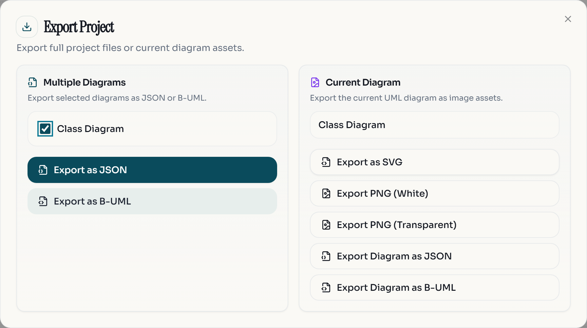

To restore the backup, in this or another browser, open :ui[File > Import > Project file (.json / .py)] and select the file. Importing always creates a new project; it does not overwrite the open one.

:::note
:ui[Export as B-UML] writes the same model as a Python file that uses the B-UML library. The next lab, [Model in Python with B-UML](/labs/buml-python/), starts from there.
:::

:::checkpoint
`Research_Lab.json` is in your downloads folder. You can compare it with the finished model of this lab, linked at the top of the page.
:::

## Exercise: add reviews with scores

:::exercise[Add a Score class]
Papers are reviewed before they are accepted. Extend the model so that:

- a new class `Score` represents the score a paper receives from one reviewer;
- a `Score` has at least two attributes: the score value and the reviewer's comments;
- each `Paper` can have several scores, and each `Score` is given by exactly one `Researcher` acting as reviewer.

Run :ui[Quality Check] when you are done.
:::

:::solution
`Score` needs two associations: one to `Paper` (a paper has `*` scores, a score belongs to `1` paper; a composition fits, since a score has no meaning without its paper) and one to `Researcher` (multiplicity `1` on the researcher end, with the role `reviewer`). The value can be an `int` for now.
:::

:::exercise[Restrict the score value]
Make sure the score value is always one of `strong_accept`, `accept`, `weak_accept`, `borderline`, `weak_reject` and `reject`. Check the model again and export a new JSON backup.
:::

:::solution
Add an enumeration, for example `ScoreValue`, with those six literals, and change the type of the value attribute from `int` to `ScoreValue` in its type dropdown.
:::

For more on the class diagram editor, see the [class diagram guide](https://besser.readthedocs.io/projects/besser-web-modeling-editor/en/latest/user-guide/diagrams/class-diagram.html) and the [projects guide](https://besser.readthedocs.io/projects/besser-web-modeling-editor/en/latest/user-guide/projects.html).
