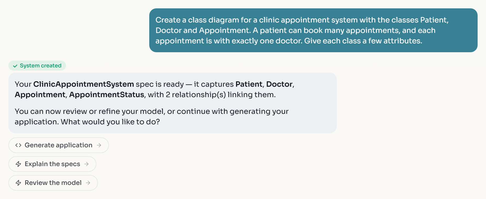
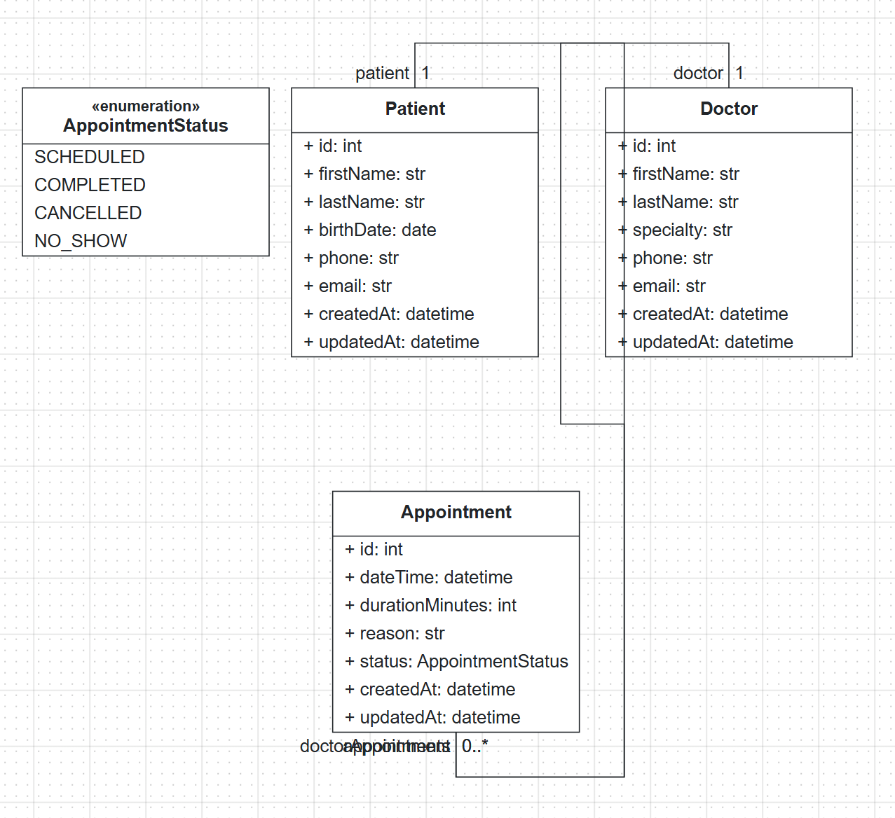
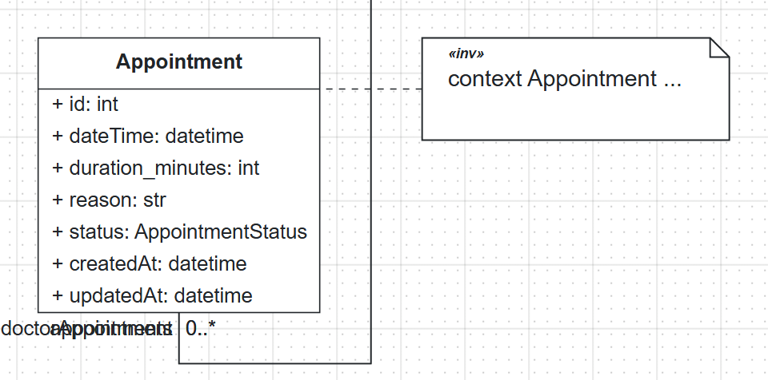
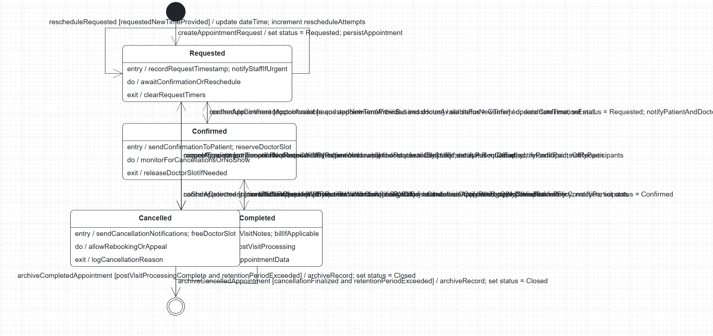
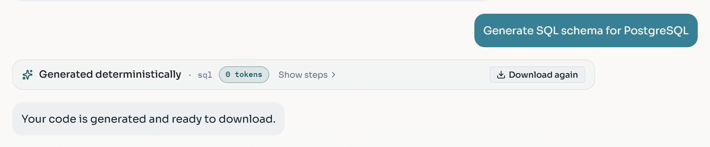

This is the lab to start with if you want to build software with BESSER without learning modeling first. The Web Modeling Editor has an agentic interface: you describe what you want in plain words, and the Modeling Assistant creates and edits the diagrams for you on a live canvas. Those diagrams are the model BESSER generates code from, so you only need to read them, not draw them. If you later want to draw them yourself, [Lab 1](/labs/first-model/) shows how, and you can switch between chatting and drawing at any time.

In this lab you model a small clinic: patients book appointments with doctors. You build the class diagram by conversation, refine it, add a rule, add a state machine for the appointment lifecycle, and generate a PostgreSQL schema, all from the chat. Throughout, you check the result yourself instead of trusting the reply.

:::note
The assistant runs on a separate BESSER service. On [editor.besser-pearl.org](https://editor.besser-pearl.org) it is hosted for you and needs no API key or account; requests are rate limited per browser tab. Your messages and a snapshot of the current project are sent to that service so it can answer. The project itself stays in your browser's storage. Do not paste personal or confidential data into the chat.
:::

## Start a project in Describe it mode

1. Open [https://editor.besser-pearl.org](https://editor.besser-pearl.org). On a first visit the editor asks how you want to build.
2. On the :ui[Describe it] card, click :ui[Start describing].


3. The :ui[Create A Project] form opens with :ui[Agentic] already selected under :ui[View]. Enter the name `Clinic Appointments` and click :ui[Create Project]. The editor stores it as `Clinic_Appointments`.


4. The assistant workspace fills the screen with the question "What would you like to create today?" and a composer that reads "Describe what you want to create or modify...". Next to the subtitle a dot shows the connection state.


:::note
If the editor opens straight into the canvas (because you ticked "Remember my choice" earlier, or already have projects), use :ui[File > New Project], choose :ui[Agentic] under :ui[View], and create the project there. Adding `?mode=agent` to the editor URL also opens the assistant workspace.
:::

:::checkpoint
The top bar shows the project name `Clinic_Appointments`, the workspace says :ui[Connected] with a green dot, and the line under the composer reads "Free to use with our hosted Qwen model."
:::

## Describe the clinic and let the assistant build the class diagram

1. Click into the composer, type the following prompt exactly, and press :kbd[Enter]:

```text
Create a class diagram for a clinic appointment system with the classes Patient, Doctor and Appointment. A patient can book many appointments, and each appointment is with exactly one doctor. Give each class a few attributes.
```

2. Wait for the reply. It usually arrives within 20 to 30 seconds. The assistant marks it with a :ui[System created] badge, summarises what it built ("Your ClinicAppointmentSystem spec is ready — it captures Patient, Doctor, Appointment, with 2 relationship(s) linking them.") and offers three quick-action chips under it: :ui[Generate application], :ui[Explain the specs] and :ui[Review the model].



:::note
The wording of the reply, the attribute names and the layout differ from run to run, because a language model writes them. In one run the assistant added an `AppointmentStatus` enumeration, in another it added methods such as `cancel()`, and it often gives `Appointment` a `durationMinutes` attribute without being asked. That is expected. What you check in this lab is the model, not the text: which classes, attributes and associations exist on the canvas.
:::

:::troubleshoot
**The reply says "I had a bit of trouble building everything at once, but I set up 3 item(s)..." and each class only has `+ id: str`.** The assistant fell back to placeholder classes because its language-model call failed on the server. The same happens if every follow-up returns "I couldn't process that modification. Please try again or rephrase your request." This is a service problem, not a problem with your prompt. Wait a few minutes and click :ui[New Chat] to try again, or continue the lab on the canvas: add the attributes and associations by hand as shown in [Lab 1](/labs/first-model/), then come back to the chat for the later steps.
:::

:::checkpoint
The chat shows your prompt, a reply naming Patient, Doctor and Appointment, and at least the :ui[Review the model] chip.
:::

## Switch to the canvas and verify what the assistant built

The assistant edits the model you see on the canvas. Look at the canvas after every change.

1. Click the :ui[Review the model] chip. It does not send a message; it closes the assistant workspace so you see the canvas. You can also click the :ui[See the Specs] tab at the bottom of the workspace, or press :kbd[Esc].
2. The Class editor shows the new diagram. Check:
   - There are three classes: `Patient`, `Doctor` and `Appointment`, each with several typed attributes.
   - There is an association between `Patient` and `Appointment` with a many end (`*` or `0..*`) on the Appointment side.
   - There is an association between `Appointment` and `Doctor` with multiplicity `1` on the Doctor side.
3. Double-click an association to open its properties and read the exact multiplicities. The automatic layout sometimes draws two association ends on top of each other, so their role names overlap; drag a class to separate them.

:::note[New to class diagrams?]
Each box is a **class**: a kind of thing your application stores, such as a patient. The lines inside the box are its **attributes**, the data kept for each one, written `name: type` (for example `+ birth_date: date`). A line between two boxes is an **association**: the things are related. The numbers at each end are **multiplicities**. They say how many: `1` means exactly one, `*` or `0..*` means any number. So `Appointment 0..*` next to `Patient 1` reads "a patient has any number of appointments, and each appointment belongs to exactly one patient". That is all you need to read what the assistant builds.
:::



4. To return to the chat, click the :ui[Describe your app] tab at the top of the canvas. The conversation is still there. In the low-code view the same assistant is also available from the round assistant button in the bottom-right corner (:ui[Open assistant]); both share one conversation.
5. In the workspace's bottom bar, click :ui[Your model]. It opens a recap of the data model and its relationships, derived from the project. Click it again to close it.

:::checkpoint
You can move between chat and canvas with :ui[Describe your app] and :ui[See the Specs], and the canvas shows the three classes connected by two associations with the multiplicities from your prompt. If a multiplicity is wrong, note it; you fix it in the next step.
:::

## Refine the model with follow-up prompts

Small, specific prompts work best. Name the class and the attribute, and say what must stay unchanged.

1. Send:

```text
Add an integer attribute named duration_minutes to the Appointment class.
```

2. Send:

```text
Rename the Doctor class to Physician.
```

   Each edit gets a :ui[Modified] badge and a one-line reply, for example "Added attribute to Appointment." or "Updated Doctor."
3. Close the workspace and check both edits on the canvas: `Appointment` has `+ duration_minutes: int`, and the class formerly called `Doctor` is now `Physician`, still connected to `Appointment`. If the class already had a `durationMinutes` attribute, the assistant may rename that one instead of adding a second ("Updated attribute in attribute durationMinutes from Appointment."), or leave it unchanged. Make sure `Appointment` ends up with exactly one duration attribute, named `duration_minutes`; if not, ask for it again by name.
4. Revert the rename. :kbd[Ctrl+Z] on the canvas undoes your own canvas edits, but it does not undo changes the assistant made, so ask for the reverse change instead:

```text
Rename the Physician class back to Doctor.
```

   The reply reads "Updated Physician." Check on the canvas that the class is called `Doctor` again and that both associations are still there.
5. Add a rule. The assistant only writes OCL when you ask for a constraint explicitly:

```text
Add a constraint that the duration_minutes of an Appointment must be greater than 0.
```

6. The reply reads "Added OCL constraint on Appointment." On the canvas, an OCL constraint box marked `«inv»` is attached to `Appointment` by a dashed line. The box shows only the start of the expression (`context Appointment ...`); double-click it to read the whole text. It should be equivalent to `context Appointment inv: self.duration_minutes > 0`. In one run it read `context Appointment inv duration_must_be_positive: self.duration_minutes > 0`; the constraint name and exact formatting may differ.



:::checkpoint
`Appointment` has `duration_minutes: int`, the class is named `Doctor` again, and an OCL constraint on `Appointment` requires `duration_minutes` to be greater than 0.
:::

## Ask the assistant to explain the model

The assistant can describe the current model in words. This is a quick way to spot a misunderstanding, but it is a summary, not a check.

1. Send:

```text
Describe my current model.
```

2. Compare the description with the canvas. The reply is headed "Current model" and lists each class with its attributes, the two associations and their role names, and usually the new constraint. It also summarises the other diagrams in the project (for example "GUI Diagram: A Home page with no sections."). It may mention "an association from ocl_... to Appointment": that is the dashed line linking the constraint box to its class, not an extra relationship. If the description and the canvas disagree, the canvas is the truth: the description is generated text, the canvas is the model that generators read.
3. The :ui[Explain the specs] chip (shown after a model is created) sends a similar request for a plain-language overview.

:::checkpoint
The reply describes patients, doctors and appointments and how they relate, and nothing in it contradicts what you see on the canvas.
:::

## Add a state machine by chat

The assistant can add a diagram of another type to the same project. Here you model the lifecycle of an appointment.

1. Send:

```text
Create a state machine for the appointment lifecycle with the states Requested, Confirmed, Completed and Cancelled.
```

2. The reply has a :ui[System created] badge and reads like "Built the AppointmentLifecycle state machine with 6 state(s): Requested, Confirmed, Completed, Cancelled, connected by 13 transition(s)." The six states include an initial and a final node; the number of transitions varies between runs. The assistant adds a :ui[State Machine Diagram] and switches the canvas to it. Close the workspace: the :ui[State] editor is now highlighted in the left sidebar.
3. Check that the four states exist, that there is an initial state, and that the transitions make sense (for example Requested to Confirmed, Confirmed to Completed, and transitions to Cancelled). The assistant also gives each state `entry`, `do` and `exit` actions and writes guards on the transitions. Transition names are chosen by the assistant and vary, and long transition labels often overlap; drag the states apart or zoom in to read them.
4. If a state is missing, ask for it by name, for example `Add a NoShow state to the state machine, reachable from Confirmed.`



:::note
The assistant supports eight of the nine diagram types: class, object, state machine, agent, user, GUI, quantum circuit and BPMN. Neural network diagrams are not supported, and the assistant button is hidden while a Neural Net diagram is open.
:::

:::checkpoint
The sidebar :ui[State] editor contains a state machine with the states Requested, Confirmed, Completed and Cancelled, and the :ui[Class] editor still contains your class diagram.
:::

## Validate the model and generate code from the chat

1. Click :ui[Class] in the left sidebar so the class diagram is active.
2. Click :ui[Quality Check] (the check-mark button in the top bar). Resolve any reported errors before you generate. Because the model has a constraint, a message titled "Valid Constraints:" lists it (for example `[Appointment inv duration_must_be_positive] 'context Appointment inv duration_must_be_positive: self.duration_minutes > 0'`) and stays open until you close it; a second, short-lived message reads "Diagram is valid". Quality Check validates the model; it says nothing about generated code.
3. Open the chat again and send:

```text
Generate SQL schema for PostgreSQL
```

4. The assistant runs the same SQL DDL generator as :ui[Generate > Database > SQL DDL], with the PostgreSQL dialect taken from your sentence. Within about 15 seconds a compact result card appears: :ui[Generated deterministically] · `sql` · :ui[0 tokens], with :ui[Show steps] and a :ui[Download] button, followed by "Your code is generated and ready to download." The deterministic generators need no API key, use no language-model tokens, and give the same output for the same model.
5. Click :ui[Download]. Nothing is saved until you click; the browser then saves `tables.sql` and the button changes to :ui[Download again].
6. Open `tables.sql` in a text editor. It starts with `-- Generated by BESSER 8.0.1`. Check that it contains a `CREATE TABLE` statement for each class (`patient`, `doctor`, `appointment`), a `duration_minutes INTEGER NOT NULL` column, and the foreign keys `FOREIGN KEY(doctor_id) REFERENCES doctor (id)` and `FOREIGN KEY(patient_id) REFERENCES patient (id)` in the appointment table. If your model has an enumeration such as `AppointmentStatus`, PostgreSQL gets a `CREATE TYPE ... AS ENUM` statement for it.



:::note
Other inline generator requests follow the same pattern, for example `generate django backend with project name "clinic" and app name "appointments"` or `generate python`. Requests for a whole application ("generate the web app") are different: after a confirmation they start the Spec-Driven Agent, which uses a language model to build an app on top of the generators. That is the subject of the [next lab](/labs/spec-driven-agent/).
:::

:::troubleshoot
**No result card appears, or the assistant replies with a list of generators ("What would you like me to generate? Here are the available options...").** The request was not recognised as a specific generator. Reply with the generator name it lists, for example `generate sql`, or use :ui[Generate > Database > SQL DDL] and pick :ui[PostgreSQL] in the dialog. If the browser blocked the download, allow downloads for the editor site.
:::

:::checkpoint
Quality Check reports the class diagram as valid, and you have a downloaded SQL file whose `CREATE TABLE` statements match the classes on the canvas.
:::

## Exercise: extend the clinic by conversation

:::exercise[Add prescriptions and keep the model consistent]
Using only the chat, add a `Prescription` class that belongs to exactly one appointment (an appointment can have several prescriptions), with a medication name and a dosage. Then add a constraint that a prescription's dosage must not be empty. Verify every change on the canvas, run Quality Check, and export the project with :ui[File > Export Project] as a JSON backup.
:::

:::solution
Two short prompts work better than one long one: first create the class and its association, then add the constraint. On the canvas, check that the association end on the Prescription side is many and on the Appointment side is `1`. A constraint such as `context Prescription inv: self.dosage <> ''` is one valid form.
:::

:::exercise[Compare chat and canvas]
Rebuild the same three-class clinic model by hand on the canvas in a second project, following [Lab 1](/labs/first-model/). Export both projects as B-UML (:ui[File > Export Project], then :ui[Export as B-UML]) and compare the two Python files. Which differences come from the assistant's choices (names, types, multiplicities) and which are only layout?
:::

:::solution
Layout is not part of the B-UML export, so any difference you find in the files is a modeling decision. Typical differences are attribute types (`str` versus `date` for a date), an extra identifier attribute, and the role names on association ends.
:::
