The Generate menu runs one deterministic generator over one diagram: the same model always gives the same files. The Spec-Driven Agent goes further. It starts from that deterministic scaffold, lets a language model fill the gaps your request asks for (a React frontend, extra pages, authentication, Docker files), and then validates the result and repairs what it can. You start it from the assistant chat, watch it work in a run card, and download a complete codebase.

In this lab you describe a small event-ticketing system, review the model, ask for the web app, and then run what comes out on your own machine. You also learn where the agent's limits are, because they decide how much you can trust the result.

:::caution
The Spec-Driven Agent is marked experimental in the BESSER documentation. Its output is not reproducible: two runs on the same model give different code. Quality depends on the language model, and the free tier gives a thinner result than paid models. Fixes the agent makes during validation land in the generated code, not in your model, so a later from-scratch regeneration does not keep them, and neither does it keep hand edits. Treat the result as a starting point you review, not as a finished product.
:::

## Describe the system and review the model

The agent builds the application from the model, so the model has to be right first.

1. Open [https://editor.besser-pearl.org](https://editor.besser-pearl.org), click :ui[Start describing] on the :ui[Describe it] card, name the project `Event Ticketing` and click :ui[Create Project]. (If you land on the canvas instead, use :ui[File > New Project] and choose :ui[Agentic].)
2. Send this prompt:

```text
Create a class diagram for a small event ticketing system with the classes Venue, Event and Ticket. An event takes place at exactly one venue, a venue hosts many events, and an event has many tickets. Give each class a few attributes, including a price on Ticket.
```

3. When the reply arrives, click :ui[Review the model]. The workspace closes and you see the class diagram on the canvas.
4. Check the model as in Lab 4: three classes, typed attributes, an association `Venue` 1 to many `Event`, and an association `Event` 1 to many `Ticket`. The assistant may draw `Event` to `Ticket` as a composition (a filled diamond), and the role names at the `Event` end can overlap; double-click an association to read its multiplicities. Fix anything wrong with a follow-up prompt or directly on the canvas.
5. Click :ui[Quality Check] and resolve any errors. A valid model shows "Diagram is valid".

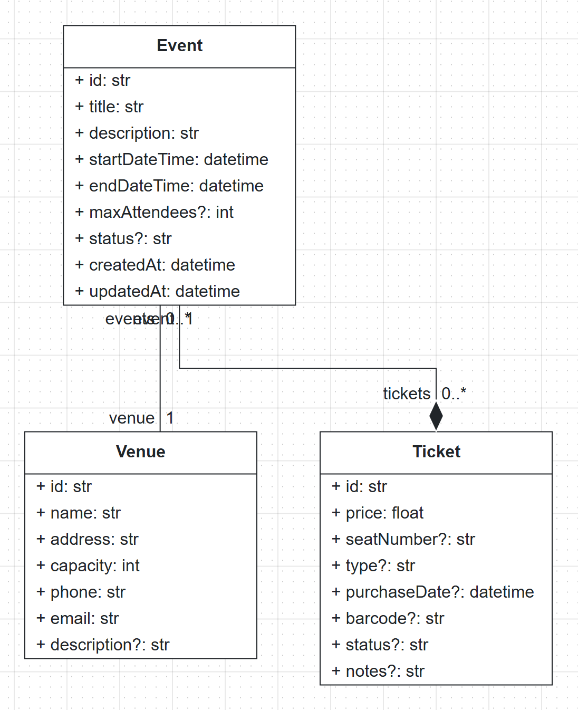

Creating or editing a model never starts a generation run. The editor always waits for an explicit request.

:::troubleshoot
**The assistant cannot build the model** (the reply says "I had a bit of trouble building everything at once..." and the classes only contain `id`). Use a template instead and continue with the next step: open :ui[File > Load Template], select :ui[Class Diagram] on the left, pick :ui[Library] and click :ui[Load Template]. If the editor reports "Existing diagram detected", choose :ui[Replace]. The Library template has three classes (`Library`, `Book`, `Author`), a `Genre` enumeration and an OCL constraint, which is a good size for a first run.

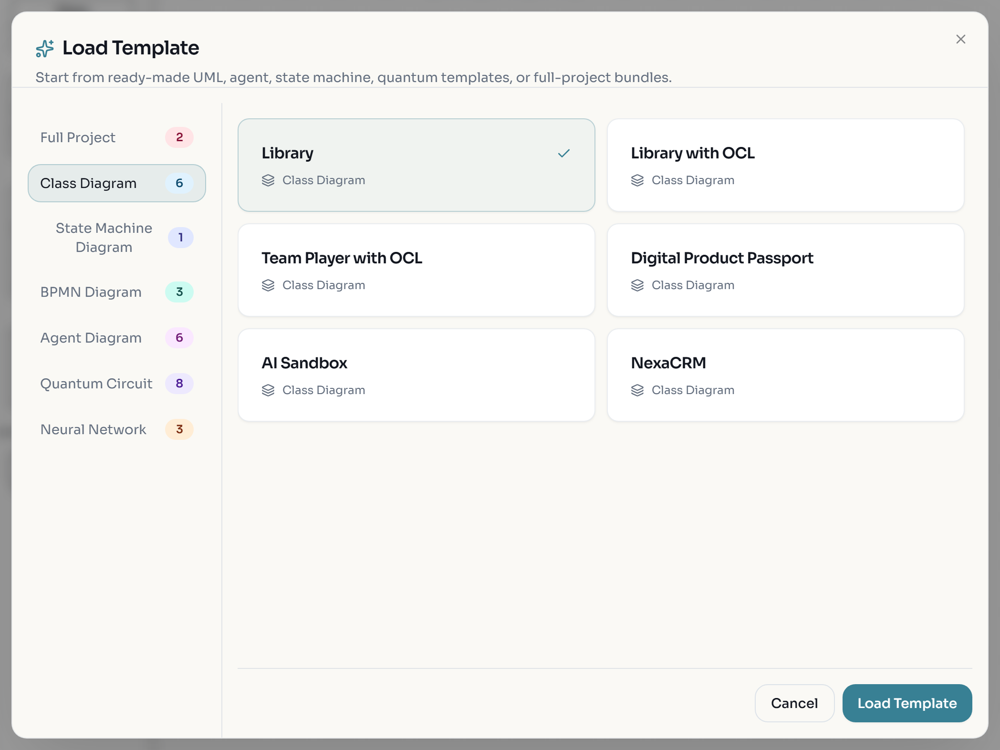

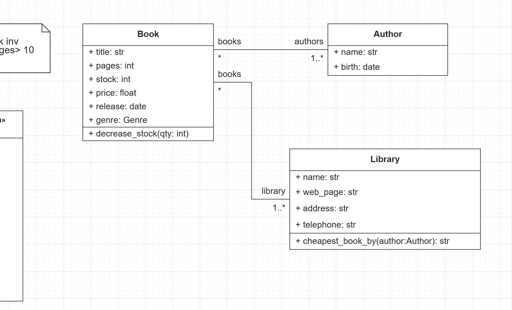
:::

:::checkpoint
The :ui[Class] editor shows a valid model of three connected classes (yours or the Library template), and Quality Check reports no errors.
:::

## Decide how the run is paid for and set a budget

A run uses a language model for the customisation and repair phases. There are two ways to pay for it.

- **No key (free tier).** If you have not saved an API key, the run uses the server-hosted free tier. No key dialog opens and no account is needed. The server picks the free model (the run card shows it, for example `free / moonshotai/Kimi-K3`), and it may switch to another free model during the run if the first one is unavailable. Quality is lower than with paid providers. It runs on shared hardware, so use it for real work, not for repeated test runs.
- **Your own key.** If you saved a key, the run is billed to that key as soon as you confirm it.

:::caution
With a saved API key, clicking :ui[Continue] after "generate the web app" starts a paid run. Set the run budget before you ask. The key is kept only in this browser tab's session storage, is never stored on the BESSER server, and is cleared when you close the tab.
:::

1. Open the key dialog from the workspace: click :ui[API key] in the bottom bar of the chat (or the :ui[Change the model] link under the composer, or :ui[Settings > AI / LLM API Key] in the sidebar). The dialog is titled :ui[Use your own API key].
2. Look at the :ui[Provider] list. It contains :ui[Free — included, no key required] next to Anthropic, OpenAI, Mistral and Nebius. The free option applies to the Spec-Driven Agent only.
3. Expand :ui[Spec-Driven Agent settings]. It holds :ui[Max spend / run (USD)] and :ui[Max time / run (min)]. On the hosted editor both default to the server's ceiling, "Up to $5 and 40 min per run", and the server enforces those caps whatever you type.

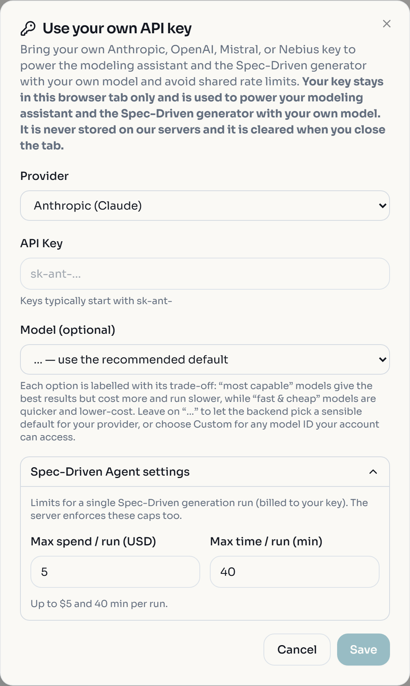

4. For this lab, use the free tier: click :ui[Cancel] without entering a key. If you do want to use your own key, enter it, lower :ui[Max spend / run (USD)] (for example to 1), and click :ui[Save].

:::note
If the server offers no free tier and you have no key, asking for a run opens a dialog titled :ui[Spec-Driven Agent — Run] with a :ui[Save & run] button instead. Dismissing it cancels the run.
:::

:::checkpoint
You know which way your run will be paid for. With no key saved, the bottom bar button still reads :ui[API key] (it reads :ui[API key set] once a key is saved).
:::

## Ask for the web app and watch the run card

1. Click :ui[Describe your app] at the top of the canvas to reopen the chat.
2. Type the request exactly and press :kbd[Enter]:

```text
generate the web app
```

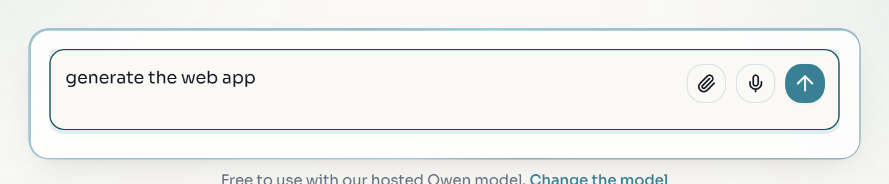

Instead of typing, you can click a :ui[Generate web app] or :ui[Generate application] chip if the assistant offered one under its last reply. A request for an app, a web app, a UI or a dashboard always gets a frontend, even when the project has no GUI diagram.

3. The assistant does not start right away. It explains that BESSER generates the application with its built-in generators and uses a language model only for what they do not cover, mentions the free model and the :ui[set up your own API key] link, and asks "Do you want to continue?". Click the :ui[Continue] chip. If you do nothing, no run starts.

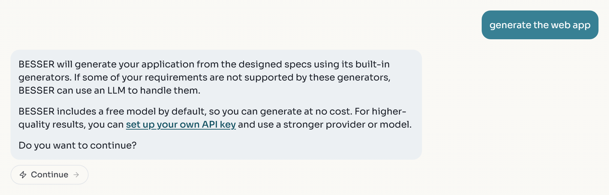

4. A run card titled :ui[Spec-Driven Agent] appears a few seconds later, with the start of the run id, the provider and model (`free / ...` on the free tier) and a :ui[Running] pill. While it runs it shows:
   - a phase list that ticks off in order: :ui[Selecting generator], :ui[Running deterministic generator], :ui[Analysing gaps], :ui[Customising output], :ui[Validating]. The deterministic step names the BESSER generator it runs, for example `running generate_fastapi_backend`, and the customising step counts the model's actions;
   - extra rows when something changes, for example "Switched to poolside/laguna-s-2.1-free — The primary model was unavailable.";
   - a :ui[Working…] strip (after about 45 seconds it adds "Big steps can take a few minutes — the timer keeps moving while it's running.");
   - streamed commentary from the model;
   - a footer with the elapsed time against the runtime cap (for example `5m 9s / 40m`) and a red :ui[Stop] button.

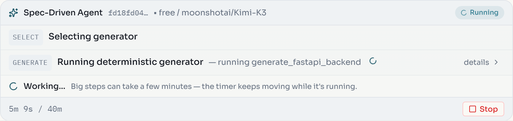

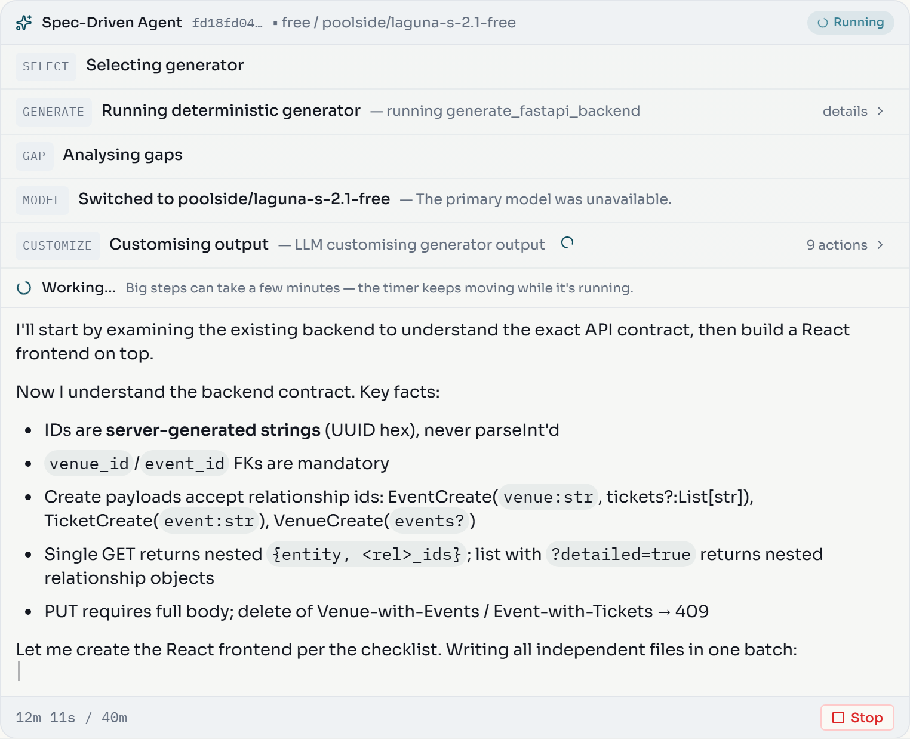

5. Let it run. Free-tier runs are slow and the phase times vary a lot. In one of our runs :ui[Selecting generator] alone took 5 minutes; in another the scaffold was generated within the first minute, :ui[Customising output] started after 7 minutes, :ui[Validating] after 21 minutes, and the run stopped at the 40-minute runtime cap. Plan for a run of 20 to 40 minutes. You can keep working in another tab. Reloading the page does not cancel the run: the editor reattaches to it and replays what you missed. It finds the run through this browser's storage, so stay in the same browser; a private window you close loses the card, and with it the download, even though the run keeps going on the server.
6. :ui[Stop] ends the run (the button reads "Stopping…" while it winds down). The card then reports `CANCELLED`. Only one run can be live per tab; a second request gets "Spec-Driven Agent is already running — please wait for it to finish or click Stop."

:::troubleshoot
**The assistant answers with a list of generators ("What would you like me to generate? Here are the available options...") and no run card appears.** The request was not routed to the Spec-Driven Agent; no run started and nothing was charged. Reply with the exact sentence `generate the web app` again, or click a :ui[Generate application] chip under an earlier reply. If it keeps happening, the assistant service is degraded; try again later.

**The progress stops updating.** If the stream is quiet for 60 seconds the editor says the run may still be finishing on the server and reconnects automatically, up to four times. Corporate networks and proxies that cut long-lived connections are a common cause; the run itself keeps going on the server.
:::

:::checkpoint
A run card is visible, its phases tick off one after another, and the :ui[Working…] strip shows the elapsed time.
:::

## Read the finished run card

When the run ends, the card collapses to a short summary.


1. Read the status. :ui[Application ready] means the run finished without unresolved blockers. Other outcomes are :ui[Generated — incomplete] (with a count of unresolved blockers), :ui[Delivered — rules not enforced] (a rule from your model was checked and found missing in the code), or an error code: `COST_CAP`, `TIMEOUT` or `INCOMPLETE` keep partial output; `UPSTREAM_LLM`, `INTERNAL` or `BAD_REQUEST` mean a provider or backend failure, so retry; `INVALID_KEY` clears your key. Our run ended as :ui[Generated — incomplete] · 12 unresolved blockers, with the warnings "Runtime cap reached (2426.7s > 2400s). Output may be incomplete." and "The download is available for inspection and further work."
2. Next to the status you see the generator the run started from (`generate_fastapi_backend`) and the file count (15 files).
3. Click the badge that reads "N% files unchanged from scaffold". It opens :ui[How this was built]: the share of scaffold files the run did not edit, the share BESSER generated and the model then edited, and the share of additional files outside the scaffold. Below that come the token counts and, on the free tier, "No cost — this run used the free tier." This is provenance, not a quality score. A high percentage means more of the app is deterministic BESSER output that follows your model exactly; the rest was written or edited by a language model and deserves a closer review.

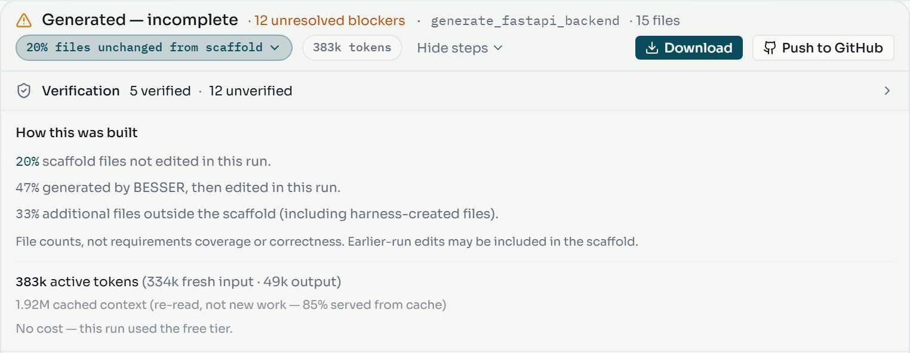

4. Click :ui[Show steps] to expand the phase timeline and the model's commentary again. :ui[Hide steps] collapses it. Each phase row has a :ui[details] link or an action count (here 56 actions while customising and 84 while validating) that you can open.

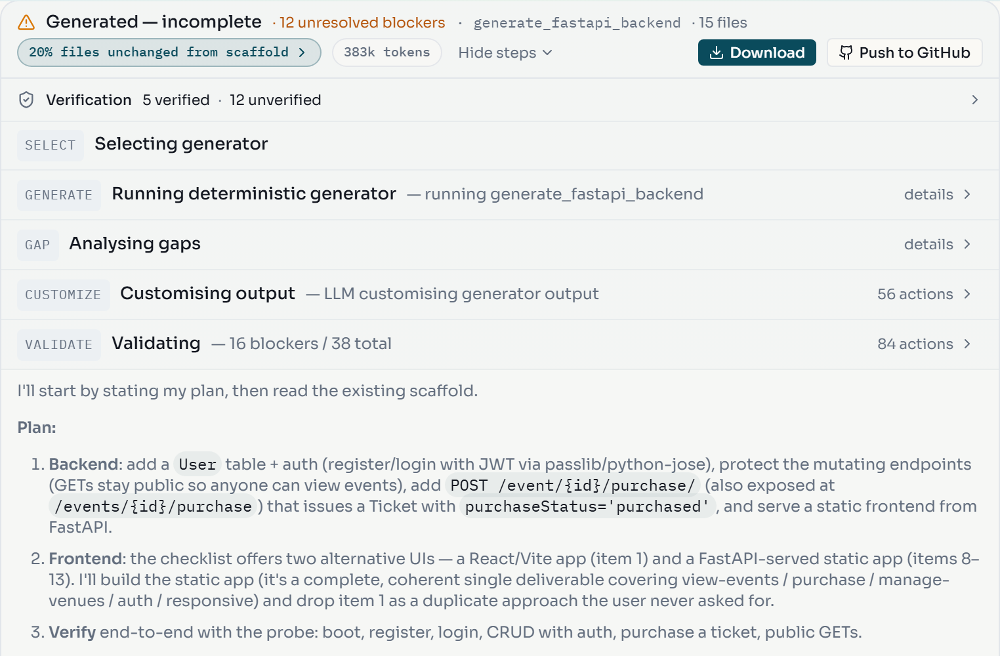

5. Read the verification line. It summarises the checks (in our run "5 verified · 12 unverified"); click it to see the individual findings. Unverified means unknown, not absent: the check could not run or did not pass, so you have to test that part yourself. In our run, the automatic check of `POST /auth/login` was refused because it sent an unknown user, while registering and logging in worked when we tried them by hand.

:::note
Validation has a defined scope: syntax, imports, contracts and lint, plus sandboxed checks such as booting the backend or building the frontend where the server allows them. It does not prove every business requirement. Read the findings even when the card says :ui[Application ready].
:::

:::checkpoint
You can say which generator the run started from, how many files it produced, what percentage of files are unchanged from the scaffold, and how many checks are unverified.
:::

## Download the application and run it locally

1. Click :ui[Download] on the card. Nothing is written to your machine until you click, and the archive stays on the server for about 30 minutes, so download it now.
2. Unzip the archive (named like `besser_smart_<run id>.zip`) into an empty folder.
3. Open `BESSER_GENERATION.md` at the top level. It records the BESSER version and build, the generator `spec_driven_agent`, the base generator (`generate_fastapi_backend` in our run) and the language model the run used. Keep it with the code.
4. Look at the layout before you run anything; it depends on the run. Our archive had no `README.md` and no `docker-compose.yml`, only a `backend/` folder with `main_api.py`, `requirements.txt`, the routers (`venue.py`, `event.py`, `ticket.py`, plus an added `auth.py`) and a `static/` folder with `index.html`, `app.js` and `styles.css`. Check which case you have:

**Case A: there is a `docker-compose.yml` at the top level.** With Docker running:

```bash
docker compose up --build
```

The web app is at http://localhost:3000, the API at http://localhost:8000, and the interactive API documentation at http://localhost:8000/docs. Stop it with :kbd[Ctrl+C], then `docker compose down`.

**Case B: no compose file.** Start the backend from the folder that contains `main_api.py` and `requirements.txt`:

```bash
cd backend
python -m venv .venv
source .venv/bin/activate
pip install -r requirements.txt
python main_api.py
```

```powershell
cd backend
python -m venv .venv
.venv\Scripts\Activate.ps1
pip install -r requirements.txt
python main_api.py
```

The backend listens on port 8000. If the backend has a `static/` folder (as in our run), it also serves the web app: open http://localhost:8000. If the archive instead has a separate frontend folder with a `package.json`, start it in a second terminal with `npm install` and `npm run dev`, and open http://localhost:3000.

5. Open the web app, create a venue, an event for it and a ticket, and check that the lists update. If the app asks you to log in, register an account first. Then open http://localhost:8000/docs and confirm there are endpoints for each class of your model.

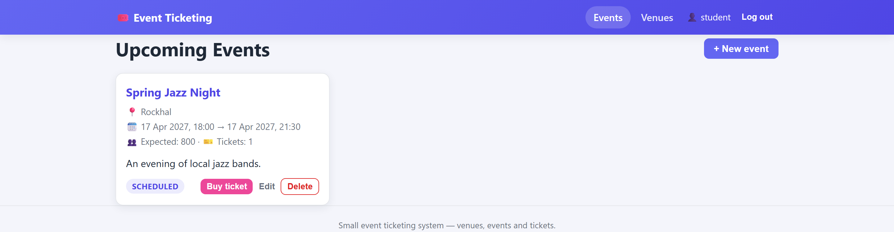

:::troubleshoot
**Port 3000 or 8000 is already in use.** Stop the other process, or start the backend on another port and, for a separate frontend, point it at the backend with the `VITE_API_URL` environment variable, for example `VITE_API_URL=http://localhost:8080 npm run dev`. **The build fails.** Check the run card's findings first; a check listed as unverified may be exactly what fails. Fix the generated code by hand, or ask the agent to fix it within the retention window (next step).
:::

:::checkpoint
The application runs locally, you can create records through the UI, and http://localhost:8000/docs lists endpoints for the classes in your model.
:::

## Iterate on the generated app

While the previous run is still held on the server (about 30 minutes after it finished), a follow-up request edits that application instead of rebuilding it.

1. In the same project's chat, send:

```text
add a search page for events by name
```

2. The assistant asks you to confirm again before anything runs. For a change to an existing app the message reads "I'll update your existing app to make that change." and the chip is :ui[Fix it]; otherwise it is the :ui[Continue] message from before. Click the chip. The agent starts a new run in modify mode: it seeds the workspace with the previous output and changes it. This is a second run, with the same cost rules as the first (free tier, or billed to your key).
3. Download the new archive and compare it with the first one. Only the files related to the search page should have changed.

:::caution
After the retention window the previous output is gone and a request like this produces a fresh build from the model. Edits you made by hand to the downloaded code are never carried into a new run. If you want to keep working on the same code later, push it to GitHub first (next step).
:::

:::checkpoint
A second run card appears, and its result contains your earlier application plus a search page for events.
:::

## Push to GitHub and continue from the repository

This step is optional and needs a GitHub account.

1. On a finished run card, click :ui[Push to GitHub]. If you are not signed in, the editor first sends you through GitHub sign-in and reopens the dialog when you come back.
2. In the :ui[Push to GitHub] dialog choose :ui[Create new repo], enter a :ui[Repository Name] (for example `event-ticketing-app`), an optional :ui[Description], tick :ui[Private repository] if you want, and click :ui[Push to GitHub]. If the name already exists, the dialog tells you to push to it as an existing repository instead; :ui[Use existing repo] pushes a later run into the same repository with :ui[Push update].

3. Open the repository on GitHub and check that it contains the application and `BESSER_GENERATION.md`.
4. Later, or on another computer, reopen it: choose :ui[File > Import > From GitHub], or click :ui[Continue from GitHub] in the project hub (on the first-run screen, :ui[More options] opens the hub).

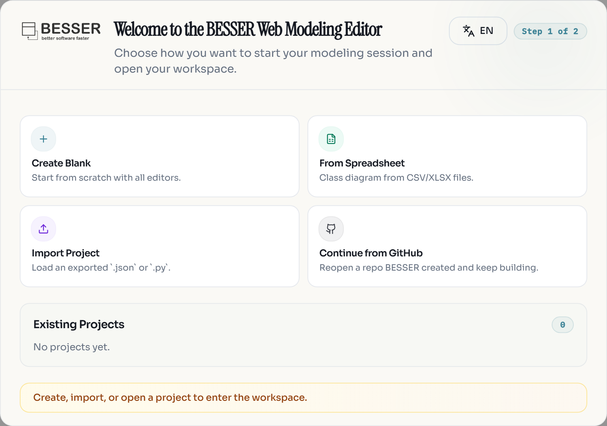

5. Pick the repository and branch. The editor imports the model stored in the repository as a new project and links the repository, so your next request ("add a search page", "add an organiser to events") edits that application. A repository BESSER did not create is rejected with "This repo has no BESSER model — it wasn't created by BESSER, so there's nothing to continue from yet." Importing never overwrites the project you have open.

You can also ask in the chat: `continue from github.com/<owner>/<repo>`.

:::checkpoint
The repository exists on GitHub, and after :ui[Continue from GitHub] a new project shows the same class diagram as the one you generated from.
:::

## Exercise: change the model, not only the code

:::exercise[Add a customer and regenerate]
Add a `Customer` class to the ticketing model (a customer buys many tickets, each ticket belongs to at most one customer), validate it, and run "generate the web app" again. Compare the new download with your first one. Which files changed because the model changed, and which changed only because a language model wrote them differently this time?
:::

:::solution
Look at the files BESSER generates deterministically first (the ORM models, Pydantic classes and routers): their changes should all trace to `Customer` and the new association. Differences elsewhere, for example in LLM-written frontend pages, are the non-reproducible part. The "% files unchanged from scaffold" badge and :ui[How this was built] help you tell the two apart.
:::

:::exercise[Generate menu versus Spec-Driven Agent]
For the same model, use :ui[Generate > Web > Full Backend] from the Class editor and compare that archive with the backend part of the Spec-Driven output. Write down two things the agent added and one reason you might prefer the deterministic output for a course project.
:::

:::solution
The deterministic backend is reproducible and follows the model exactly, which makes it easy to regenerate after a model change. The agent's version may add a frontend, extra endpoints or configuration that the templates do not produce, at the cost of review effort and reproducibility.
:::
