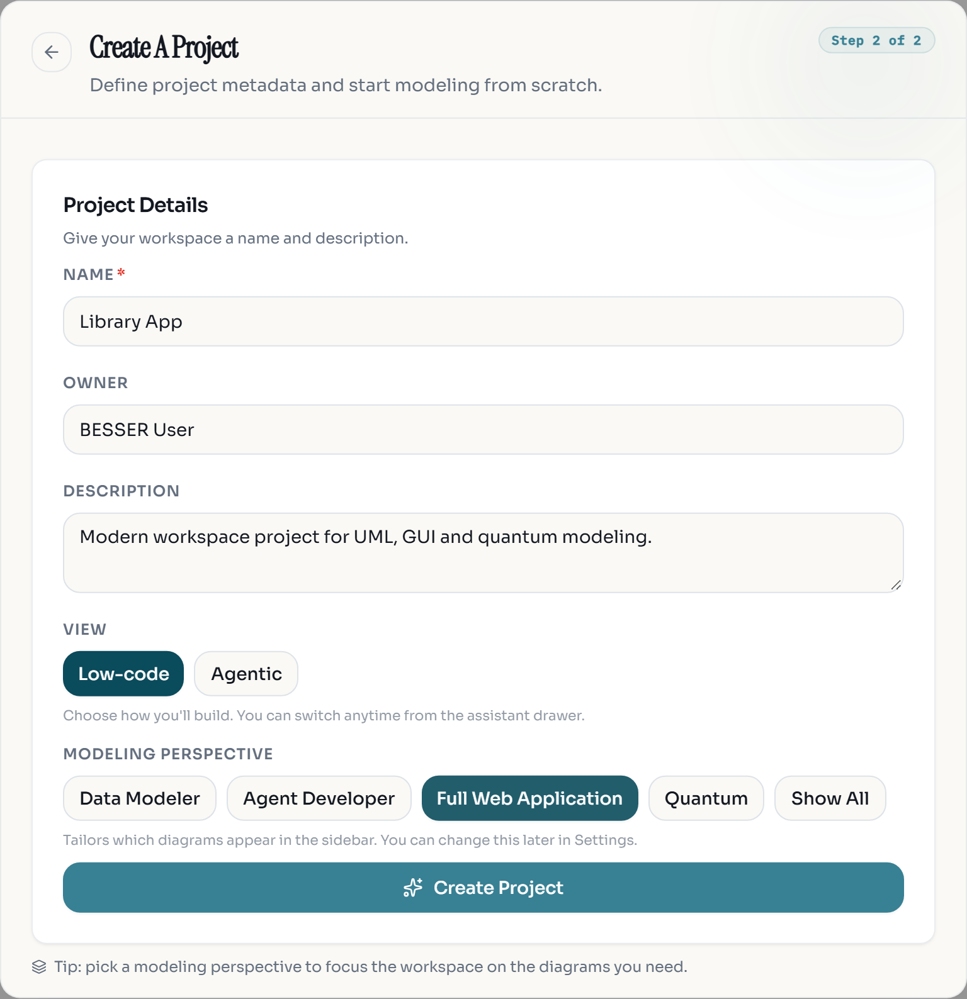
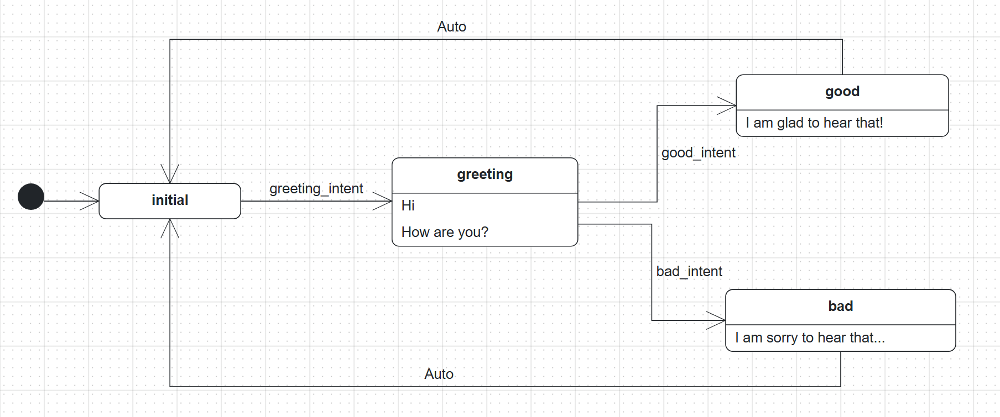
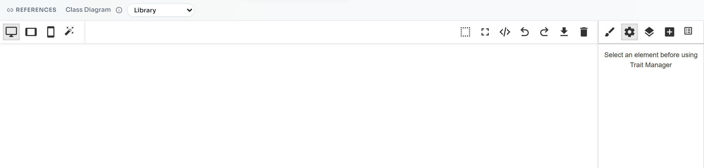
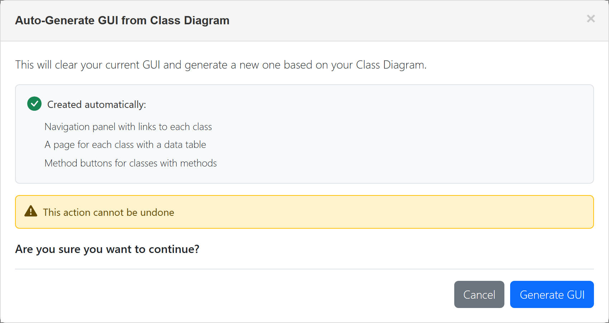
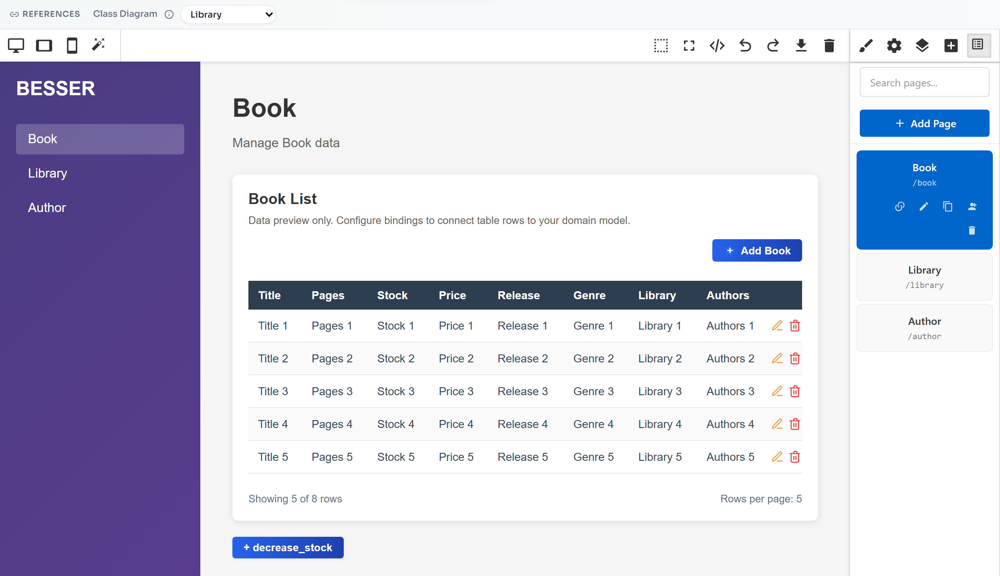
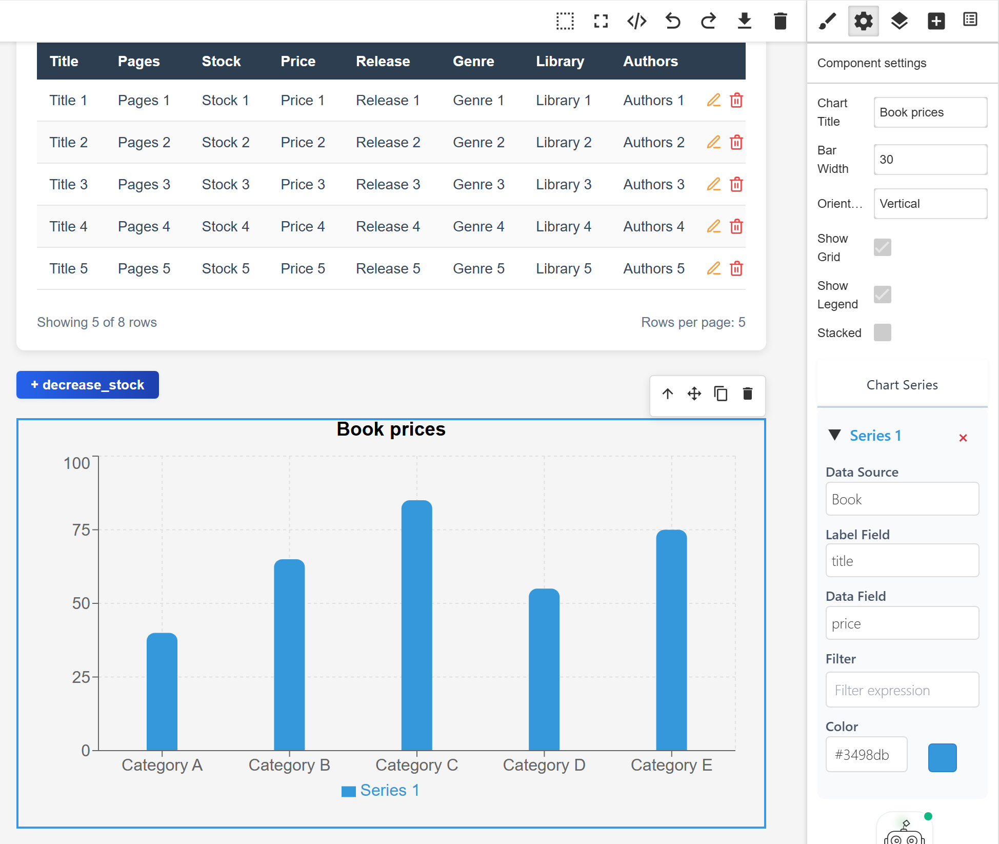
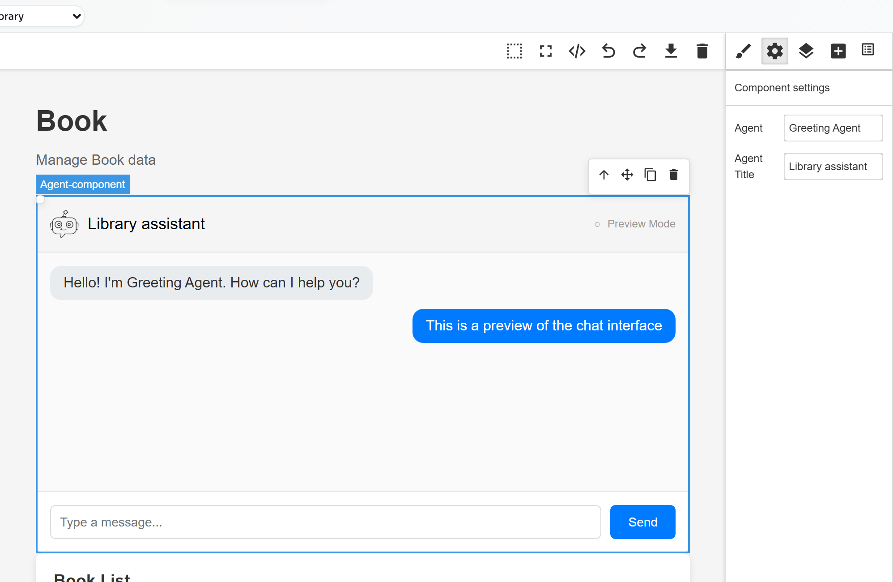
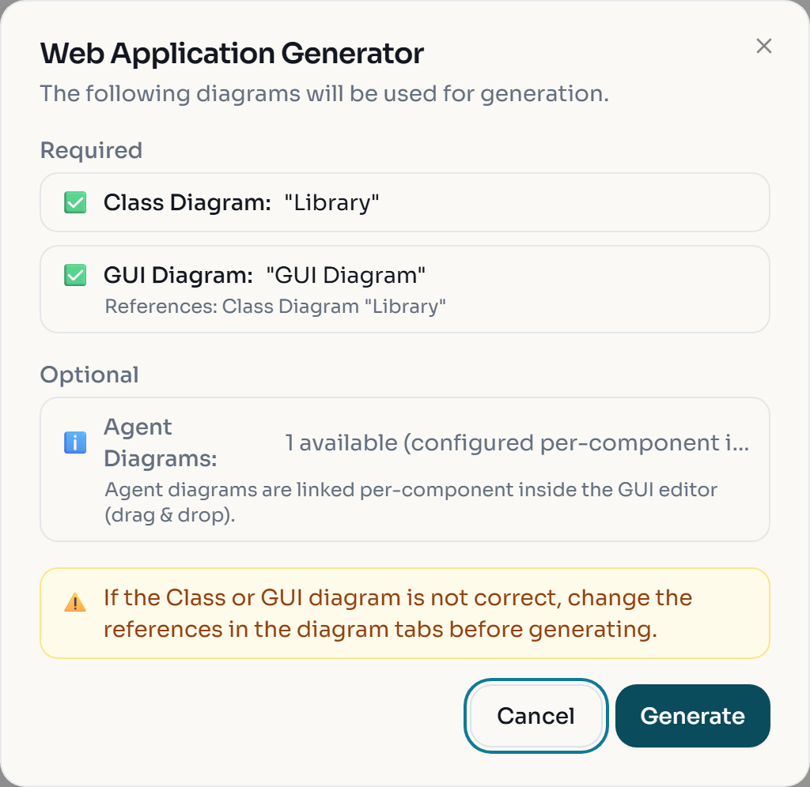
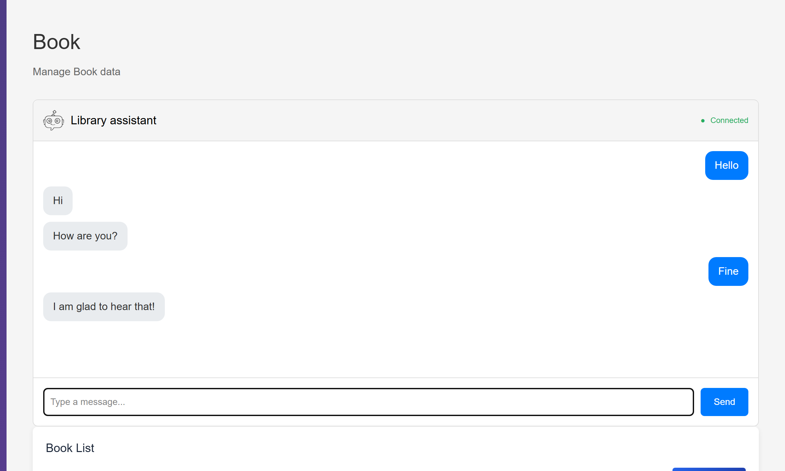
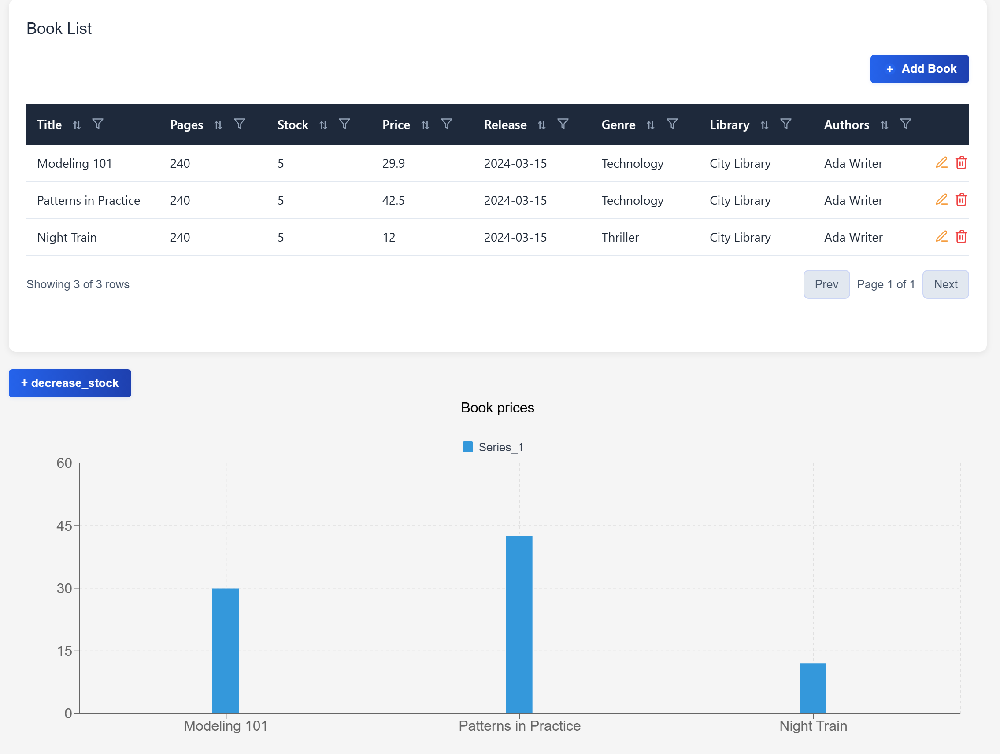

A web application needs at least three things: the data it manages, the screens people use, and often an
assistant that answers questions. In BESSER each of these is a separate model in the same project: a class
diagram, a GUI model and an agent diagram. The Web Application generator reads all three and produces a
FastAPI backend, a React frontend, one service per agent and a `docker-compose.yml` that starts everything.

In this lab you build a small Library application. You reuse two templates so the result is predictable,
design the screens in the no-code GUI editor, generate the code, run it with Docker and fill it with data.

## Create a Full Web Application project

1. Open [editor.besser-pearl.org](https://editor.besser-pearl.org/) and open :ui[File > New Project]
   (on a first visit, click :ui[Start modelling] on the :ui[Model it] card).
2. Name the project `Library App`, keep :ui[Low-code], and choose the modeling perspective
   :ui[Full Web Application]. Click :ui[Create Project].



3. Load the data model: :ui[File > Load Template], category :ui[Class Diagram], template :ui[Library],
   then :ui[Load Template]. Click :ui[Quality Check]; it reports "Diagram is valid".

:::checkpoint
The sidebar lists :ui[Class], :ui[Agent] and :ui[GUI]. The Class editor shows Book, Author, Library and
the Genre enumeration.
:::

## Add the Greeting Agent

1. Click :ui[Agent] in the sidebar.
2. Open :ui[File > Load Template], choose the category :ui[Agent Diagram] and the template
   :ui[Greeting Agent], then click :ui[Load Template].
3. Click :ui[Quality Check]. It reports "Diagram is valid".



Read the model before you continue. The agent waits in `initial`. When the user's message matches
`greeting_intent` (training sentences such as "Hi", "Hello", "Howdy") it moves to `greeting`, which replies
"Hi" and "How are you?". The answer is classified as `good_intent` or `bad_intent`, the matching state
replies, and an :ui[Auto] transition returns to `initial`. No language model is involved, so the agent needs
no API key.

:::checkpoint
The Agent editor shows four states (`initial`, `greeting`, `good`, `bad`), three intent transitions and two
:ui[Auto] transitions back to `initial`.
:::

## Generate the GUI from the class diagram

1. Click :ui[GUI] in the sidebar. The page builder opens with an empty canvas. The :ui[REFERENCES] bar shows
   that this GUI uses the class diagram `Library`.



2. Click the magic-wand button, :ui[Auto-Generate GUI from Class Diagram].
3. The dialog warns that it will clear the current GUI and lists what it creates. Click :ui[Generate GUI].



4. Open the :ui[Pages] panel (the right-most icon in the panel toolbar) and click the :ui[Book] page.



:::caution
:ui[Auto-Generate GUI from Class Diagram] cannot be undone and removes everything you added by hand,
including chatbot widgets. Run it first, then customise.
:::

:::checkpoint
The :ui[Pages] panel lists Book (`/book`), Library (`/library`) and Author (`/author`). The Book page shows a
table with the columns Title, Pages, Stock, Price, Release, Genre, Library and Authors.
:::

## Add a bar chart and the chatbot widget

The table already exists. Add a chart of book prices and the Greeting Agent as a chat window on the Book page.

1. Open the :ui[Open Blocks] panel (the plus icon in the panel toolbar). Drag :ui[Bar Chart] from the
   :ui[Basic] group onto the Book page, below the :ui[decrease_stock] button.
2. Click the chart to select it. The :ui[Component settings] panel opens. Set:
   - :ui[Chart Title]: `Book prices`
   - Under :ui[Chart Series] > :ui[Series 1]: :ui[Data Source] `Book`, :ui[Label Field] `title`, :ui[Data Field] `price`



3. Open :ui[Open Blocks] again and drag :ui[BESSER Agent] onto the Book page, above the Book List table.
4. Click the widget. In :ui[Component settings], choose `Greeting Agent` in the :ui[Agent] field and set
   :ui[Agent Title] to `Library assistant`.



:::note
The editor saves the GUI automatically; the status at the bottom right changes to "Saved". Charts and tables
show placeholder data in the editor because the database does not exist yet.
:::

:::troubleshoot
If a block does not land on the page, drop it onto an existing element such as the table or the button: the
blue outline shows where it will be inserted. Use the arrow and move icons on the selected element's toolbar
to change its position afterwards.
:::

:::checkpoint
The Book page contains, from top to bottom, the Library assistant chat window, the Book List table, the
:ui[decrease_stock] button and the Book prices chart.
:::

## Generate the web application

1. With the GUI editor open, choose :ui[Generate > Web Application]. (From the class diagram, the same
   generator is under :ui[Generate > Web > Web Application].)
2. The :ui[Web Application Generator] dialog lists the diagrams it will use. Check that both required
   diagrams have a green tick, then click :ui[Generate].



3. The browser downloads `web_app_output.zip`. The zip has no top-level folder, so create a folder
   `library_app/` and extract it there. You get:

```text
library_app/
├── docker-compose.yml
├── BESSER_GENERATION.md
├── backend/          FastAPI app: main_api.py, routers/, sql_alchemy.py, pydantic_classes.py, Dockerfile
├── frontend/         React + TypeScript (Vite): src/pages/Book.tsx, Library.tsx, Author.tsx, Dockerfile
└── agents/
    └── greeting_agent/   Greeting_Agent.py, config.yaml, Dockerfile
```

Open `frontend/src/pages/Book.tsx`. Your GUI model is now code: you find
`<AgentComponent ... agent-name="Greeting Agent" agent-title="Library assistant" />` and a
`<ChartBlock ... chartType="bar-chart" title="Book prices" ...>`.

:::troubleshoot
"Cannot generate web application: GUI diagram is empty." means the GUI model has no pages. The dialog warns
about it with "(empty - will be skipped)". Go back to the GUI editor and run
:ui[Auto-Generate GUI from Class Diagram] first.
:::

:::checkpoint
`library_app/` contains `docker-compose.yml` and the folders `backend`, `frontend` and `agents/greeting_agent`.
:::

## Run the application with Docker Compose

`docker-compose.yml` defines three services: `frontend` on port 3000, `backend` on port 8000 with a SQLite
database in the volume `sqlite_data`, and `greeting_agent_agent` with its WebSocket on port 8765 (and 5000).

1. Make sure ports 3000, 8000, 8765 and 5000 are free, then start everything from `library_app/`:

```bash
docker compose up --build
```

The first build downloads Python, Node and PyTorch layers and takes several minutes (about 7 minutes on a
fast connection; the agent image alone is about 3 GB). It is ready when the log shows these three lines:

```text
backend-1               | INFO:     Uvicorn running on http://0.0.0.0:8000 (Press CTRL+C to quit)
greeting_agent_agent-1  | ... Greeting_Agent's WebSocketPlatform starting at ws://0.0.0.0:8765
frontend-1              |  INFO  Accepting connections at http://localhost:3000
```

The agent also logs an error about the monitoring database (`could not translate host name "YOUR-DB-HOST"`).
Monitoring is optional and the agent works without it.

2. Open [http://localhost:3000](http://localhost:3000). The app opens on the Book page. The table and the
   chart are empty because the database is empty.
3. Type `Hello` in the chat window and press :kbd[Enter], then answer `Fine`.



:::troubleshoot
If `pip install` or `npm install` fails during the build with `CERTIFICATE_VERIFY_FAILED` or
`self-signed certificate in certificate chain`, your network inspects HTTPS traffic and the containers do
not trust its certificate. Build on another network, or ask your IT department how to add their certificate
to Docker builds. If a port is already in use, stop the other program or change the left-hand port numbers
in `docker-compose.yml`.
:::

:::checkpoint
`docker compose ps` lists three running services, http://localhost:3000 shows the Book page, and the chat
header says "Connected".
:::

## Fill the database through Swagger and see it in the app

The backend is the same kind of FastAPI service you would get from :ui[Generate > Web > Full Backend], with
interactive documentation at [http://localhost:8000/docs](http://localhost:8000/docs).

1. In Swagger, expand :ui[POST /library/], click :ui[Try it out], and execute:

```json
{
  "name": "City Library",
  "address": "1 Main Street",
  "telephone": "+352 123 456",
  "web_page": "https://library.example.org"
}
```

2. Create an author with :ui[POST /author/]:

```json
{
  "name": "Ada Writer",
  "birth": "1970-05-01"
}
```

3. Create three books with :ui[POST /book/], changing `title`, `price` and `genre` each time. In the
   Library template a book can belong to several libraries, so `library` is a list here:

```json
{
  "title": "Modeling 101",
  "pages": 240,
  "stock": 5,
  "price": 29.9,
  "release": "2024-03-15",
  "genre": "Technology",
  "library": [1],
  "authors": [1]
}
```

The other two books used in the screenshot are `Patterns in Practice` (42.5, Technology) and
`Night Train` (12.0, Thriller). Remember that the OCL constraint requires more than 10 pages.

4. Reload http://localhost:3000. The Book List shows the three books with their library and author, and the
   Book prices chart draws one bar per book.



5. Try the generated frontend as a user: open the Author page, click :ui[Add Author], fill in Name and Birth
   and submit. The form also offers the existing books as relationships. The pencil and bin icons in each row
   edit and delete records without Swagger.

When you are done, press :kbd[Ctrl+C] in the terminal and run `docker compose down`. Add `-v`
(`docker compose down -v`) only if you also want to delete the database volume.

:::checkpoint
The Book page lists three books, the chart has three bars, and the Library page shows City Library with
its books.
:::

## Exercise: a digital twin dashboard

:::exercise[Model and run a digital twin application]
Build a new project for a digital twin. Model `PhysicalThing` (`name`, `location`), `DigitalTwin` (`status`,
`lastSync`), `Sensor` (`type`, `unit`) and `Measurement` (`timestamp`, `value: float`). A physical thing has
zero or more sensors and digital twins; a sensor produces many measurements. Auto-generate the GUI, then add
a line chart of measurement values over time on the Measurement page. Generate the application, run it, and
fill it through Swagger in the right order so every mandatory association end has a target.
:::

:::solution
Decide the multiplicities first: `1` on the PhysicalThing end and `0..*` on the Sensor end means every
sensor needs an existing physical thing when you create it. For the line chart, use `timestamp` as the label
field and `value` as the data field.
:::

:::exercise[Replace the Greeting Agent with your own assistant]
Create an agent with an initial state and at least six states that each reply with a fixed text: what a
digital twin is, how sensors work, how to read a measurement, help, back and exit. Give the states a
fallback body that answers messages matching no intent. Put the agent on the dashboard page with the
:ui[BESSER Agent] block and regenerate.
:::

:::solution
Start from the Greeting Agent structure: one hub state that every answer state returns to with an
:ui[Auto] transition. Intent names must differ from state names, so use names like `sensor_intent`.
:::
